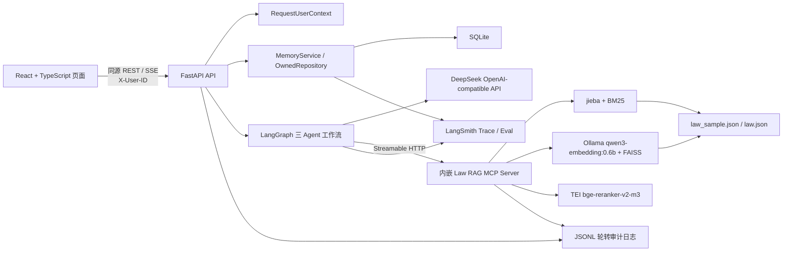

# LawStation 项目 Spec

> 版本：3.8
> 基线日期：2026-08-31
> 适用仓库：`/Users/Admin1/Files/LawStation`  
> 文档性质：后续开发、代码审查、回归测试和验收的共同基线

## 1. 文档约定

本文使用以下状态标记，避免将目标架构误认为当前实现：

- **[已实现]**：已有代码且已通过当前测试或启动验证。
- **[部分实现]**：主链路存在，但能力、边界或测试尚不完整。
- **[待实现]**：已确定方向，当前代码尚未提供。
- **[禁止]**：后续开发不得引入的实现方式。
- “必须 / 不得”是强制要求；“建议”是推荐要求。

发生冲突时，以用户最新明确需求为最高优先级；修改本 Spec 时必须同步记录变更原因和影响范围。

## 2. 产品目标与范围

LawStation 是面向中国法律咨询场景的多用户对话 Agent。系统通过 DeepSeek 完成多轮回答，由大模型自主判断是否调用法律检索工具及选择工具参数；法律知识通过 MCP 协议提供 BM25 与 FAISS Dense 混合召回；用户的会话、消息、摘要和长期记忆保存在 SQLite 中，并以 `tenant_id + user_id` 作为所有权边界。

首版目标：

- **[已实现]** 页面可切换演示用户、创建和打开会话、流式接收回答。
- **[已实现]** FastAPI、React 静态页面和 MCP Server 使用单进程、单端口运行。
- **[已实现]** 大模型自主选择 `search_laws` 或 `get_law_article` 及参数。
- **[已实现]** 法规检索支持 BM25，并在 Dense 索引就绪时进行 RRF 混合融合。
- **[已实现]** 用户会话、消息、摘要和长期记忆具备服务端所有权过滤。
- **[已实现]** 对话、工具和索引关键事件写入控制台及本地轮转日志。
- **[待实现]** 正式登录、JWT、RBAC 和生产级租户管理。
- **[已实现]** TEI `BAAI/bge-reranker-v2-m3` Cross-Encoder 批量精排；异常时整批降级 RRF。
- **[待实现]** 多机部署和分布式数据存储。

## 3. 总体架构



### 3.1 运行边界

- **浏览器进程**：响应式工作台、用户切换、会话列表、安全 Markdown、完整 SSE 状态消费和索引状态展示。
- **唯一 Uvicorn 进程**：承载 `/api/*`、`/health`、`/docs`、`/mcp/` 和 React 静态文件。
- **MCP 协议边界**：MCP Server 虽与 API 同进程，但 Agent 必须通过 `http://127.0.0.1:8000/mcp/` 调用，不得绕过协议直接调用检索函数。
- **持久化边界**：SQLite 保存用户域数据；`data/indexes/law/` 保存 Dense 索引；`data/logs/` 保存审计日志。

关键实现：

- `run.py::main`、`run.py::build_frontend`
- `backend/app/main.py::lifespan`、`backend/app/main.py::app`
- `mcp_servers/law_rag/server.py::mcp_app`

## 4. 目录和模块职责

| 路径 | 职责 | 关键 symbol / 文件 |
|---|---|---|
| `backend/app/main.py` | FastAPI 组装、生命周期、数据库初始化、MCP 挂载、静态页面托管 | `initialize_database`、`lifespan`、`app` |
| `backend/app/api/` | REST 与 SSE 接口，串联用户上下文、数据库、记忆和 Agent | `routes.py::stream_message`、`routes.py::sse` |
| `backend/app/agent/` | 三 Agent LangGraph、并发准入、DeepSeek Provider、MCP 工具缓存、流式适配和工具审计 | `LegalConsultationGraph`、`AgentConcurrencyManager`、`AgentRuntime`、`MCPToolRegistry` |
| `backend/app/core/` | `.env` 配置、不可变用户上下文、审计日志、脱敏与 Ollama/TEI 进程管理 | `Settings`、`RequestUserContext`、`OllamaProcessManager`、`TEIRerankerProcessManager`、`audit`、`redact` |
| `backend/app/db/` | SQLAlchemy 引擎、会话工厂和领域表模型 | `Base`、`SessionLocal`、各 ORM Model |
| `backend/app/services/` | 所有权限定仓储和记忆上下文/压缩 | `OwnedRepository`、`MemoryService` |
| `backend/app/observability/` | LangSmith 客户端、进程级模式、根 Trace/预算、身份哈希、内容过滤和反馈同步 | `LangSmithObservability`、`RootTrace`、`SessionTraceBudget` |
| `backend/app/evaluation/` | 确定性评估器、独立 Judge 和无生产写入的评测目标 | `DETERMINISTIC_EVALUATORS`、`LegalQualityJudge` |
| `backend/app/schemas.py` | API 输入校验模型 | `ConversationCreate`、`ChatRequest`、`MemoryUpdate` |
| `mcp_servers/law_rag/` | 法规切分、BM25、Dense、索引生命周期和 MCP 工具 | `LawSearchEngine`、`search_laws`、`get_law_article` |
| `frontend/src/` | React 响应式工作台、用户/会话隔离、Markdown 消息、完整 SSE 状态和索引状态展示 | `App.tsx::App`、`api.ts::api`、`sse.ts::consumeSse` |
| `frontend/src/components/` | 侧栏、顶栏、消息、输入器和安全状态提示等展示组件 | `Sidebar`、`ChatHeader`、`MessageList`、`Composer`、`StatusNotice` |
| `frontend/src/test/` | SSE、用户切换、输入器和状态展示测试 | `sse.test.ts`、`App.test.tsx`、`components.test.tsx` |
| `scripts/` | 可复现样本生成与手工索引构建 | `create_sample`、`build` |
| `data/knowledge/law/` | 原始法规与固定抽样法规 | `law.json`、`law_sample.json` |
| `data/indexes/law/` | manifest、chunk、Embedding 与 FAISS 产物 | `manifest.json`、`chunks.jsonl`、`embeddings.npy`、`law.faiss` |
| `data/runtime/` | SQLite 运行数据 | `lawstation.db` |
| `data/logs/` | JSON Lines 审计日志 | `lawstation.log` 及轮转文件 |
| `tests/` | 样本、索引幂等、隔离、日志脱敏和启动器测试 | `test_*.py` |
| `tools/` | 既有法律业务工具与参考实现 | 可在明确需求范围内修改、导入或重构；必须遵守最小变更和测试要求 |
| `ai-context/` | 面向后续开发和 Agent 的项目上下文文档 | 本 Spec |

## 5. 启动与生命周期

### 5.1 本地环境

- **[已实现]** 项目统一使用 Conda 环境 `LawStation`。
- 环境定义位于 `environment.yml`，当前包含 Python 3.12、Node.js 22、pip 和 `.[dev]`。
- **[禁止]** 在仓库内创建或依赖 `.venv`、`venv` 等项目级 Python 虚拟环境。
- 所有应用配置和密钥必须放入根目录 `.env`；不得用 Conda 环境变量维护业务配置。

```bash
conda env create -f environment.yml
conda activate LawStation
python run.py
```

### 5.2 `python run.py` 流程

1. `run.py::main` 将工作目录固定到仓库根目录。
2. `Settings` 从根目录 `.env` 加载配置。
3. `frontend_is_stale` 判断前端构建是否缺失或过期。
4. 需要构建时，优先以 `npm ci` 安装锁定依赖，然后执行 `npm run build`。
5. `OllamaProcessManager.ensure_ready` 探测外部 Ollama；不可达且允许自动启动时执行非交互式 `ollama serve`。
6. 精确校验 `qwen3-embedding:0.6b` 标签和 digest，并调用 `/api/embed` 预热、验证 1024 维向量；任一步失败均阻止启动。
7. `TEIRerankerProcessManager.ensure_ready` 启动或复用 TEI，验证 BGE 模型、类型和 SHA，再执行正负法条预热；失败默认降级 RRF。
8. 启动唯一 Uvicorn 进程。
9. `backend.app.main::lifespan` 初始化日志、数据库和演示用户。
10. `initialize_engine` 同步加载法规和 BM25，验证当前 provider/model digest 对应的 Dense 索引；必要时后台建库。
11. 创建应用级 `MCPToolRegistry`、`LLMProvider` 和 `AgentRuntime`；此时不通过 HTTP 自调用 MCP。
12. 进入 `mcp.session_manager.run()`，确保 MCP 嵌入式 ASGI 生命周期有效。
13. 首个聊天请求 single-flight 发现 MCP 工具并编译三 Agent LangGraph，后续请求复用只读图结构。
14. 停止时清理应用资源，并只关闭本次入口创建的 TEI 与 Ollama 进程组，不影响外部服务。

启动参数：`--rebuild`、`--no-build`、`--host`、`--port`、`--langsmith-trace-all`、`--langsmith-trace-limit`、`--no-langsmith-trace`。生产/常规开发不默认开启 Uvicorn reload，防止重复初始化索引和 MCP session manager。

## 6. 核心请求链路

### 6.1 用户和会话链路

1. 前端在请求头发送 `X-User-ID`。
2. `get_user_context` 查询用户并生成不可变 `RequestUserContext(tenant_id, user_id, request_id)`。
3. `OwnedRepository` 的每条会话、消息和记忆 SQL 同时限定 `tenant_id` 与 `user_id`。
4. 会话不存在或不属于当前用户时统一返回“会话不存在或无权访问”。

**安全边界：** 当前 `X-User-ID` 只是演示用户切换，不构成身份认证。上线前必须由 JWT claims 建立 `RequestUserContext`，但领域服务和仓储接口应保持不变。

### 6.2 流式问答链路

1. `POST /api/conversations/{conversation_id}/messages/stream` 校验会话归属。
2. 保存用户原始消息并记录 `conversation.received`、`conversation.started`。
3. `MemoryService.context` 加载当前用户的长期记忆、当前会话摘要和近期消息。
4. `AgentConcurrencyManager` 执行会话唯一、单用户 2 个、全局 6 个任务的并发准入。
5. `AgentService.run` 调用共享 `AgentRuntime`；每轮 Graph state、记忆和证据包均独立创建。
6. `CaseAnalystAgent` 分类、拆解争议点并制定研究任务；闲聊和信息不足可提前结束。
7. `LegalResearchAgent` 是唯一绑定 MCP Tool 的 Agent，负责检索并生成结构化 `EvidencePacket`；`matched`、`no_match`、`tool_unavailable`、`tool_error` 必须严格区分。
8. `no_match` 是检索成功的正常结果：后续 LegalCounsel 继续生成低置信度、条件化的一般性分析，Reviewer 检查证据边界，不得仅因无法条而重复检索。
9. `LegalCounselAgent` 根据案情和证据状态生成草稿，随后由 Case Analyst 复核；有部分证据且确有新查询目标时最多补检索一次，表达越界时最多修订一次。
10. 通过复核的回答和 citations 才映射为 SSE；`no_match` 回答的 citations 必须为空，内部草稿和推理过程不输出。
11. 工具审计使用独立短 Session；模型和 MCP 执行期间不持有数据库事务。
12. 完成后用短事务保存助手消息并整理记忆；取消时保存已实际发送部分为 `interrupted`。

SSE 事件契约：

- `message_start`
- `agent_status`
- `tool_call_start`
- `tool_call_result`
- `token`
- `memory_status`
- `message_end`
- `error`

- `citations` **[已实现]**：来源于本轮 `EvidencePacket`，不接受模型自由生成的外部编号。

### 6.3 并发与页面切换

- 同一进程最多运行 6 个 Graph，同一用户最多运行 2 个不同会话，同一会话最多 1 个任务。
- 相同所有权会话重复发送返回 HTTP 409；超出用户或全局容量时通过 `agent_status=queued` 排队，默认最多等待 30 秒。
- 前端以 `user_id:conversation_id` 保存独立 runtime；切换用户或会话不取消旧 SSE，原任务在页面存活期间继续。
- 后台 token 只更新所属 runtime。返回原会话时恢复累计内容；主动停止只取消当前会话 controller。
- 浏览器刷新、关闭或网络断开不保证任务恢复；首版不引入服务端持久任务队列。
- SQLite 启用 WAL、5 秒 busy timeout 和外键；SSE 路由只使用短生命周期 Session。
- SSE 在 Agent 长时间无业务事件时每 15 秒发送 comment heartbeat；反向代理不得缓冲 SSE。审计分别记录排队、首状态、首文本和总耗时。

### 6.4 法规检索链路

1. `LawSearchEngine.__init__` 读取 `LAW_DATA_PATH`，按法条加载并构建 BM25。
2. 超过阈值的法条由 `split_text` 按段落/标点分块，默认 1,000 字、重叠 150 字。
3. 指纹包含源文件 SHA256、切分版本/参数、Embedding provider、模型标签/digest、维度和查询指令版本。
4. `_validate_and_load` 只有在 manifest、chunks、embeddings 和 FAISS 全部有效时才复用索引。
5. 索引无效时以 staging、文件锁、批次 checkpoint 和原子替换构建；旧有效索引不因失败而被覆盖。
6. Dense 未就绪时降级到 BM25；Dense 查询要求 Ollama Provider ready，且当前模型 digest 与 manifest 一致，不依赖 DashScope 密钥。
7. Dense 就绪时，BM25 与 FAISS 候选使用 RRF 合并并去重；BM25、Dense 和 RRF 均执行可配置最低分过滤。
8. `law_name` 必须在排序前限定候选范围；未知过滤字段必须拒绝，不得静默忽略。精确法条查询使用启动时建立的内存映射。

Agent 对检索结果的业务语义：

- `matched`：至少一条工具返回候选被确认为可引用证据，允许生成 citations。
- `no_match`：工具正常完成但没有候选被确认为可引用证据；这是成功结果，继续生成一般性分析，不重复检索，不引用具体法律名称或条号。
- `tool_unavailable`：MCP 工具未加载，回答必须披露检索能力不可用。
- `tool_error`：工具超时、连接、协议或执行异常，不得冒充“没有相关法律”。
- MCP 返回的法条字段必须由代码从 ToolMessage 组装；`document_id` 表示原始法条，`chunk_id` 是引用证据的唯一标识。模型只能选择真实 `chunk_id`，不得自由生成证据。旧模型只返回 `document_id` 时，仅在该法条只有一个候选 chunk 的情况下兼容。
- 最终 citations 只能来自 `CounselDraft.claims` 实际引用且存在于 EvidencePacket 的 chunk，不得把所有检索候选自动作为引用输出。
- 低风险 `no_match` 回答通过确定性边界校验后可以跳过 LLM Reviewer；中高风险、matched、工具异常、修订草稿或校验失败时必须执行 LLM Reviewer。

MCP 工具契约：

```text
search_laws(query: string, top_k: integer = 8, filters?: object)
get_law_article(law_name: string, article_number: string)
```

当前 `filters` 仅支持 `law_name`。`top_k` 在服务端限制为 1～20。

## 7. 记忆系统

### 7.1 四层分层记忆

- **原始消息 [已实现]**：`messages` 完整保存用户、助手消息及状态。
- **近期对话 [已实现]**：按上下文预算选取当前会话最近消息。
- **工作记忆 [已实现]**：`conversation_summaries` 保存当前会话的结构化滚动摘要。
- **长期记忆 [已实现]**：`user_memories` 区分用户级偏好与会话级案件事实，并具有生效、替换、拒绝和过期状态。

### 7.2 当前上下文、摘要与提取算法

`MemoryService.context` 使用中英文保守 token 估算，将 `MEMORY_CONTEXT_TOKEN_LIMIT` 分配给当前问题、近期消息、当前案件 active 记忆、用户级 active 偏好和结构化摘要。案件事实只允许在来源会话使用；跨会话只加载 `profile_preference` 和 `identity_background`。

`MemoryTaskManager` 在主回答保存后创建 SQLite 持久任务。后台 worker 只从本轮用户消息抽取结构化候选；通过 Schema 和作用域校验的用户偏好、身份背景及案件事实均直接写为 `active`，无需用户再次确认。提取模型同时读取当前用户级 active 记忆和当前会话 active 记忆，可通过 `replaces_memory_id` 建议冲突目标；服务端必须使用所有者、作用域、会话、状态和版本号复核。合法冲突在原记忆行上更新，新事实沿用原 `memory_id/canonical_key`，旧正文仅写入 `memory_revisions(action=auto_replace)`。达到压缩阈值时，worker 使用旧摘要和新增覆盖区间生成结构化增量摘要。

`MemoryTaskManager.enqueue()` 是唯一允许的记忆整理入口。旧 `MemoryService.consolidate()` 已封存并必须抛出弃用错误，不得重新启用截断拼接或把用户长消息原文直接写成 active 记忆。

记忆抽取和摘要使用 `LLMProvider.get_memory_model` 提供的独立非流式、非 Thinking 模型配置，通过 DeepSeek JSON Output 返回 JSON 并由 Pydantic 校验。该链路不得绑定、发现或调用 MCP/业务工具，也不得发送 `tools` 或 `tool_choice`。没有可沉淀内容时 `memories=[]` 是成功结果；确定性配置或兼容错误不得反复重试，主回答保存不受后台记忆失败影响。

记忆状态为 `pending | active | superseded | rejected | expired`；作用域为 `user | conversation`。`pending/superseded` 只用于兼容历史记录，新抽取记录和新冲突不再进入这些状态。会话级冲突只能原位替换同一案件内的旧事实，用户级冲突可以在该用户范围内替换。模型返回的无效、越权或跨会话替换 ID 必须丢弃，不得降级为新增记录。当前轮消息与历史记忆冲突时，Case Analyst、Legal Counsel 和 Reviewer 均必须以当前消息为准。

### 7.3 强制隔离规则

- 所有用户域记录必须带 `tenant_id + user_id`。
- 记忆查询、更新、删除的所有权条件必须进入同一条 SQL；禁止先按 `memory_id` 获取后在应用层判断。
- `conversation_id` 必须归属于当前上下文用户。
- 模型和 MCP 工具不得接收或推断记忆查询所用的 `user_id`。
- 更新/删除其他用户 ID 时统一返回“不存在或无权访问”，不得泄露记录是否存在。
- 流建立后必须固定使用创建该流时的 `RequestUserContext`；页面切换只能改变可见 runtime，不得改变或复用后台流的用户上下文。

## 8. 数据模型

| 表 | 用途 | 关键所有权/约束 |
|---|---|---|
| `tenants` | 租户 | `id` 主键 |
| `users` | 演示用户 | `tenant_id` 外键；`tenant_id + id` 唯一 |
| `conversations` | 用户会话 | `tenant_id + user_id + id` 唯一及复合外键 |
| `messages` | 原始消息 | 复合外键指向所属用户会话 |
| `conversation_summaries` | 滚动摘要 | 每个所属用户会话一条当前摘要 |
| `user_memories` | 长期记忆 | 复合外键指向来源用户会话；所有操作必须限定所有者 |
| `memory_revisions` | 记忆修订历史 | 按 `tenant_id + user_id + memory_id` 追溯原位自动替换、历史确认、拒绝和修改 |
| `memory_jobs` | 后台记忆整理任务 | 来源消息幂等；`pending/running/completed/failed` 可恢复 |
| `tool_call_records` | 工具调用数据库审计 | 保存用户、会话、参数、结果摘要、状态和耗时 |
| `retrieval_traces` | 法规检索追踪 | 保存用户、会话、查询及截断结果 |
| `index_manifests` | 已构建索引版本记录 | `data_version` 唯一 |
| `message_feedback` | 助手消息的本地反馈与 LangSmith 同步状态 | `tenant_id + user_id + message_id` 唯一 |

模型定义：`backend/app/db/models.py`。数据库会话：`backend/app/db/session.py::SessionLocal`。

## 9. API 契约

| 方法与路径 | 用途 | 用户上下文 |
|---|---|---|
| `GET /health` | 服务和索引简化状态 | 不需要 |
| `GET /docs` | OpenAPI 文档 | 不需要 |
| `GET /api/index/status` | 索引状态和进度 | 不需要 |
| `GET /api/users` | 演示用户列表 | 不需要；正式认证后应重新评估 |
| `GET /api/conversations` | 当前用户会话列表 | 必须 |
| `POST /api/conversations` | 创建当前用户会话 | 必须 |
| `GET /api/conversations/{id}/messages` | 当前用户会话消息 | 必须 |
| `POST /api/conversations/{id}/messages/stream` | SSE 问答 | 必须 |
| `GET /api/memories` | 当前用户记忆，可按会话过滤 | 必须 |
| `PATCH /api/memories/{id}` | 修改当前用户记忆 | 必须 |
| `POST /api/memories/{id}/confirm` | 兼容处理升级前已有待确认记忆并应用冲突替换 | 必须 |
| `POST /api/memories/{id}/reject` | 拒绝待处理记忆 | 必须 |
| `DELETE /api/memories/{id}` | 删除当前用户单条记忆 | 必须 |
| `DELETE /api/memories` | 清空当前用户全部或指定会话记忆 | 必须 |
| `GET /api/memory-jobs/{id}` | 查询当前用户的后台记忆整理状态 | 必须 |
| `POST /api/messages/{id}/feedback` | 当前用户对所属助手消息点赞或点踩 | 必须 |
| `/mcp/` | Streamable HTTP MCP | Agent 内部使用 |

## 10. 技术选型

| 领域 | 选型 | 当前用途 |
|---|---|---|
| Python 环境 | Conda，环境名 `LawStation` | 统一管理 Python 3.12、Node 22 和项目依赖 |
| 后端 Web | FastAPI + Uvicorn | REST、SSE、生命周期和静态文件托管 |
| AI 编排 | LangGraph `StateGraph` + LangChain `create_agent` | 三 Agent 路由、研究工具循环、复核回流、调用上限和流式阶段状态 |
| MCP 适配 | LangChain MCP Adapters | 首次发现并缓存 MCP Tool；实际调用保持短生命周期 MCP session |
| 大模型 | DeepSeek，OpenAI-compatible API | 对话、工具决策和回答生成 |
| MCP | MCP Python SDK，Streamable HTTP | 标准化暴露法规检索工具 |
| 词法检索 | jieba + rank-bm25 | 中文分词与 BM25 召回 |
| Dense Embedding | 本机 Ollama、`qwen3-embedding:0.6b`、1024 维 | 文档直接向量化；查询使用法律检索指令前缀；不消耗云端 Embedding token |
| 向量索引 | FAISS `IndexFlatIP` | 归一化向量的内积/余弦近邻搜索 |
| 混合融合 | Reciprocal Rank Fusion | 合并 BM25 与 Dense 排名 |
| 法条精排 | Hugging Face TEI + `BAAI/bge-reranker-v2-m3` | 通过 `/rerank` 一次批量提交 RRF 候选并返回 Cross-Encoder 相关性分数 |
| 数据库 | SQLite + SQLAlchemy 2.x + Alembic | 用户、会话、消息、分层记忆、后台任务、审计与版本化迁移 |
| 配置 | pydantic-settings + 根目录 `.env` | 类型化读取全部应用环境变量 |
| 前端 | React + TypeScript + Vite | 响应式单页法律咨询工作台和同源 API 消费 |
| 前端网络层 | 原生 `fetch` + `ReadableStream` | 类型化 REST 封装和完整 SSE 事件消费；不使用 TanStack Query |
| 前端内容/图标 | react-markdown + remark-gfm + lucide-react | 禁止原始 HTML 的 Markdown 展示和一致的矢量图标 |
| 日志 | Python logging + `RotatingFileHandler` | 控制台和 JSONL 文件审计 |
| 模型可观测与评估 | LangSmith + `LangChainTracer` | Agent/记忆 trace、实验、确定性/LLM Judge 和用户反馈 |
| 测试/质量 | pytest、pytest-asyncio、ruff、Vitest、Testing Library | 后端单元/异步测试及前端交互、SSE 测试 |
| 容器 | Docker 多阶段构建 + Docker Compose | Node 构建前端、Python 运行单容器应用 |

### 10.1 明确延期的技术

- 将 TEI Reranker 合并回单进程运行时；当前保持独立本地推理进程以使用原生 Cross-Encoder。
- Redis 或其他缓存服务。
- MQ。
- 独立业务 RPC 服务。
- PostgreSQL、分布式向量数据库。
- JWT、OAuth2、RBAC。

除非需求明确变更，不得为了“预留”而提前引入上述基础设施。

## 11. 配置规范

全部运行配置必须定义在 `backend/app/core/config.py::Settings`，并在 `.env` 与 `.env.example` 中保持同名、同类型语义：

```text
DEEPSEEK_API_KEY
DEEPSEEK_BASE_URL
DEEPSEEK_MODEL
DASHSCOPE_API_KEY
DASHSCOPE_BASE_URL
EMBEDDING_PROVIDER
EMBEDDING_MODEL
EMBEDDING_DIMENSION
OLLAMA_AUTO_START
OLLAMA_COMMAND
OLLAMA_BASE_URL
OLLAMA_STARTUP_TIMEOUT_SECONDS
OLLAMA_SHUTDOWN_TIMEOUT_SECONDS
OLLAMA_REQUEST_TIMEOUT_SECONDS
OLLAMA_KEEP_ALIVE
OLLAMA_MAX_LOADED_MODELS
OLLAMA_EMBEDDING_BATCH_SIZE
OLLAMA_LOG_PATH
OLLAMA_QUERY_INSTRUCTION
DATABASE_URL
LAW_DATA_PATH
INDEX_DIR
MCP_LAW_SERVER_URL
MCP_DEBUG_HOST
MCP_DEBUG_PORT
MCP_TOOL_TIMEOUT_SECONDS
MCP_TOOL_DISCOVERY_RETRY_SECONDS
AGENT_MAX_TOOL_CALLS
AGENT_MAX_MODEL_CALLS
AGENT_GLOBAL_CONCURRENCY
AGENT_PER_USER_CONCURRENCY
AGENT_PER_CONVERSATION_CONCURRENCY
AGENT_QUEUE_TIMEOUT_SECONDS
AGENT_SKILLS_ENABLED
AGENT_SKILL_ROOT
AGENT_MAX_ACTIVE_SKILLS
AGENT_SKILL_STRICT_VALIDATION
LLM_REQUEST_TIMEOUT_SECONDS
LLM_MAX_RETRIES
LLM_TEMPERATURE
MEMORY_CONTEXT_TOKEN_LIMIT
MEMORY_COMPRESSION_THRESHOLD
MEMORY_RECENT_MESSAGE_COUNT
MEMORY_WORKER_POLL_SECONDS
MEMORY_JOB_MAX_ATTEMPTS
MEMORY_LLM_MODEL
MEMORY_LLM_THINKING
MEMORY_LLM_TEMPERATURE
MEMORY_LLM_MAX_TOKENS
MEMORY_LLM_JSON_RETRY_COUNT
APP_HOST
APP_PORT
LOG_LEVEL
LOG_DIR
LOG_MAX_BYTES
LOG_BACKUP_COUNT
AUDIT_SUMMARY_MAX_CHARS
INDEX_AUTO_BUILD
INDEX_CHUNK_MAX_CHARS
INDEX_CHUNK_OVERLAP_CHARS
INDEX_BUILD_BATCH_SIZE
INDEX_EMBEDDING_TIMEOUT_SECONDS
INDEX_EMBEDDING_MAX_RETRIES
INDEX_EMBEDDING_RETRY_BASE_SECONDS
INDEX_EMBEDDING_RETRY_MAX_SECONDS
RAG_BM25_MIN_SCORE
RAG_DENSE_MIN_SCORE
RAG_RRF_MIN_SCORE
RAG_RETRIEVAL_MODE
RAG_RERANK_ENABLED
RAG_RERANK_PROVIDER
RAG_RERANK_MODEL
RAG_RERANK_BASE_URL
RAG_RERANK_AUTO_START
RAG_RERANK_COMMAND
RAG_RERANK_MODEL_CACHE
RAG_RERANK_STARTUP_TIMEOUT_SECONDS
RAG_RERANK_SHUTDOWN_TIMEOUT_SECONDS
RAG_RERANK_LOG_PATH
RAG_RERANK_MAX_CLIENT_BATCH_SIZE
RAG_RERANK_MAX_BATCH_REQUESTS
RAG_RERANK_CANDIDATE_COUNT
RAG_RERANK_CONCURRENCY
RAG_RERANK_MIN_SCORE
RAG_RERANK_STAGE_TIMEOUT_SECONDS
RAG_RERANK_REQUEST_TIMEOUT_SECONDS
RAG_RERANK_TOP_LOGPROBS
RAG_RERANK_KEEP_ALIVE
RAG_RERANK_RETRY_SECONDS
RAG_RERANK_REQUIRED
SSE_HEARTBEAT_SECONDS
```

强制规则：

- `.env` 存放真实值且必须被 Git 忽略；建议文件权限为 `0600`。
- `.env.example` 只提供安全示例，不得包含真实密钥。
- 新增配置时必须同时修改 `Settings`、`.env.example`、相关测试和本 Spec；本地 `.env` 也必须补齐。
- **[禁止]** 在源代码、前端产物、日志、Dockerfile、Compose 文件或测试中硬编码真实密钥。
- **[禁止]** 使用散落的 `os.getenv`/`os.environ` 读取或写入应用配置；统一通过 `get_settings()`。
- 前端不得获得 DeepSeek、DashScope 或任何服务端密钥。

## 12. 法规数据与索引规范

### 12.1 数据源

- 默认生产数据源：`data/knowledge/law/law.json`，不得由运行时或抽样脚本修改。
- 测试和演示样本：`data/knowledge/law/law_sample.json`，固定 seed 42、无放回抽取 100 条、按原位置排序；不得作为生产默认值。
- 默认所有切分、BM25、Dense、指纹与查询必须统一读取 `LAW_DATA_PATH`。
- 临时切换样本只允许修改 `.env` 中 `LAW_DATA_PATH`，不得在代码中另写路径分支。

### 12.2 幂等和可靠性

- 只有 manifest 指纹、chunk 数、Embedding shape、FAISS 维度和 `ntotal` 全部一致时才能跳过建库。
- `chunk_id` 必须由源法条标识、chunk 序号和内容哈希稳定生成。
- 构建必须使用文件锁、staging 和原子切换；失败不得破坏旧有效索引。
- 默认 Ollama Embedding 每批最多 8 条；请求必须携带 `dimensions=1024`、`truncate=false` 和配置的 `keep_alive`，响应必须校验数量、顺序、维度和有限数值，可重试错误采用有上限的指数退避。
- 全量向量必须通过 memmap 分批写入并增量加入 FAISS，禁止使用 `np.vstack` 形成全量重复内存副本。
- 只有 provider、模型 digest、查询指令和数据指纹完全一致的 staging 批次允许在下次启动时恢复；损坏批次必须单独重建，`--force` 不得复用 staging 批次。未知或不兼容 staging 不得自动递归删除。
- 统一入口的 Ollama 探测、模型校验或预热失败必须阻止 LawStation 启动；应用已经启动后若后台 Dense 建库失败，或独立 MCP 调试模式无法准备 Provider，则保留 BM25 降级能力。
- 手工构建脚本必须复用 `LawSearchEngine`，不得维护第二套切分/建库实现。

### 12.3 Ollama 运行边界

- 正式本地入口使用 `ollama serve` 提供服务，使用 `/api/embed` 加载模型，禁止使用交互式 `ollama run`。
- 启动器必须精确验证模型标签和 digest；模型缺失时提示用户手工执行 `ollama pull qwen3-embedding:0.6b`，不得自动下载。
- 只允许关闭本次启动入口创建的 Ollama 独立进程组；外部已运行的 Ollama 不得关闭，也不得使用 `pkill` 等宽泛命令。
- Ollama 子进程环境只传递基础系统变量和 `OLLAMA_*` 配置，不得传递 DeepSeek、DashScope、LangSmith 等密钥。
- Docker 内禁止自动启动 Ollama，统一访问宿主 `host.docker.internal:11434`；不可达或模型缺失时阻止容器应用启动。

### 12.4 TEI Reranker 运行边界

- Reranker 由独立 TEI 进程承载；本机入口可自动启动或复用回环地址上的 TEI，Docker 只访问宿主 `host.docker.internal:8081`。
- TEI 必须精确返回配置模型和 Reranker 类型。模型 revision 按 `/info.model_sha`、`RAG_RERANK_MODEL_REVISION`、项目 Hugging Face 缓存 `refs/<revision>` 的顺序解析；兼容 TEI 对部分模型返回 `model_sha=null`，但不得在没有任何可验证 revision 时伪造版本或标记 ready。
- 解析得到的模型 revision 必须进入检索结果的 `ranking_version`、状态接口、LangSmith Trace 与评测报告；它不属于向量索引指纹，更换 Reranker 不得触发 FAISS 重建。托管 TEI 时若配置了 `RAG_RERANK_MODEL_REVISION`，启动命令必须通过 `--revision` 固定同一版本。
- `/rerank` 必须一次批量接收 RRF 候选；缺失、重复或越界索引、非法分数、请求超时或响应异常时必须整批降级到 RRF，不得使用部分分数，也不得制造错误 `no_match`。
- 只允许关闭本次入口创建的 TEI 进程组；外部 TEI 不得关闭。Reranker 不可用且 `RAG_RERANK_REQUIRED=false` 时继续启动并标记 degraded；Embedding 仍是正式入口的强依赖。
- `scripts/start_tei_reranker.sh` 是 TEI 的前台手动调试入口，命令参数必须与 `.env` 的模型、revision、端口、缓存和批处理配置保持一致；由该脚本启动的 TEI 视为外部进程，`run.py` 只能复用、不得关闭。

## 13. 审计、安全与隐私

### 13.1 日志要求

- 控制台和 `data/logs/lawstation.log` 同时输出 JSON Lines。
- 默认单文件 20 MB、保留 10 个轮转文件；写文件失败时降级到 stderr，不得中断问答。
- 对话链路至少记录 received、started、completed、interrupted、failed。
- 工具链路至少记录 discovery 和 call 的 started、completed、failed、timeout。
- 索引链路至少记录 check、build、progress、loaded、switched、failed。
- `request_id`、`tenant_id`、`user_id`、`conversation_id` 应在适用事件中完整关联。

### 13.2 隐私要求

- 问题、回答和参数日志只允许记录限定长度的脱敏摘要。
- 手机号、身份证号、银行卡号、邮箱必须脱敏。
- 不得记录 API Key、Authorization header、`.env` 内容或模型内部推理过程。
- 文件审计日志不得记录完整法条正文。
- 工具结果日志只保留数量、document ID、chunk ID、法律名称、条号及耗时等元数据。

**[已实现]** 文件日志和数据库工具审计均执行正文最小化：参数只保存脱敏摘要，结果只保存数量、document ID、法律名称、条号和字符数。正式上线前仍须确定审计留存周期和清理策略。

### 13.3 LangSmith 可观测与评估

- **[已实现]** `LangSmithObservability` 在应用生命周期复用 Client。默认 `config` 沿用 `.env` 采样和月度预算；`--langsmith-trace-all` 将当前进程切为 100% 采样并使用咨询/记忆共享的 Session 根 Trace 上限（默认 200）；`--no-langsmith-trace` 强制关闭。CLI 覆盖不得写回 `.env`，互斥和非法上限必须在启动前拒绝。
- **[已实现]** 全量模式在前端构建、Ollama 和 Uvicorn 前严格校验 API Key、HMAC、Workspace 及远端鉴权；启动后导出故障 fail-open。达到 Session 上限后停止创建新 Trace，只记录一次告警，业务继续。
- **[已实现]** `backend/app/api/routes.py::stream_message` 持有 `lawstation.consultation` 根 Run，覆盖会话预占、排队、用户消息/MemorySnapshot、三 Agent Graph、回答持久化和记忆任务入队；heartbeat 和回答字符分片不得产生 Span。咨询根 Trace ID 写入用户及助手消息。
- **[已实现]** LangGraph、DeepSeek 与 MCP Tool 继承请求级 Trace config。MCP Client Interceptor 只在当前父 Run 存在时传播 `langsmith-trace`/`baggage`，MCP Server 还必须验证进程内随机 Bridge Token；普通或伪造外部 MCP 请求不得注入咨询 Trace。
- **[已实现]** Learn/Smoke 评测可使用 `LANGSMITH_TEST_CACHE`；Python 依赖通过 `langsmith[vcr]` 安装 `vcrpy`。上传的 Compare/Release 在 `aevaluate` 作用域内强制移除并随后恢复该环境变量，禁止 VCR 回放污染 Baseline/Candidate 的真实延迟、Token 和模型调用对比。
- **[已实现]** RAG 以 `law_rag.search_laws` retriever 为父 Span，并记录 filter、BM25、query embedding、FAISS、RRF 和 get_article；不得上传原始向量、FAISS 对象或密钥，Dense 追踪候选明细限制为 100 条但不得改变实际检索结果。
- **[已实现]** 每个 Memory Job 只创建一个独立 `lawstation.memory` 根 Trace，提取、替换/创建、增量摘要和持久化为子 Span；通过来源消息的咨询 Trace ID、会话哈希和来源消息哈希关联。重试 attempt 可形成新根 Trace，但同一进程同一 attempt 不得重复创建。
- **[已实现]** 采样基于 `request_id` 稳定哈希，生产成功请求默认采样 2%；高风险、工具不可用和失败的未采样请求可补充 summary trace，但生产 Trace 月度预算耗尽后停止上报。LangSmith 异常或预算耗尽不得中断业务。
- **[已实现]** 租户、用户、会话标识以 HMAC-SHA256 上报；API Key、Authorization、Cookie、数据库 URL 和 `reasoning_content` 强制过滤。正文由 `LANGSMITH_CAPTURE_CONTENT` 控制。
- **[已实现]** `evals/datasets/` 保存 60 条合成 E2E、30 条分层 Agent 基准和 100 条引用真实 document/chunk ID 的源数据派生检索集；retrieval/component/live 分别隔离评估 RAG、Agent 编排和真实 MCP 链路。源数据派生集必须标记 `human_verified=false`，不得冒充律师人工标注。
- **[已实现]** 简历挑战集流水线从真实法规 chunk 生成不泄漏法名、条号和长原文的 Codex xhigh 任务；300条 Dense 集直接冻结，Reranker 使用600条候选，只有 Gold 进入未开启BGE的 Hybrid Top12 且至少两个预声明相邻干扰 chunk 同时召回时，才能按候选冻结顺序进入前200条正式精排集。原300条候选必须作为不可变前缀保留，生成与资格检查均不得读取 BGE 实验结果。
- **[已实现]** Reranker 资格检查处理全部候选并每25条原子保存 checkpoint；checkpoint 绑定候选SHA、索引指纹、检索阈值、Top12和禁用精排配置。成功或不足200条都必须保存逐条资格结果、失败原因与分类汇总；配置不一致时不得复用旧进度。
- **[已实现]** 评估器覆盖路由、Schema、Recall@5、MRR、Hit@1、Top3、Gold 排名、chunk 命中、引用、no_match、轨迹、循环、最新事实和隔离；报告按 category/difficulty 分组并保留最多3条定性改善案例。独立非 Thinking Judge 输出结构化评分。
- **[已实现]** 评测采用 learn、smoke、compare、release 四级渐进模式；默认 learn 不访问外部服务，smoke 不上传 Trace，云端上传必须显式确认。Compare 默认只执行 10 条检索、3 条 Reviewer 和 2 条 E2E 双组见证样本。
- **[已实现]** 评测 Trace、Agent 模型和 Judge 只记录实际月度用量，不设置累计硬上限；`--plan-only` 继续展示样本哈希和最坏调用量，云端上传必须显式确认，在线 LLM evaluator 默认关闭。生产 Trace 仍使用独立月度保护，全量追踪仍受进程 Session 根 Trace 上限约束。
- **[已实现]** 完整本地确定性 RAG 指标通过数据集 SHA256、索引指纹和 Git Commit 作为可复现事实源；LangSmith 负责小样本 Trace 见证。Agent/Judge 数字必须标注样本量，任何报告不得把小样本结果描述为生产准确率。
- **[已实现]** 每次非 `plan-only` 评测按新加坡时区归档到 `evals/reports/runs/YYYYMMDD-HHMMSS-ffffff-<profile>/`；JSON 与 CSV 同名，分阶段实验共享一个运行目录。Manifest 保存状态、失败阶段、完成产物和 Baseline 复用来源，原子维护 `latest.json` 与 `latest-success.json`，历史运行不自动清理。
- **[已实现]** Baseline 复用必须校验数据集 SHA256、样本内容哈希、种子、运行模式、Graph/Prompt 版本及 LangSmith 完整性；复用结果复制进当前运行目录并记录来源，不能只按文件名复用。
- **[已实现]** 用户反馈先写 `message_feedback`，再异步同步 LangSmith；越权消息 ID 统一返回不存在或无权访问。
- **[需配置]** 云端数据集、在线 evaluator、费用规则和 Annotation Queue 需配置 API Key 后初始化。

## 14. 开发要求与准则

### 14.1 必须做的事

- 修改前先从代码验证现状，不得只依据 README 或本 Spec 推断实现。
- 所有代码和文档修改必须遵循最小变更原则：优先原地修改现有 symbol，只调整实现需求所必需的内容。
- 能够原地修改的文件不得删除后重建；必须保留无关代码、格式、注释以及用户已有改动。
- 只有现有结构无法合理承载需求时才允许新增、拆分或整体替换文件，并应在交付说明中说明必要性。
- 任何用户域读写必须从 `RequestUserContext` 获取所有者，且在数据库语句内限定 `tenant_id + user_id`。
- 新 API 必须定义输入模型、错误语义、权限边界和测试。
- 新 MCP 工具必须有明确用途、JSON Schema、超时、调用次数限制和审计事件。
- 涉及具体法律结论时，系统提示和 Agent 行为必须优先检索；无法核验时明确说明，不得虚构法条。
- 检索成功但证据为空必须标记为 `no_match` 并继续一般性回答；不得将其作为异常、无限补检索或输出未经核验的具体法条。
- 阻塞型 BM25、FAISS 和法规精确匹配必须在线程池执行，避免阻塞事件循环。
- 修改索引格式或切分算法时必须改变指纹输入或 `CHUNKER_VERSION`。
- 修改 SSE 事件时必须同步前端消费者、API 文档和回归测试。
- 新增环境变量时同步 `Settings`、`.env.example`、`.env` 和 Spec。
- 后续新增、修改或移除任意功能时，必须在同一次交付中同步更新 `resume/` 下受影响模块的说明文档，并同步检查、更新 `resume/architecture.md` 中的项目结构、模块边界、依赖关系和核心链路；如总体架构确实未受影响，也必须完成核验，并在交付说明中明确标记“架构文档已核验，无需修改”。
- `resume/` 文档必须以修改后的实际代码、配置、数据模型和测试结果为依据；不得只复制需求或本 Spec 的计划性描述。新增或改变的关键流程应记录入口文件、关键 symbol、输入输出、异常路径、并发/隔离边界和实现状态。
- 功能变更未完成对应 `resume/` 模块文档与架构总览的同步或核验时，不得视为开发完成；相关文档更新属于验收项，而非可选的后续整理工作。
- 后端变更至少运行 `pytest`；相关 Python 文件运行 `ruff check`；前端变更运行 `npm test` 和 `npm run build`。
- 涉及启动链路时，必须实际验证 `/`、`/health`、`/docs`、`/api/index/status` 和 MCP 初始化/工具调用。
- 保持 `python run.py` 为常规运行的唯一启动入口。

### 14.2 不可以做的事

- **[禁止]** 创建或恢复仓库内 `.venv`，或在文档/脚本中要求使用它。
- **[禁止]** 为了实现局部需求而无必要地删除、重建、整体改写文件或覆盖无关的既有实现。
- **[禁止]** 让模型传入任意 `user_id` 访问记忆，或把用户记忆暴露为自由指定用户的 MCP 工具。
- **[禁止]** 提供 `get_memory(memory_id)` 一类无所有者上下文的仓储接口。
- **[禁止]** 仅凭 `memory_id`、`conversation_id` 查询后再在 Python 层判断归属。
- **[禁止]** 因 MCP 与 API 同进程而绕过 MCP 协议直接调用检索函数。
- **[禁止]** 只 `app.mount()` MCP 而不运行 `mcp.session_manager.run()`。
- **[禁止]** 将 API Key、完整敏感输入、完整法条正文或模型推理过程写入日志。
- **[禁止]** 将 `.env`、SQLite 运行库、索引文件、日志、`node_modules`、`frontend/dist` 提交到 Git。
- **[禁止]** 在没有明确需求时接入 `case_tool`、`crime_tool`、`procedure_tool`、`template_tool`、`check_tool`、`plan_tool` 或 `memory_tool`。
- **[禁止]** 默认开启 Uvicorn reload 或启动第二个生产 MCP 进程。
- **[禁止]** 开发、测试或构建完成后自动执行 `python run.py`、`uvicorn`、`docker compose up` 等命令启动服务，或遗留任何常驻服务进程；仅当用户在当前任务中明确要求启动、运行或进行在线联调时，才允许启动服务。测试和生产构建本身不视为启动授权。
- **[禁止]** Dense 建库失败时让整个应用不可访问。

## 15. 测试与验收基线

当前自动化测试覆盖：

- `tests/test_isolation.py`：其他用户无法列出、修改或删除记忆。
- `tests/test_memory.py`：案件/用户作用域、上下文预算、模型建议与 canonical key 原位替换、越权拒绝、结构化抽取和后台任务。
- `tests/test_migrations.py`：旧 SQLite 自动备份、字段升级和 Alembic 版本。
- `tests/test_law_sample.py`：样本数量、来源一致性、可复现性和默认路径。
- `tests/test_index_manager.py`：有效索引跳过 Embedding、强制重建、稳定 chunk ID、检索阈值、前置法律过滤和精确法条映射。
- `tests/test_audit_logging.py`：敏感信息脱敏和摘要长度。
- `tests/test_langsmith_observability.py`：trace 内容过滤、稳定采样/哈希和关键 evaluator。
- `tests/test_feedback.py`：消息反馈所有权和本地优先持久化。
- `tests/test_run.py`：前端过期检测与 `--no-build` 失败语义。
- `frontend/src/test/sse.test.ts`：分块 SSE、全部事件解析和 HTTP 错误语义。
- `tests/test_agent_runtime.py`：三 Agent 路由、工具研究、matched/no_match、chunk 级引用边界、确定性复核快速路径、MCP 内容块审计解析、共享 Runtime 隔离和并发准入。
- `tests/test_skills.py`：Skill Registry、渐进式加载、角色/工具白名单、组合上限、输出 Schema、伪造 ID 拒绝和路由评测数据。
- `frontend/src/test/App.test.tsx`：切换用户隔离显示、后台流继续、返回会话恢复进度和 no_match 工具状态清理。
- `frontend/src/test/components.test.tsx`：输入快捷键、停止生成、索引降级和安全工具状态。
- `frontend/src/test/MemoryPanel.test.tsx`：记忆面板用户限定加载、仅展示 active 最新事实和记忆治理。

截至本 Spec 基线：应以当前 CI/本地验证输出为准；后端、前端测试和生产构建必须同时通过。

每次发布至少满足：

1. 用户 A 无法读取、修改、删除用户 B 的记忆或使用其会话问答。
2. 并发流不能跨用户串写；页面切换用户时旧流继续运行，但只能更新其所属会话 runtime。
3. 服务重启后会话和记忆隔离仍有效。
4. 有效索引启动时不会重新调用 Embedding。
5. 缺少 Dense 密钥或索引构建失败时 BM25 仍可查询。
6. Agent 能自主选择法律工具和参数，调用次数与超时受控。
7. 日志可用 `request_id` 串联且不泄露敏感数据。
8. 修改 `tools/*.py` 时必须有明确业务需求，变更范围最小，并通过对应回归测试。
9. `.env` 未被 Git 跟踪，前端产物不含服务端密钥。
10. `python run.py` 可从 Conda `LawStation` 环境启动完整程序。

## 16. 当前已知缺口与建议优先级

### P0：进入真实数据前必须完成

- 接入正式认证，从可信 token claims 建立用户上下文，移除公开演示用户切换的安全假设。
- 增加跨用户会话、消息、摘要、记忆和并发 SSE 的 API 集成测试。
- 收紧数据库工具审计内容，建立留存周期与数据清理策略。
- 为异常、客户端断流、数据库提交失败补充事务和资源关闭测试。

### P1：核心体验与质量

- 增加记忆来源消息跳转、自动替换提示和冲突历史并排对比。
- 扩充当前记忆基准，增加摘要事实保持率和错误沉淀率指标。
- 扩展 citations 展示和法规原文定位能力；当前已展示法律名称、条号并保存证据摘要。
- 用全量正式法规标注扩充当前合成 RAG 基准并持续校准 Recall@5 门槛。

### P2：检索与部署演进

- 基于冻结检索集标定 BGE Cross-Encoder 阈值、候选数和 p95 延迟，并持续验证 macOS Metal 与生产 GPU 环境的性能差异。
- 支持更多法规元数据过滤和法条版本/效力状态。
- 评估多进程部署下索引构建协调、SQLite 并发限制和迁移方案。
- 多进程部署前将 SQLite 后台任务抢占升级为数据库原子租约，避免多个 worker 重复处理。

## 17. 关键代码导航

后续开发前建议按以下顺序阅读：

1. `run.py::main`：统一启动和前端构建策略。
2. `backend/app/main.py::lifespan`：全系统生命周期和 ASGI 挂载。
3. `backend/app/api/routes.py::stream_message`：完整对话主链路。
4. `backend/app/core/context.py::RequestUserContext`：用户隔离信任边界。
5. `backend/app/services/repositories.py::OwnedRepository`：所有权 SQL 规则。
6. `backend/app/services/memory.py::MemoryService`：分层作用域、预算和安全上下文装配。
7. `backend/app/services/memory_tasks.py::MemoryTaskManager`：持久后台抽取与增量摘要。
8. `backend/app/agent/graph.py::LegalConsultationGraph`：三 Agent 节点、结构化证据和复核回流。
9. `backend/app/agent/concurrency.py::AgentConcurrencyManager`：会话唯一、用户及全局并发准入。
10. `backend/app/agent/runtime.py::AgentRuntime`：Graph 编译缓存与 SSE 事件适配。
11. `backend/app/agent/registry.py::MCPToolRegistry`：工具首次发现、缓存、失效和冷却刷新。
12. `backend/app/observability/langsmith.py::LangSmithObservability`：采样、隐私过滤、trace 与反馈。
13. `backend/app/evaluation/evaluators.py::DETERMINISTIC_EVALUATORS`：发布质量门禁。
14. `backend/app/agent/skills.py::SkillRegistry`：运行时 Skill 加载、白名单解析、渐进式指令注入与输出校验。

## 18. Spec 维护规则

- 架构边界、API、数据模型、配置项、索引格式、安全规则或技术选型发生变化时，代码 PR 必须同步更新本文件。
- 已实现能力必须有代码路径和测试依据；不能确认的内容必须标记为“推测”或“待验证”。
- 完成待实现项后，应将状态改为“已实现”，补充关键 symbol 和验收测试。
- 每次基线更新应修改版本和日期，并在本节追加简短变更摘要。

### 变更记录

- **1.0 / 2026-08-20**：依据当前仓库代码和既有需求历史建立首份完整 Spec。
- **1.1 / 2026-08-20**：完成响应式法律咨询工作台重构，增加安全 Markdown、完整 SSE 状态、停止/重试、请求快照隔离和前端自动化测试。
- **1.2 / 2026-08-20**：使用 LangChain `create_agent` 替换手写工具循环；增加应用级 MCP Tool Registry、首次发现缓存、失效冷却刷新、标准调用上限 middleware 和最小化数据库工具审计。
- **1.3 / 2026-08-20**：升级为 Case Analyst、Legal Research、Legal Counsel 三 Agent LangGraph；增加复核回流、引用事件、三级并发准入、SQLite WAL 短事务和前端跨用户后台会话任务。
- **1.4 / 2026-08-20**：将无法条定义为正常 `no_match` 结果；增加结构化研究状态、ToolMessage 权威证据组装、一般性回答边界、禁止无效补检索、最终确定性校验和前端工具状态清理。
- **1.5 / 2026-08-20**：撤回 `tools/` 不可修改约束；确立最小变更、优先原地修改、禁止无必要删除重建及保护用户已有改动的开发原则。
- **1.6 / 2026-08-20**：实现用户/案件分层记忆、确认生命周期、上下文预算、结构化增量摘要、持久后台抽取任务、Alembic 迁移和前端记忆治理面板。
- **1.7 / 2026-08-21**：将记忆抽取和摘要从 Function Calling 改为独立非 Thinking JSON Output；空记忆正常完成，增加错误分类、有限重试和历史兼容失败任务恢复。
- **1.8 / 2026-08-21**：新抽取记忆通过校验后直接生效，无需用户确认；同语义键冲突由新记录自动替换旧记录，历史待确认数据保持原状以避免批量误激活。
- **1.9 / 2026-08-21**：最新事实冲突改为模型建议、服务端验证的原位替换；主表只保留最新事实，旧内容进入修订审计，三 Agent 明确优先采用本轮用户消息。
- **2.0 / 2026-08-21**：接入集中式 LangSmith 追踪、HMAC 身份隔离和敏感字段过滤；增加 60 条合成基准、确定性/独立 Judge 评估、实验脚本、反馈持久化与前端赞踩闭环。
- **2.1 / 2026-08-21**：补充开发、测试或构建完成后不得自动启动服务或遗留常驻服务进程的执行约束。
- **2.2 / 2026-08-21**：默认法规源切换为全量 `law.json`；增加 Embedding 响应校验、有限重试、批次恢复、memmap/FAISS 增量装配和全量索引热切换约束。
- **2.3 / 2026-08-21**：默认 Dense Provider 改为本机 Ollama `qwen3-embedding:0.6b`；统一入口负责探测、按需启动、模型校验和预热，索引指纹加入模型 digest 与查询指令，Docker 改为访问宿主 Ollama。
- **2.4 / 2026-08-22**：完成 chunk 级证据追踪、检索阈值与过滤修复、SSE 心跳、低风险确定性 Reviewer 快速路径，并封存旧记忆整理入口。
- **2.5 / 2026-08-22**：增加 LangSmith 三模式分阶段消融评测、真实法规 ID 源数据派生集、严格缺失指标门禁、重复实验统计和本地对比报告；生产 RAG 与 Reviewer 默认行为保持不变。
- **2.6 / 2026-08-22**：LangSmith 评测改为 learn/smoke/compare/release 四级低资源流程；增加显式上传确认、分层小批次、月度 Trace/Agent/Judge 预算、生产 2% 采样、零资源学习指南及本地可复现指标规则。
- **2.7 / 2026-08-23**：评测报告改为新加坡时区的逐次时间戳目录；增加原子 Manifest、最近运行索引、中断归档、同目录 staged 产物及严格 Baseline 跨运行复用校验。
- **2.8 / 2026-08-24**：将 `resume/` 文档同步设为所有功能变更的强制交付门禁；每次变更必须更新受影响模块分册并同步更新或明确核验架构总览，文档结论必须以实际代码和测试为依据。
- **2.9 / 2026-08-25**：增加 `config/all/off` 进程级 LangSmith 开关、严格启动预检、Session 根 Trace 上限、SSE 端到端咨询 RunTree、签名 MCP 分布式传播、RAG 内部检索 Span，以及每个 Memory Job 单根 Trace 收敛。
- **3.0 / 2026-08-25**：默认精排从 Ollama Qwen 生成式 Pairwise 改为独立 TEI `BAAI/bge-reranker-v2-m3` Cross-Encoder；统一入口负责自动下载、启动、预热、降级与托管进程关闭，旧 Ollama Provider 保留为显式回滚路径。
- **3.1 / 2026-08-25**：增加简历导向但透明披露偏差的 Dense/Reranker 挑战集流水线、Codex xhigh 分批生成与严格泄漏校验、Hybrid Top12 预资格冻结，以及 Hit@1/Top3/Gold 排名和分组对比报告；原100条通用回归集继续保留。
- **3.2 / 2026-08-25**：兼容 TEI 对 BGE 返回 `model_sha=null`；增加显式 `RAG_RERANK_MODEL_REVISION` pin 和项目 Hugging Face 缓存 ref 回退，托管启动同步传递 `--revision`，未获得可验证 revision 时仍保持降级。
- **3.3 / 2026-08-25**：将简历导向量化评测收敛为单一编排入口；默认执行模块回归、挑战集校验、缺失时的 Hybrid Top12 资格冻结、通用/Dense/Reranker 三组消融和6类 Agent 冒烟，并归档实验快照、硬门禁、分组对比及仅基于实测数字生成的简历表述；保持零 LangSmith Trace、零 Judge，Agent 冒烟只允许少量 DeepSeek 调用。
- **3.4 / 2026-08-26**：针对300条精排候选仅115条通过双干扰项资格的问题，将候选池以不可变前缀方式扩充到600条；资格检查改为全候选诊断、每25条断点续跑和严格指纹校验，正式评测在模型服务启动前拒绝不足600条的候选池，仍保持200条目标和原双干扰项规则不变。
  生成续跑会自动重做 task_id 与当前修复任务不匹配的旧响应；冻结构建允许盲修复造成的问题措辞漂移和新增 `generator_model` 等非语义元数据，但会继续校验 Gold、task_id、源内容哈希和干扰项等不变量，旧300条记录仍原样保留，只追加新候选。
- **3.5 / 2026-08-26**：完成100条通用回归、300条Dense挑战和200条Reranker挑战的六组本地消融，共1,200次检索；正式报告记录Hybrid Recall@5 `86.67% → 96.33%`、BGE Hit@1 `95% → 97%`、精排应用率100%及降级率0%。
- **3.6 / 2026-08-26**：移除评测Trace、Agent模型和Judge的月度硬阻断，保留实际用量账本、显式上传确认、生产Trace月度保护及全量追踪Session上限；补跑casual/clarification/matched/no_match/tool_error/memory六类Agent Fixture，配置门禁全部通过，检索状态和最新事实优先两个非门禁诊断均为83.33%。原始预算失败manifest保留，恢复结果单独归档，禁止覆盖审计历史。
- **3.7 / 2026-08-26**：咨询主入口升级为 SQLite `AgentRun + AgentRunEvent` 持久化任务，并以独立 `AsyncSqliteSaver` 保存每个 Run 的 LangGraph super-step；新增租约恢复、取消、SSE sequence 重放和页面刷新恢复。RAG 增加 `law-search-v2` Envelope 与确定性 `RetrievalConfidenceGate`，Research 明确记录候选接受/拒绝；MemorySnapshot 与当前事实 override 进入 Graph State，并在服务端校验替换目标所有权。新增 200 条冻结检索校准集、30 条事实冲突集及离线网格校准脚本。当前 gate 配置标记为 `provisional`，只有运行 `scripts/calibrate_retrieval_gate.py --write` 且冻结验证集通过门禁后才可标记为已校准。
- **3.8 / 2026-08-31**：引入 4 个版本化运行时 Agent Skill 与 2 个仓库开发 Skill；实现模型建议、服务端白名单/角色/工具/数量校验、Progressive Disclosure、请求级 Skill State、安全 SSE 状态、LangSmith 版本 metadata 和 24 条 Skill 路由 fixture。Skill 关闭或一般执行失败时保持三 Agent 主链路可用，越权工具和伪造输出由服务端拒绝。

## 18. 持久化 Agent Run 与 LangGraph Checkpoint

- **[已实现]** `backend/app/services/agent_runs.py::AgentRunManager` 是咨询任务事实源，负责 queued/running/terminal 状态、所有权、租约、恢复、取消、最终消息幂等与事件序列。
- **[已实现]** `backend/app/agent/checkpoint.py::checkpoint_saver` 使用独立 `data/runtime/langgraph-checkpoints.db`，业务 SQLite 与 Checkpoint SQLite 不共用文件。
- **[已实现]** 每次 Run 使用 `thread_id=agent-run:<run_id>` 和 `checkpoint_ns=lawstation-consultation-v1`；不得使用 conversation ID 继承 Graph 状态，跨轮上下文仍只来自消息与 MemoryService。
- **[已实现]** 前端使用 `create run → GET events`；SSE `id` 为持久化 sequence，断线通过 `after_sequence/Last-Event-ID` 重放。浏览器断线不取消 Graph，明确 cancel API 才会停止任务。
- **[已实现]** 节点至少一次执行；只读 MCP 工具允许节点恢复时重放，消息、最终回答和事件正文必须幂等。未来有副作用工具必须增加业务幂等键。
- **[禁止]** Checkpoint 保存 SQLAlchemy Session、网络 Client、密钥或跨请求可变对象；不得把 Checkpoint 当作第二套长期记忆。

## 19. 准确性闭环

- MCP `search_laws` 输出 `law-search-v2` Envelope，区分候选检索成功与 Research 证据接受；解析器继续兼容旧数组工具结果。
- `RetrievalConfidenceGate` 只负责 `candidate_status=matched|no_match`，Research 输出 `accepted_chunk_ids/rejected_candidates`，最终 `retrieval_status` 仍由证据与工具状态共同确定。
- 当高置信候选未被 Research 接受或拒绝时，最多追加一次无工具 Evidence Selector；其输出 ID 必须回映射到本轮真实候选。
- Case Analyst 的 `current_fact_overrides` 进入 Graph State；带 memory ID 的 override 必须用同一 SQL 同时校验 tenant、user、active 状态和作用域。
- `FactBoundaryValidator` 发现回答继续使用旧金额、日期、名称等明确被替换值时，只回到 Counsel 修改一次，不重新检索。
- 冻结校准门禁：status accuracy ≥95%、no-match precision/recall ≥90%、matched Recall@5 回退≤1pp；未实际运行并通过校准脚本前不得把 provisional 阈值写成实测达标。

## 20. 运行时 Skill 与开发 Skill

### 20.1 运行时能力

- **[已实现]** `backend/app/agent/skills.py::SkillRegistry` 在应用启动时扫描 `skills/runtime/*/SKILL.md`，校验名称、SemVer、Agent 角色、工具白名单、输出 Schema、路径边界和内容摘要，并以应用级只读对象复用。
- **[已实现]** Case Analyst 首轮只接收 Skill 名称、描述与触发语义；模型通过 `CaseAnalysis.requested_skill_ids` 提出建议，服务端按注册顺序、白名单和 `AGENT_MAX_ACTIVE_SKILLS` 最终裁决。只有选中后，完整 Skill 指令才通过 `prompt_for()` 注入获授权的 Graph 节点。
- **[已实现]** 首期 Skill 为 `case-intake`、`evidence-audit`、`procedure-roadmap`、`document-readiness`。`procedure-roadmap` 只允许 Legal Research 继续使用现有 `search_laws/get_law_article`；其他 Skill 不获得工具权限。
- **[已实现]** `LegalConsultationState.active_skills/skill_outputs` 与 `AgentInvocationContext.active_skills` 均为请求级数据，不写入共享 Graph、Registry 或其他用户上下文。Checkpoint 只保存本 Run 的结果。
- **[已实现]** 普通解析/生成失败记录 `skill.execution.failed` 并 fail-open；未知 ID、未授权工具、越权角色和未选中输出被服务端拒绝。Skill 不得绕过 MCP，不得成为用户记忆或数据库 Session 的持有者。
- **[已实现]** SSE `skill_status` 只包含 `skill_id/status/message`；前端只展示安全中文状态，不发送完整 Skill 指令、Schema 或工具参数。LangSmith 根 Trace metadata/outputs 保存 `skill_ids/skill_versions`，不保存完整 Skill Prompt。
- **[部分实现]** 已生成 `lawstation-skills-v1` 24 条合成路由 fixture，并提供 selection precision/recall 与 policy compliance evaluator；尚未运行真实模型路由基准，因此不得宣称实际 Skill 选择准确率。

### 20.2 仓库开发能力

- **[已实现]** `.agents/skills/lawstation-spec-change/SKILL.md` 固化 SDD、最小原地修改、配置/API/迁移同步、测试、resume 同步和禁止自动启动服务的交付闭环。
- **[已实现]** `.agents/skills/lawstation-eval-review/SKILL.md` 固化公平消融、版本/哈希冻结、安全门禁、时间戳归档与简历数字真实性约束。
- 两个开发 Skill 随仓库版本化，并通过 `quick_validate.py` 结构校验；它们只约束开发过程，不进入线上 Agent Prompt。
