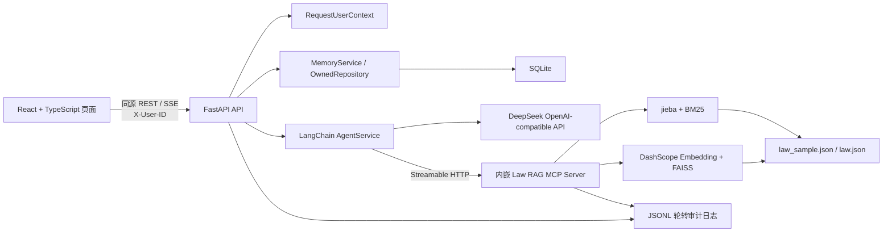

# LawStation 项目 Spec

> 版本：1.1
> 基线日期：2026-08-20  
> 适用仓库：`/Users/Admin1/Files/LawStation`  
> 文档性质：后续开发、代码审查、回归测试和验收的共同基线

## 1. 文档约定

本文使用以下状态标记，避免将目标架构误认为当前实现：

- **[已实现]**：已有代码且已通过当前测试或启动验证。
- **[部分实现]**：主链路存在，但能力、边界或测试尚不完整。
- **[待实现]**：已确定方向，当前代码尚未提供。
- **[禁止]**：后续开发不得引入的实现方式。
- “必须 / 不得”是强制要求；“建议”是推荐要求。

发生冲突时，以用户最新明确需求为最高优先级；修改本 Spec 时必须同步记录变更原因和影响范围。

## 2. 产品目标与范围

LawStation 是面向中国法律咨询场景的多用户对话 Agent。系统通过 DeepSeek 完成多轮回答，由大模型自主判断是否调用法律检索工具及选择工具参数；法律知识通过 MCP 协议提供 BM25 与 FAISS Dense 混合召回；用户的会话、消息、摘要和长期记忆保存在 SQLite 中，并以 `tenant_id + user_id` 作为所有权边界。

首版目标：

- **[已实现]** 页面可切换演示用户、创建和打开会话、流式接收回答。
- **[已实现]** FastAPI、React 静态页面和 MCP Server 使用单进程、单端口运行。
- **[已实现]** 大模型自主选择 `search_laws` 或 `get_law_article` 及参数。
- **[已实现]** 法规检索支持 BM25，并在 Dense 索引就绪时进行 RRF 混合融合。
- **[已实现]** 用户会话、消息、摘要和长期记忆具备服务端所有权过滤。
- **[已实现]** 对话、工具和索引关键事件写入控制台及本地轮转日志。
- **[待实现]** 正式登录、JWT、RBAC 和生产级租户管理。
- **[待实现]** Cross-Encoder 精排。
- **[待实现]** 多机部署和分布式数据存储。

## 3. 总体架构



### 3.1 运行边界

- **浏览器进程**：响应式工作台、用户切换、会话列表、安全 Markdown、完整 SSE 状态消费和索引状态展示。
- **唯一 Uvicorn 进程**：承载 `/api/*`、`/health`、`/docs`、`/mcp/` 和 React 静态文件。
- **MCP 协议边界**：MCP Server 虽与 API 同进程，但 Agent 必须通过 `http://127.0.0.1:8000/mcp/` 调用，不得绕过协议直接调用检索函数。
- **持久化边界**：SQLite 保存用户域数据；`data/indexes/law/` 保存 Dense 索引；`data/logs/` 保存审计日志。

关键实现：

- `run.py::main`、`run.py::build_frontend`
- `backend/app/main.py::lifespan`、`backend/app/main.py::app`
- `mcp_servers/law_rag/server.py::mcp_app`

## 4. 目录和模块职责

| 路径 | 职责 | 关键 symbol / 文件 |
|---|---|---|
| `backend/app/main.py` | FastAPI 组装、生命周期、数据库初始化、MCP 挂载、静态页面托管 | `initialize_database`、`lifespan`、`app` |
| `backend/app/api/` | REST 与 SSE 接口，串联用户上下文、数据库、记忆和 Agent | `routes.py::stream_message`、`routes.py::sse` |
| `backend/app/agent/` | DeepSeek 接入、MCP 工具发现、模型工具循环、工具审计记录 | `service.py::AgentService`、`SYSTEM_PROMPT` |
| `backend/app/core/` | `.env` 配置、不可变用户上下文、审计日志和脱敏 | `Settings`、`RequestUserContext`、`audit`、`redact` |
| `backend/app/db/` | SQLAlchemy 引擎、会话工厂和领域表模型 | `Base`、`SessionLocal`、各 ORM Model |
| `backend/app/services/` | 所有权限定仓储和记忆上下文/压缩 | `OwnedRepository`、`MemoryService` |
| `backend/app/schemas.py` | API 输入校验模型 | `ConversationCreate`、`ChatRequest`、`MemoryUpdate` |
| `mcp_servers/law_rag/` | 法规切分、BM25、Dense、索引生命周期和 MCP 工具 | `LawSearchEngine`、`search_laws`、`get_law_article` |
| `frontend/src/` | React 响应式工作台、用户/会话隔离、Markdown 消息、完整 SSE 状态和索引状态展示 | `App.tsx::App`、`api.ts::api`、`sse.ts::consumeSse` |
| `frontend/src/components/` | 侧栏、顶栏、消息、输入器和安全状态提示等展示组件 | `Sidebar`、`ChatHeader`、`MessageList`、`Composer`、`StatusNotice` |
| `frontend/src/test/` | SSE、用户切换、输入器和状态展示测试 | `sse.test.ts`、`App.test.tsx`、`components.test.tsx` |
| `scripts/` | 可复现样本生成与手工索引构建 | `create_sample`、`build` |
| `data/knowledge/law/` | 原始法规与固定抽样法规 | `law.json`、`law_sample.json` |
| `data/indexes/law/` | manifest、chunk、Embedding 与 FAISS 产物 | `manifest.json`、`chunks.jsonl`、`embeddings.npy`、`law.faiss` |
| `data/runtime/` | SQLite 运行数据 | `lawstation.db` |
| `data/logs/` | JSON Lines 审计日志 | `lawstation.log` 及轮转文件 |
| `tests/` | 样本、索引幂等、隔离、日志脱敏和启动器测试 | `test_*.py` |
| `tools/` | 历史参考工具，仅供阅读 | **不得导入、修改或重构** |
| `ai-context/` | 面向后续开发和 Agent 的项目上下文文档 | 本 Spec |

## 5. 启动与生命周期

### 5.1 本地环境

- **[已实现]** 项目统一使用 Conda 环境 `LawStation`。
- 环境定义位于 `environment.yml`，当前包含 Python 3.12、Node.js 22、pip 和 `.[dev]`。
- **[禁止]** 在仓库内创建或依赖 `.venv`、`venv` 等项目级 Python 虚拟环境。
- 所有应用配置和密钥必须放入根目录 `.env`；不得用 Conda 环境变量维护业务配置。

```bash
conda env create -f environment.yml
conda activate LawStation
python run.py
```

### 5.2 `python run.py` 流程

1. `run.py::main` 将工作目录固定到仓库根目录。
2. `Settings` 从根目录 `.env` 加载配置。
3. `frontend_is_stale` 判断前端构建是否缺失或过期。
4. 需要构建时，优先以 `npm ci` 安装锁定依赖，然后执行 `npm run build`。
5. 启动唯一 Uvicorn 进程。
6. `backend.app.main::lifespan` 初始化日志、数据库和演示用户。
7. `initialize_engine` 同步加载法规和 BM25，验证 Dense 索引；必要时后台建库。
8. 进入 `mcp.session_manager.run()`，确保 MCP 嵌入式 ASGI 生命周期有效。
9. 停止时取消后台索引任务、关闭检索引擎和 MCP session manager。

启动参数：`--rebuild`、`--no-build`、`--host`、`--port`。生产/常规开发不默认开启 Uvicorn reload，防止重复初始化索引和 MCP session manager。

## 6. 核心请求链路

### 6.1 用户和会话链路

1. 前端在请求头发送 `X-User-ID`。
2. `get_user_context` 查询用户并生成不可变 `RequestUserContext(tenant_id, user_id, request_id)`。
3. `OwnedRepository` 的每条会话、消息和记忆 SQL 同时限定 `tenant_id` 与 `user_id`。
4. 会话不存在或不属于当前用户时统一返回“会话不存在或无权访问”。

**安全边界：** 当前 `X-User-ID` 只是演示用户切换，不构成身份认证。上线前必须由 JWT claims 建立 `RequestUserContext`，但领域服务和仓储接口应保持不变。

### 6.2 流式问答链路

1. `POST /api/conversations/{conversation_id}/messages/stream` 校验会话归属。
2. 保存用户原始消息并记录 `conversation.received`、`conversation.started`。
3. `MemoryService.context` 加载当前用户的长期记忆、当前会话摘要和近期消息。
4. `AgentService.run` 发现 MCP 工具并将工具 schema 绑定到 DeepSeek。
5. 大模型自主判断是否调用工具、选择工具及参数；每轮最多调用 `AGENT_MAX_TOOL_CALLS` 次。
6. 工具调用结果以 `ToolMessage` 返回模型，并保存 `ToolCallRecord`；法规查询同时保存 `RetrievalTrace`。
7. 模型 token 通过 SSE 逐步返回前端。
8. 完成后保存助手消息，执行记忆压缩/沉淀并返回 `memory_status` 与 `message_end`。
9. 流取消时保存已有部分回答为 `interrupted`；异常时发送 `error` 事件并写审计日志。

SSE 事件契约：

- `message_start`
- `tool_call_start`
- `tool_call_result`
- `token`
- `memory_status`
- `message_end`
- `error`

`citations` 是既定扩展事件，**[待实现]**。

### 6.3 法规检索链路

1. `LawSearchEngine.__init__` 读取 `LAW_DATA_PATH`，按法条加载并构建 BM25。
2. 超过阈值的法条由 `split_text` 按段落/标点分块，默认 1,000 字、重叠 150 字。
3. 指纹包含源文件 SHA256、切分版本/参数、Embedding 模型和维度。
4. `_validate_and_load` 只有在 manifest、chunks、embeddings 和 FAISS 全部有效时才复用索引。
5. 索引无效时以 staging、文件锁、批次 checkpoint 和原子替换构建；旧有效索引不因失败而被覆盖。
6. Dense 未就绪或无 DashScope 密钥时降级到 BM25。
7. Dense 就绪时，BM25 与 FAISS 候选使用 RRF 合并并去重。

MCP 工具契约：

```text
search_laws(query: string, top_k: integer = 8, filters?: object)
get_law_article(law_name: string, article_number: string)
```

当前 `filters` 仅支持 `law_name`。`top_k` 在服务端限制为 1～20。

## 7. 记忆系统

### 7.1 三层记忆

- **原始消息 [已实现]**：`messages` 完整保存用户、助手消息及状态。
- **工作记忆 [已实现]**：当前会话的 `conversation_summaries` 加最近若干消息。
- **长期记忆 [部分实现]**：`user_memories` 保存从旧用户消息沉淀的事实。

### 7.2 当前压缩算法

`MemoryService.consolidate` 以字符数除以 2 粗略估算 token；达到 `MEMORY_COMPRESSION_THRESHOLD` 后保留最近 `MEMORY_RECENT_MESSAGE_COUNT` 条，将旧消息拼接成摘要，并把长度不少于 20 字的旧用户消息作为长期记忆保存。

当前限制：

- **[部分实现]** 摘要是截断拼接，不是大模型语义摘要。
- **[部分实现]** 长期记忆提取没有事实分类、冲突合并、置信度和过期策略。
- **[待实现]** `MEMORY_CONTEXT_TOKEN_LIMIT` 已配置，但尚未用于严格上下文预算。
- **[待实现]** 记忆来源和修订历史的完整可追溯机制。

### 7.3 强制隔离规则

- 所有用户域记录必须带 `tenant_id + user_id`。
- 记忆查询、更新、删除的所有权条件必须进入同一条 SQL；禁止先按 `memory_id` 获取后在应用层判断。
- `conversation_id` 必须归属于当前上下文用户。
- 模型和 MCP 工具不得接收或推断记忆查询所用的 `user_id`。
- 更新/删除其他用户 ID 时统一返回“不存在或无权访问”，不得泄露记录是否存在。
- 流建立后必须固定使用创建该流时的 `RequestUserContext`；前端切换用户必须先中止旧流。

## 8. 数据模型

| 表 | 用途 | 关键所有权/约束 |
|---|---|---|
| `tenants` | 租户 | `id` 主键 |
| `users` | 演示用户 | `tenant_id` 外键；`tenant_id + id` 唯一 |
| `conversations` | 用户会话 | `tenant_id + user_id + id` 唯一及复合外键 |
| `messages` | 原始消息 | 复合外键指向所属用户会话 |
| `conversation_summaries` | 滚动摘要 | 每个所属用户会话一条当前摘要 |
| `user_memories` | 长期记忆 | 复合外键指向来源用户会话；所有操作必须限定所有者 |
| `tool_call_records` | 工具调用数据库审计 | 保存用户、会话、参数、结果摘要、状态和耗时 |
| `retrieval_traces` | 法规检索追踪 | 保存用户、会话、查询及截断结果 |
| `index_manifests` | 已构建索引版本记录 | `data_version` 唯一 |

模型定义：`backend/app/db/models.py`。数据库会话：`backend/app/db/session.py::SessionLocal`。

## 9. API 契约

| 方法与路径 | 用途 | 用户上下文 |
|---|---|---|
| `GET /health` | 服务和索引简化状态 | 不需要 |
| `GET /docs` | OpenAPI 文档 | 不需要 |
| `GET /api/index/status` | 索引状态和进度 | 不需要 |
| `GET /api/users` | 演示用户列表 | 不需要；正式认证后应重新评估 |
| `GET /api/conversations` | 当前用户会话列表 | 必须 |
| `POST /api/conversations` | 创建当前用户会话 | 必须 |
| `GET /api/conversations/{id}/messages` | 当前用户会话消息 | 必须 |
| `POST /api/conversations/{id}/messages/stream` | SSE 问答 | 必须 |
| `GET /api/memories` | 当前用户记忆，可按会话过滤 | 必须 |
| `PATCH /api/memories/{id}` | 修改当前用户记忆 | 必须 |
| `DELETE /api/memories/{id}` | 删除当前用户单条记忆 | 必须 |
| `DELETE /api/memories` | 清空当前用户全部或指定会话记忆 | 必须 |
| `/mcp/` | Streamable HTTP MCP | Agent 内部使用 |

## 10. 技术选型

| 领域 | 选型 | 当前用途 |
|---|---|---|
| Python 环境 | Conda，环境名 `LawStation` | 统一管理 Python 3.12、Node 22 和项目依赖 |
| 后端 Web | FastAPI + Uvicorn | REST、SSE、生命周期和静态文件托管 |
| AI 编排 | LangChain Core、LangChain OpenAI、LangChain MCP Adapters | DeepSeek 调用、工具绑定、MCP Client |
| 大模型 | DeepSeek，OpenAI-compatible API | 对话、工具决策和回答生成 |
| MCP | MCP Python SDK，Streamable HTTP | 标准化暴露法规检索工具 |
| 词法检索 | jieba + rank-bm25 | 中文分词与 BM25 召回 |
| Dense Embedding | DashScope 兼容接口、`qwen3.7-text-embedding`、1024 维 | 文档及查询向量化 |
| 向量索引 | FAISS `IndexFlatIP` | 归一化向量的内积/余弦近邻搜索 |
| 混合融合 | Reciprocal Rank Fusion | 合并 BM25 与 Dense 排名 |
| 数据库 | SQLite + SQLAlchemy 2.x | 用户、会话、消息、记忆和审计数据 |
| 配置 | pydantic-settings + 根目录 `.env` | 类型化读取全部应用环境变量 |
| 前端 | React + TypeScript + Vite | 响应式单页法律咨询工作台和同源 API 消费 |
| 前端网络层 | 原生 `fetch` + `ReadableStream` | 类型化 REST 封装和完整 SSE 事件消费；不使用 TanStack Query |
| 前端内容/图标 | react-markdown + remark-gfm + lucide-react | 禁止原始 HTML 的 Markdown 展示和一致的矢量图标 |
| 日志 | Python logging + `RotatingFileHandler` | 控制台和 JSONL 文件审计 |
| 测试/质量 | pytest、pytest-asyncio、ruff、Vitest、Testing Library | 后端单元/异步测试及前端交互、SSE 测试 |
| 容器 | Docker 多阶段构建 + Docker Compose | Node 构建前端、Python 运行单容器应用 |

### 10.1 明确延期的技术

- Cross-Encoder 精排。
- Redis 或其他缓存服务。
- MQ。
- 独立业务 RPC 服务。
- PostgreSQL、分布式向量数据库。
- JWT、OAuth2、RBAC。

除非需求明确变更，不得为了“预留”而提前引入上述基础设施。

## 11. 配置规范

全部运行配置必须定义在 `backend/app/core/config.py::Settings`，并在 `.env` 与 `.env.example` 中保持同名、同类型语义：

```text
DEEPSEEK_API_KEY
DEEPSEEK_BASE_URL
DEEPSEEK_MODEL
DASHSCOPE_API_KEY
DASHSCOPE_BASE_URL
EMBEDDING_MODEL
EMBEDDING_DIMENSION
DATABASE_URL
LAW_DATA_PATH
INDEX_DIR
MCP_LAW_SERVER_URL
MCP_DEBUG_HOST
MCP_DEBUG_PORT
MCP_TOOL_TIMEOUT_SECONDS
AGENT_MAX_TOOL_CALLS
MEMORY_CONTEXT_TOKEN_LIMIT
MEMORY_COMPRESSION_THRESHOLD
MEMORY_RECENT_MESSAGE_COUNT
APP_HOST
APP_PORT
LOG_LEVEL
LOG_DIR
LOG_MAX_BYTES
LOG_BACKUP_COUNT
AUDIT_SUMMARY_MAX_CHARS
INDEX_AUTO_BUILD
INDEX_CHUNK_MAX_CHARS
INDEX_CHUNK_OVERLAP_CHARS
INDEX_BUILD_BATCH_SIZE
```

强制规则：

- `.env` 存放真实值且必须被 Git 忽略；建议文件权限为 `0600`。
- `.env.example` 只提供安全示例，不得包含真实密钥。
- 新增配置时必须同时修改 `Settings`、`.env.example`、相关测试和本 Spec；本地 `.env` 也必须补齐。
- **[禁止]** 在源代码、前端产物、日志、Dockerfile、Compose 文件或测试中硬编码真实密钥。
- **[禁止]** 使用散落的 `os.getenv`/`os.environ` 读取或写入应用配置；统一通过 `get_settings()`。
- 前端不得获得 DeepSeek、DashScope 或任何服务端密钥。

## 12. 法规数据与索引规范

### 12.1 数据源

- 原始全集：`data/knowledge/law/law.json`，不得由运行时或抽样脚本修改。
- 默认样本：`data/knowledge/law/law_sample.json`，固定 seed 42、无放回抽取 100 条、按原位置排序。
- 默认所有切分、BM25、Dense、指纹与查询必须统一读取 `LAW_DATA_PATH`。
- 切回全量数据只允许修改 `.env` 中 `LAW_DATA_PATH`，不得在代码中另写路径分支。

### 12.2 幂等和可靠性

- 只有 manifest 指纹、chunk 数、Embedding shape、FAISS 维度和 `ntotal` 全部一致时才能跳过建库。
- `chunk_id` 必须由源法条标识、chunk 序号和内容哈希稳定生成。
- 构建必须使用文件锁、staging 和原子切换；失败不得破坏旧有效索引。
- 无 Dense 能力时服务必须继续提供 BM25，而不是阻止页面和 API 启动。
- 手工构建脚本必须复用 `LawSearchEngine`，不得维护第二套切分/建库实现。

## 13. 审计、安全与隐私

### 13.1 日志要求

- 控制台和 `data/logs/lawstation.log` 同时输出 JSON Lines。
- 默认单文件 20 MB、保留 10 个轮转文件；写文件失败时降级到 stderr，不得中断问答。
- 对话链路至少记录 received、started、completed、interrupted、failed。
- 工具链路至少记录 discovery 和 call 的 started、completed、failed、timeout。
- 索引链路至少记录 check、build、progress、loaded、switched、failed。
- `request_id`、`tenant_id`、`user_id`、`conversation_id` 应在适用事件中完整关联。

### 13.2 隐私要求

- 问题、回答和参数日志只允许记录限定长度的脱敏摘要。
- 手机号、身份证号、银行卡号、邮箱必须脱敏。
- 不得记录 API Key、Authorization header、`.env` 内容或模型内部推理过程。
- 文件审计日志不得记录完整法条正文。
- 工具结果日志只保留数量、document ID、法律名称、条号及耗时等元数据。

**[部分实现]** 文件日志满足脱敏摘要要求；数据库 `ToolCallRecord.result_summary` 和 `RetrievalTrace.results_json` 当前仍保存较长的截断工具结果。后续进入真实用户数据测试前，必须制定数据库审计留存、正文最小化和清理策略。

## 14. 开发要求与准则

### 14.1 必须做的事

- 修改前先从代码验证现状，不得只依据 README 或本 Spec 推断实现。
- 任何用户域读写必须从 `RequestUserContext` 获取所有者，且在数据库语句内限定 `tenant_id + user_id`。
- 新 API 必须定义输入模型、错误语义、权限边界和测试。
- 新 MCP 工具必须有明确用途、JSON Schema、超时、调用次数限制和审计事件。
- 涉及具体法律结论时，系统提示和 Agent 行为必须优先检索；无法核验时明确说明，不得虚构法条。
- 阻塞型 BM25、FAISS 和法规精确匹配必须在线程池执行，避免阻塞事件循环。
- 修改索引格式或切分算法时必须改变指纹输入或 `CHUNKER_VERSION`。
- 修改 SSE 事件时必须同步前端消费者、API 文档和回归测试。
- 新增环境变量时同步 `Settings`、`.env.example`、`.env` 和 Spec。
- 后端变更至少运行 `pytest`；相关 Python 文件运行 `ruff check`；前端变更运行 `npm test` 和 `npm run build`。
- 涉及启动链路时，必须实际验证 `/`、`/health`、`/docs`、`/api/index/status` 和 MCP 初始化/工具调用。
- 保持 `python run.py` 为常规运行的唯一启动入口。

### 14.2 不可以做的事

- **[禁止]** 创建或恢复仓库内 `.venv`，或在文档/脚本中要求使用它。
- **[禁止]** 修改、导入、复制嵌入或重构 `tools/*.py`；它们只作参考。
- **[禁止]** 让模型传入任意 `user_id` 访问记忆，或把用户记忆暴露为自由指定用户的 MCP 工具。
- **[禁止]** 提供 `get_memory(memory_id)` 一类无所有者上下文的仓储接口。
- **[禁止]** 仅凭 `memory_id`、`conversation_id` 查询后再在 Python 层判断归属。
- **[禁止]** 因 MCP 与 API 同进程而绕过 MCP 协议直接调用检索函数。
- **[禁止]** 只 `app.mount()` MCP 而不运行 `mcp.session_manager.run()`。
- **[禁止]** 将 API Key、完整敏感输入、完整法条正文或模型推理过程写入日志。
- **[禁止]** 将 `.env`、SQLite 运行库、索引文件、日志、`node_modules`、`frontend/dist` 提交到 Git。
- **[禁止]** 在没有明确需求时接入 `case_tool`、`crime_tool`、`procedure_tool`、`template_tool`、`check_tool`、`plan_tool` 或 `memory_tool`。
- **[禁止]** 默认开启 Uvicorn reload 或启动第二个生产 MCP 进程。
- **[禁止]** Dense 建库失败时让整个应用不可访问。

## 15. 测试与验收基线

当前自动化测试覆盖：

- `tests/test_isolation.py`：其他用户无法列出、修改或删除记忆。
- `tests/test_law_sample.py`：样本数量、来源一致性、可复现性和默认路径。
- `tests/test_index_manager.py`：有效索引跳过 Embedding、强制重建和稳定 chunk ID。
- `tests/test_audit_logging.py`：敏感信息脱敏和摘要长度。
- `tests/test_run.py`：前端过期检测与 `--no-build` 失败语义。
- `frontend/src/test/sse.test.ts`：分块 SSE、全部事件解析和 HTTP 错误语义。
- `frontend/src/test/App.test.tsx`：切换用户时清除上一用户会话数据。
- `frontend/src/test/components.test.tsx`：输入快捷键、停止生成、索引降级和安全工具状态。

截至本 Spec 基线：Conda 环境下后端 `pytest -q` 为 **10 passed**，前端 `npm test` 为 **9 passed**；前端生产构建、桌面端和 375px 响应式页面验证通过。

每次发布至少满足：

1. 用户 A 无法读取、修改、删除用户 B 的记忆或使用其会话问答。
2. 并发流不能跨用户串写，切换用户会中止旧流。
3. 服务重启后会话和记忆隔离仍有效。
4. 有效索引启动时不会重新调用 Embedding。
5. 缺少 Dense 密钥或索引构建失败时 BM25 仍可查询。
6. Agent 能自主选择法律工具和参数，调用次数与超时受控。
7. 日志可用 `request_id` 串联且不泄露敏感数据。
8. `tools/*.py` 在开发前后哈希不变。
9. `.env` 未被 Git 跟踪，前端产物不含服务端密钥。
10. `python run.py` 可从 Conda `LawStation` 环境启动完整程序。

## 16. 当前已知缺口与建议优先级

### P0：进入真实数据前必须完成

- 接入正式认证，从可信 token claims 建立用户上下文，移除公开演示用户切换的安全假设。
- 增加跨用户会话、消息、摘要、记忆和并发 SSE 的 API 集成测试。
- 收紧数据库工具审计内容，建立留存周期与数据清理策略。
- 为异常、客户端断流、数据库提交失败补充事务和资源关闭测试。

### P1：核心体验与质量

- 使用模型或结构化抽取实现长期记忆分类、合并、纠错和置信度。
- 真正执行 `MEMORY_CONTEXT_TOKEN_LIMIT`，避免上下文无限增长。
- 增加法规引用结构及 `citations` SSE 事件，前端展示法律名称、条号和来源。
- 增加 RAG 评测集，衡量召回率、法条准确率和无依据回答率。

### P2：检索与部署演进

- 接入 Cross-Encoder 精排并保留可关闭配置。
- 支持更多法规元数据过滤和法条版本/效力状态。
- 评估多进程部署下索引构建协调、SQLite 并发限制和迁移方案。
- 引入数据库 schema migration 工具；当前 `create_all` 不承担正式迁移能力。

## 17. 关键代码导航

后续开发前建议按以下顺序阅读：

1. `run.py::main`：统一启动和前端构建策略。
2. `backend/app/main.py::lifespan`：全系统生命周期和 ASGI 挂载。
3. `backend/app/api/routes.py::stream_message`：完整对话主链路。
4. `backend/app/core/context.py::RequestUserContext`：用户隔离信任边界。
5. `backend/app/services/repositories.py::OwnedRepository`：所有权 SQL 规则。
6. `backend/app/services/memory.py::MemoryService`：当前记忆装配与压缩实现。
7. `backend/app/agent/service.py::AgentService`：LLM、MCP 与工具循环。
8. `mcp_servers/law_rag/engine.py::LawSearchEngine`：切分、索引、降级和混合检索。
9. `backend/app/db/models.py`：领域模型和复合外键约束。
10. `backend/app/core/logging.py`：审计格式、轮转和脱敏边界。

## 18. Spec 维护规则

- 架构边界、API、数据模型、配置项、索引格式、安全规则或技术选型发生变化时，代码 PR 必须同步更新本文件。
- 已实现能力必须有代码路径和测试依据；不能确认的内容必须标记为“推测”或“待验证”。
- 完成待实现项后，应将状态改为“已实现”，补充关键 symbol 和验收测试。
- 每次基线更新应修改版本和日期，并在本节追加简短变更摘要。

### 变更记录

- **1.0 / 2026-08-20**：依据当前仓库代码和既有需求历史建立首份完整 Spec。
- **1.1 / 2026-08-20**：完成响应式法律咨询工作台重构，增加安全 Markdown、完整 SSE 状态、停止/重试、请求快照隔离和前端自动化测试。
