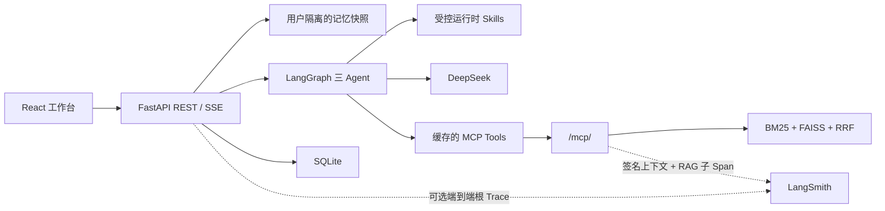

# LawStation 全项目 Review 文档

> Review 基线：2026-08-25 当前工作区代码。结论以代码、配置、迁移和测试交叉验证为准。

## 项目定位

LawStation 是一个单进程、单端口的多用户法律咨询 Agent：React 页面通过 FastAPI REST/SSE 访问三 Agent LangGraph，研究 Agent 经标准 MCP 协议调用 BM25 + Ollama Dense + FAISS 法规检索；SQLite 保存会话、审计和分层记忆，LangSmith 提供可选的链路追踪与低资源评测。

## 可直接用于简历的 SDD 工程实践

- 采用 **Spec-Driven Development（SDD）** 管理 Agent 项目演进：在 `ai-context/SPEC.md` 中先定义架构边界、Agent/RAG/记忆状态语义、API 与配置契约、安全约束和验收标准，再按最小变更原则实现；每次功能变更同步回写 Spec、受影响的 `resume/` 模块说明和架构核验结果，形成“需求澄清 → Spec 冻结 → 代码实现 → 自动化测试/离线评测 → 文档回写”的可追溯闭环。
- 将 Spec 作为开发约束而非实现事实的替代品：Review 时仍以代码、配置、Alembic 迁移和测试交叉验证，并用“已验证/部分实现/推测/文档偏差”区分完成度，避免把计划能力误写成已落地能力。
- 把关键非功能需求固化为可验收规则，包括租户与会话隔离、`no_match` 防幻觉、chunk 级引用归属、模型/工具循环上限、SSE 中断恢复、密钥与推理内容保护，以及后端测试、静态检查、前端测试和生产构建门禁。

简历精简写法：

> 采用 Spec-Driven Development（SDD）推进多 Agent 系统迭代，将架构边界、状态机、API/配置契约、安全规则和验收指标沉淀为版本化 Living Spec；建立 Spec—代码—测试—评测—文档的双向追溯机制，并以自动化回归和量化实验验证每次 Agent、RAG 与记忆链路变更。

状态标签：

- **已验证**：当前代码存在完整调用链或对应测试。
- **部分实现**：类型、配置或接口存在，但业务链路尚未完全接通。
- **推测**：代码不足以确认，只能作为演进判断。
- **文档偏差**：README/SPEC 与当前代码行为不一致。

## 阅读导航

1. [架构总览](architecture.md)：边界、依赖、共享状态与技术栈。
2. [启动与生命周期](startup.md)：`python run.py` 到应用关闭。
3. [API 与聊天链路](api-chat.md)：所有权、SSE、心跳和持久化。
4. [三 Agent 编排](agent.md)：分析、检索、生成、复核与引用。
5. [RAG 与 MCP](rag.md)：切分、建库、混合召回和证据追踪。
6. [分层记忆](memory.md)：快照、提取、摘要和最新事实覆盖。
7. [数据模型与隔离](data-isolation.md)：SQLite、Repository 和 Alembic。
8. [并发与后台流](concurrency.md)：配额、会话互斥和页面切换。
9. [前端实现](frontend.md)：组件、缓存、SSE parser 和记忆治理。
10. [LangSmith 与评测](langsmith.md)：追踪、指标、预算和报告。
11. [LangSmith 使用与简历数据指南](langsmith-usage-guide.md)：从零成本学习到小样本云端对比，以及简历指标采用规则。
12. [量化评测实测结果](eval-results.md)：100条通用回归、300条Dense挑战、200条BGE排序挑战、Agent见证边界和可用简历表述。
13. [配置、测试与部署](config-test-deploy.md)：环境、构建、Docker 和测试矩阵。
14. [Review 发现](review-findings.md)：亮点、偏差、风险和改进优先级。

## 一句话主链路

## Review 结论摘要

- **已验证**：正式启动是一个 Uvicorn 进程、一个端口；MCP 作为 ASGI 子应用挂载，前端由 FastAPI 托管。关键入口：`run.py::main`、`backend/app/main.py::lifespan`。
- **已验证**：三 Agent 是同一 LangGraph 内的角色分工，不是三个服务；只有 `LegalConsultationGraph.legal_researcher` 可以执行 MCP 工具。
- **已验证**：用户隔离依靠 `RequestUserContext` 与所有权 SQL 条件；这是演示身份，不是真实认证。
- **已验证**：同一会话互斥、同一用户最多 2 个、全局最多 6 个 Graph；页面切换不会中断其他会话流。
- **已验证**：正文并非模型 token 原样直出。系统先完成草稿和复核，再由 `AgentRuntime.stream` 每 24 个字符发送最终答案；推理期间通过状态事件和 SSE heartbeat 保活。
- **已验证**：法规空结果 `no_match` 是正常业务状态，会继续形成低置信度一般性分析，不自动重复检索。
- **已验证**：新长期记忆自动生效；确认/拒绝接口主要服务历史或兼容治理场景。
- **部分实现**：`MemorySnapshot` 已定义但未作为真实返回类型使用；线上 LLM evaluator 有配置，但没有独立在线调度器。
- **文档偏差**：非 8000 端口启动时，默认 `MCP_LAW_SERVER_URL` 不会自动跟随 `--port` 调整。
- **已验证**：`tools/` 是参考/遗留工具集合，正式 Agent、MCP 和 API 代码没有导入它。
- **已验证**：启动器提供 LangSmith `config/all/off` 进程级开关；全量模式把 SSE 编排、三 Agent、MCP 和 RAG 内部阶段关联为一个咨询根 Trace，并以 Session 上限保护线上资源。
- **已验证**：运行时 Skill 采用“模型建议 + 服务端裁决”，只在选中后加载完整指令；4 个领域 Skill 受角色、工具和最多 2 个组合约束，关闭或普通执行失败时基础三 Agent 链路仍可运行。
- **已验证**：`.agents/skills/` 将 SDD 变更闭环和评测真实性审核固化为仓库开发 Skill；它们不进入线上 Agent Prompt。

## 建议 Review 顺序

先读 `architecture.md → api-chat.md → agent.md` 理解主链路，再读 `rag.md` 和 `memory.md` 理解两条核心能力，最后读 `review-findings.md` 评估生产化差距。

## 本次验证结果

- 后端：Conda `LawStation` 环境、临时 SQLite，`153 passed`；两条第三方依赖 warning，不影响结果。
- 前端：Vitest `4` 个测试文件、`14 passed`。
- 文档：导航目标、关键 symbol、Markdown 围栏和敏感信息扫描通过。
- 已执行：前端 Vitest `4` 个测试文件、`14 passed`，Vite 生产构建成功；两个仓库开发 Skill 通过 `quick_validate.py`。
- 未执行：服务启动、Ollama、真实 Embedding、DeepSeek 和 LangSmith 上传。
