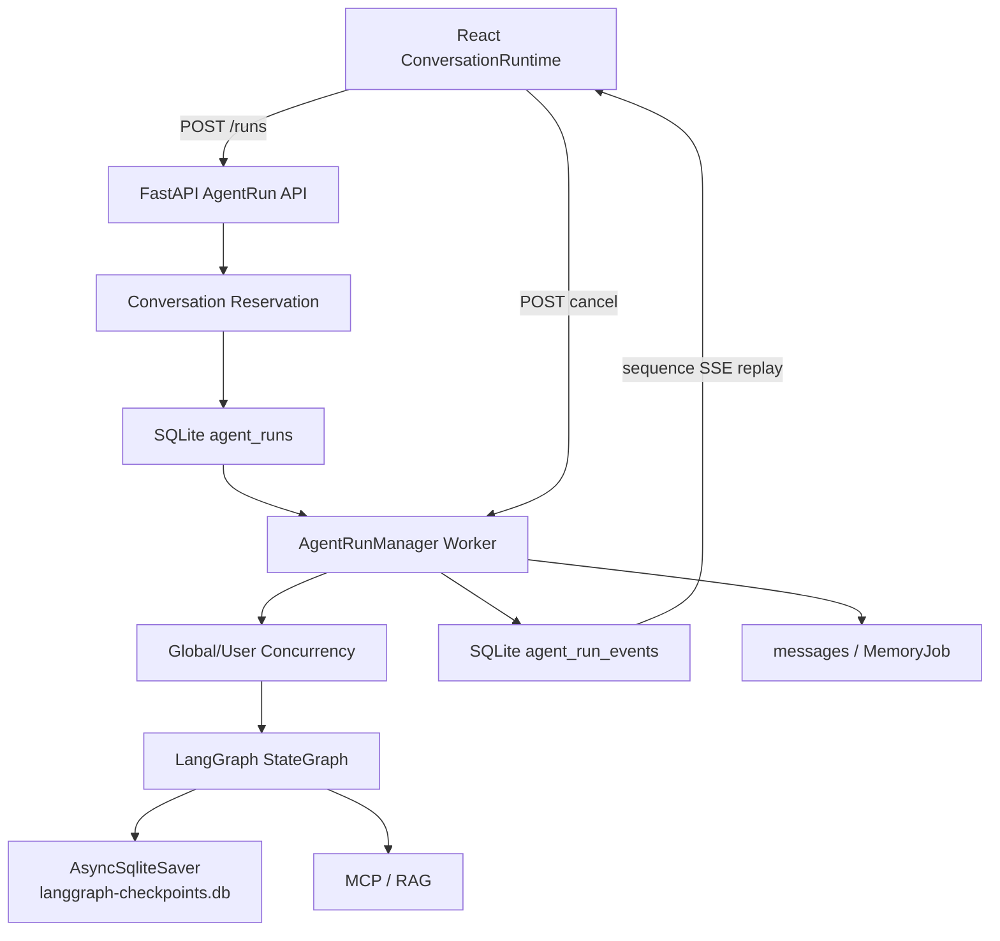
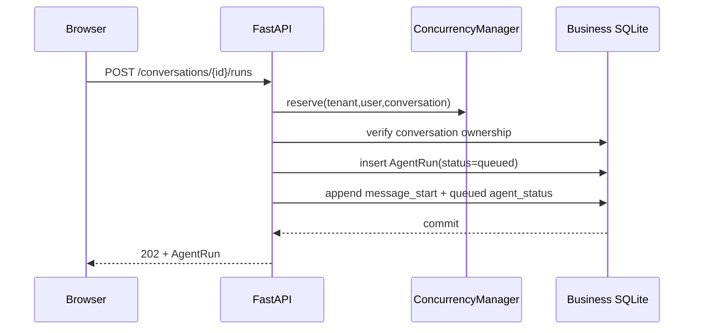

# LawStation Agent 任务持久化功能分析

> Review 基线：2026-09-01 当前工作区。本文只描述代码、配置、Alembic 迁移和测试能够证明的行为。核心入口为 `backend/app/services/agent_runs.py::AgentRunManager`、`backend/app/agent/checkpoint.py::checkpoint_saver` 和 `backend/app/agent/runtime.py::AgentRuntime.stream`。

## 1. 设计结论

LawStation 没有把长时间咨询绑定在浏览器 SSE 连接上，而是采用两层持久化：

```text
业务任务层：AgentRun + AgentRunEvent
├── 所有权、排队、状态机和同会话互斥
├── Worker 领取、并发配额、租约和取消
├── 最终消息幂等写入
└── SSE sequence 事件日志与断线重放

Graph 执行层：LangGraph AsyncSqliteSaver
├── StateGraph super-step Checkpoint
├── 已完成节点和中间业务状态
├── 节点级故障恢复
└── 模型/工具调用计数恢复
```

两层职责不能混用：

- `AgentRunManager` 回答“任务属于谁、是否排队、由谁执行、是否取消、前端从哪里续订、最终消息是否保存”；
- `AsyncSqliteSaver` 回答“Graph 已运行到哪个 super-step、恢复时哪些节点无需重做、State 中已有何种分析和证据”；
- `messages`、会话摘要和长期记忆仍是跨轮上下文的唯一事实源，Checkpoint 不承担跨轮记忆职责。

因此当前实现应表述为：**单机持久化 Agent 任务 + LangGraph 节点级恢复 + 可重放 SSE**，而不是分布式任务队列。

## 2. 为什么不能只使用 LangGraph Checkpoint

普通 SSE 断开后无法表示任务所有权、取消和事件游标；但 LangGraph Checkpoint 本身也不负责：

- `tenant_id + user_id + conversation_id` 所有权；
- 同会话唯一活动任务；
- queued/running/terminal 业务状态；
- Worker 租约和排队配额；
- SSE sequence、Last-Event-ID 和前端重放；
- 最终 Message ID 与幂等落库。

所以项目额外建立 `agent_runs` 和 `agent_run_events`，让 Checkpoint 专注 Graph 执行恢复。

## 3. 总体架构



| 对象 | 生命周期 | 状态边界 |
|---|---|---|
| `AgentRunManager` | FastAPI 应用级 | 持有 Worker task 映射，不把当前用户状态放入共享 Graph |
| `AgentRuntime` / 编译 Graph | 应用级复用 | 不保存当前消息、证据或回答 |
| `AsyncSqliteSaver` | 应用 lifespan | 通过独立 `thread_id` 隔离每个 Run |
| `AgentService` / `AgentInvocationContext` | 单次 Run | 保存本轮身份、调用计数、Trace 和 Skill 结果 |
| SQLAlchemy Session | 单次短事务 | 不跨越 LLM、MCP 或整段 SSE |
| 前端 `ConversationRuntime` | `userId:conversationId` | 每个用户与会话独立缓存和订阅 |

## 4. 数据存储划分

### 4.1 业务数据库

默认位于 `data/runtime/lawstation.db`：

- `agent_runs` 保存任务事实和终态；
- `agent_run_events` 保存可向前端公开的有序事件；
- `messages` 保存正式用户和助手消息；
- `memory_jobs` 在回答完成后异步整理记忆。

### 4.2 Checkpoint 数据库

默认位于 `data/runtime/langgraph-checkpoints.db`。`checkpoint_saver()` 创建应用生命周期的 `aiosqlite` 连接，并使用：

```python
AsyncSqliteSaver(
    connection,
    serde=JsonPlusSerializer(pickle_fallback=False),
)
```

Checkpoint 与业务 SQLite 分离，避免 LangGraph 高频写入和消息/记忆事务争用同一文件。`pickle_fallback=False` 禁止任意 Pickle 回退；配置 `LANGGRAPH_STRICT_MSGPACK=true` 后启用严格序列化路径。

## 5. AgentRun 数据模型

定义位于 `backend/app/db/models.py::AgentRun`，迁移位于 `alembic/versions/20260826_05_agent_runs.py`。

### 5.1 所有权字段

| 字段 | 作用 |
|---|---|
| `id` | Run UUID，前端订阅和取消目标 |
| `request_id` | 审计关联 ID，数据库唯一 |
| `tenant_id` | 租户边界 |
| `user_id` | 用户边界 |
| `conversation_id` | 会话边界 |
| `input_text` | 本轮用户输入副本 |

`tenant_id + user_id + conversation_id` 通过复合外键关联会话。创建、读取、取消和事件查询均在 SQL 条件中限定所有者。

### 5.2 状态与执行字段

| 字段 | 作用 |
|---|---|
| `status` | `queued/running/completed/interrupted/failed` |
| `current_stage` | `queued/analyzing/researching/drafting/reviewing/...` |
| `attempt` | Worker 成功 claim 的次数 |
| `cancel_requested` | 持久化取消标记 |
| `lease_owner` | 当前 Worker 标识 |
| `lease_expires_at` | 运行租约到期时间 |
| `started_at/completed_at` | 首次开始和终态时间 |

### 5.3 幂等与恢复字段

| 字段 | 作用 |
|---|---|
| `user_message_id` | 恢复时复用已保存用户消息 |
| `assistant_message_id` | 恢复时复用已保存最终回答 |
| `langgraph_thread_id` | 固定为 `agent-run:<run_id>`，数据库唯一 |
| `latest_checkpoint_id` | 完成时记录最新 Checkpoint ID |
| `last_event_seq` | Event 单调序号计数 |
| `model_call_count/tool_call_count` | 本轮最终调用数 |
| `error_type/error_summary` | 失败类型和脱敏摘要 |

`latest_checkpoint_id` 当前只在最终回答持久化时写回，运行中的真实最新节点位置仍以 Checkpoint 数据库为准，它不是实时进度指针。

## 6. AgentRunEvent 数据模型

`backend/app/db/models.py::AgentRunEvent` 保存：

```text
run_id
tenant_id
user_id
conversation_id
sequence
event_type
payload_json
created_at
```

约束包括：

- `(run_id, sequence)` 唯一；
- 所有权索引为 `(tenant_id, user_id, run_id, sequence)`；
- 会话或 Run 删除时事件级联删除；
- 追加事件时在同一事务中递增 `run.last_event_seq` 并写 Event。

当前公开事件包括：

```text
message_start
agent_status
tool_call_start
tool_call_result
token
citations
memory_status
message_end
error
```

内部推理、Prompt、完整工具结果和未复核草稿不会进入该事件表。

## 7. 创建任务与同会话互斥

入口：

```http
POST /api/conversations/{conversation_id}/runs
X-User-ID: <user>

{"content": "用户问题"}
```



同一会话互斥有两层：

1. `AgentConcurrencyManager.reserve()` 在当前进程内立即拒绝重复会话；
2. SQLite 部分唯一索引 `uq_agent_run_active_conversation` 保证同一 `tenant_id + user_id + conversation_id` 只能有一个 `queued/running` Run。

冲突返回 HTTP 409。数据库唯一索引用于封闭进程内检查与落库之间的竞争窗口；不同会话仍可排队或并发。

## 8. Worker 调度与并发准入

`AgentRunManager.start()` 创建 `agent-run-worker`，默认每 `0.5` 秒：

1. 按 `created_at` 查询最早的 queued Run；
2. 单次最多读取 `AGENT_GLOBAL_CONCURRENCY * 4` 条，当前为 24；
3. 为尚未在 `_active` 中的 Run 创建 `asyncio.Task`；
4. 真正执行前调用 `AgentConcurrencyManager.acquire()`；
5. 获得配额后才把 Run claim 为 running。

```dotenv
AGENT_GLOBAL_CONCURRENCY=6
AGENT_PER_USER_CONCURRENCY=2
AGENT_PER_CONVERSATION_CONCURRENCY=1
AGENT_QUEUE_TIMEOUT_SECONDS=30
AGENT_RUN_WORKER_POLL_SECONDS=0.5
```

同会话限制由 reservation 和数据库唯一索引保证；`acquire()` 只计算全局和用户配额。等待某个用户配额的请求不会提前占用全局运行计数。

成功 claim 后：

- `status=running`、`current_stage=analyzing`；
- `attempt += 1`；
- 写入 `lease_owner/lease_expires_at`；
- 追加“正在启动案情分析”的 `agent_status`。

排队超过 30 秒会进入统一失败路径，不会在获得配额前调用模型或 MCP。

## 9. 运行租约

默认：

```dotenv
AGENT_RUN_LEASE_SECONDS=120
```

活动任务每 `lease/3` 续约，即默认每 40 秒更新一次。续约 SQL 同时限定：

```text
run_id
status=running
lease_owner=当前 Worker
```

当前租约主要记录单机 Worker 归属并为演进预留字段。启动恢复会处理全部遗留 running Run，并未按 lease 过期时间实现多个实例之间的原子抢占，因此不能描述为已完成的分布式租约队列。

## 10. LangGraph Checkpoint 接入

FastAPI lifespan 先创建 Saver，再注入 `AgentRuntime`。`LegalConsultationGraph._compile()` 使用：

```python
graph.compile(
    name="lawstation-three-agent-graph",
    checkpointer=checkpointer,
)
```

每个 Run 固定：

```text
thread_id = agent-run:<run_id>
```

不使用 `conversation_id` 作为 thread ID，是为了避免同一会话多轮 Run 继承旧 Graph 的 `messages/evidence_packet/counsel_draft`，形成与业务消息和 `MemoryService` 冲突的第二套跨轮记忆。

业务层不为根 Graph 设置 `checkpoint_ns`。该字段在 LangGraph 中表示嵌套子图路径；传入类似 `lawstation-consultation-v2` 的业务版本字符串后，`aget_state()` 会尝试查找同名子图并抛出 `Subgraph ... not found`。根图 Saver 实际使用空 namespace，Graph/Prompt 版本由 LangSmith metadata 和项目版本记录管理。

Graph 完成后，`checkpoint_info()` 只读取 checkpoint ID 并写入 AgentRun bookkeeping。该辅助读取失败时记录 `langgraph.checkpoint.read.failed` 并返回空元数据，已经生成的回答仍会幂等持久化；服务重启恢复前的 `aget_state()` 属于执行正确性边界，失败时不会静默从头运行。

## 11. Checkpoint 保存的 State

`backend/app/agent/state.py::LegalConsultationState` 保存：

```text
messages
memory_context
case_analysis
evidence_packet
counsel_draft
review_result
retry_count / revision_count
final_answer / citations / errors
current_fact_overrides
model_call_count / tool_call_count / tool_trajectory
```

它覆盖恢复所需的案情、法规证据、草稿、复核、最新事实覆盖和调用计数。

不保存：

```text
SQLAlchemy Session
httpx Client
MCP Session
LangSmith Client
API Key
应用级 Registry / Provider
```

请求身份也不依赖 Checkpoint，而是从所有权已验证的 AgentRun 重建 `RequestUserContext` 和 `AgentInvocationContext`。

## 12. 正常执行链路

Worker 获得配额后执行：

1. claim Run 并启动租约续期；
2. 创建本轮 LangSmith Trace（若启用）；
3. `_prepare()` 幂等保存用户消息；
4. 获得执行配额后读取一次 `MemoryService.snapshot()`；
5. 以请求级 `AgentService` 执行 LangGraph；
6. 即时持久化 Agent、Skill 和 Tool 状态事件；
7. Graph 完成后读取最终回答、Citation 和 Checkpoint ID；
8. `_complete()` 幂等保存助手消息和正文事件；
9. 提交 MemoryJob；
10. `_finish_completed()` 写 `memory_status/message_end` 并置 completed；
11. `finally` 释放租约任务、全局/用户配额和会话 reservation。

模型和 MCP 调用期间不持有长生命周期 SQLAlchemy 事务。

## 13. 最终正文的持久化语义

`AgentRuntime.stream()` 等 Graph 完成复核和 `finalize` 后，才把批准的 `final_answer` 每 24 个字符切成 token 事件。`AgentRunManager._execute()` 先把这些 token 缓存在内存中；`_complete()` 在保存最终助手消息的事务中一次性写入 token Event。

因此：

- 分析、检索、生成、复核状态可以实时看到；
- SSE heartbeat 保持连接；
- 未复核 Counsel 草稿不会进入 Event；
- 最终正文完成后可以断线重放；
- 这不是 DeepSeek 原始 token 实时落盘。

`_complete()` 检测到已有 token 时不会重复写正文；Citation 也仅在首次最终写入时追加。

## 14. 最终消息幂等

### 用户消息

```text
user_message_id 为空 → 创建 Message(role=user)
user_message_id 已存在 → 复用原消息
```

### 助手消息

```text
assistant_message_id 为空 → 创建最终 Message(role=assistant)
assistant_message_id 已存在 → 复用原消息
Run 已 completed 且存在 assistant_message_id → 直接返回
```

### 关键崩溃窗口

如果助手消息和 token 已提交，但 `_finish_completed()` 尚未执行时进程退出，下次恢复会复用 `assistant_message_id`，再补齐 Run 终态与 `message_end`，不会创建第二条助手回答。

## 15. SSE sequence 重放

```http
GET /api/agent-runs/{run_id}/events?after_sequence=N
Last-Event-ID: N
```

服务端取查询参数和 Header 的最大值作为游标，执行：

```text
sequence > cursor
ORDER BY sequence
```

事件格式：

```text
id: <sequence>
event: <event_type>
data: <safe JSON>
```

发送完存量事件后：

- Run 活跃时等待进程内 `asyncio.Condition` 通知；
- 默认 15 秒无新事件时发送 `: heartbeat` comment；
- heartbeat 没有 sequence、不写数据库、不生成聊天消息；
- Run 终止且游标达到 `last_event_seq` 后关闭 SSE。

浏览器断开只终止订阅，不会设置 `cancel_requested`，因此 Graph 继续后台运行。

## 16. 前端恢复和隔离

前端使用 `createRun/activeRun/agentRun/runEvents/cancelRun`。`ConversationRuntime` 按 `userId:conversationId` 保存：

```text
runId
lastEventSequence
serverStatus
requestToken
reconnecting
messages/status/toolActivity/skillActivity
```

网络瞬断时，`followRun()` 用本地 `lastEventSequence` 重新订阅，失败后等待 750ms 重试。服务端只返回大于该序号的事件。

页面刷新或重新打开会话时，`openConversation()` 同时读取消息和 `/active-run`：

- 存在 queued/running Run 时从 sequence 0 重放保留事件；
- 终态后重新加载正式 `messages`，替换前端占位消息；
- 后台会话完成时设置未读状态。

用户/会话切换不会调用 cancel。旧任务仍绑定原 `ConversationKey`；事件回调再验证 `requestToken`，避免迟到订阅写入已经替换的新任务。

## 17. 明确取消

接口：

```http
POST /api/agent-runs/{run_id}/cancel
```

取消查询同时限定 `run_id + tenant_id + user_id`。

### queued 任务

- 持久化 `cancel_requested=true`；
- 转为 interrupted；
- 追加 interrupted `agent_status` 和 `message_end`；
- 不调用模型或 MCP。

### running 任务

- 先持久化取消标记；
- 再取消当前进程 `_active[run_id]` 中的 asyncio Task；
- `_execute()` 捕获 `CancelledError` 后写 interrupted 和 `message_end`；
- `finally` 释放运行配额和会话 reservation。

由于正文只在 Graph 完成后持久化，主动中断不会把未复核草稿或部分最终答案写成助手消息。重复取消终态 Run 不覆盖已有终态。

## 18. 应用关闭与服务重启

### 正常关闭

`AgentRunManager.close()` 先设置 `_closing=true`，停止 Worker，再取消本进程活动任务。此时 `_execute()` 不把任务误标为用户 interrupted，而是保留 running 状态供下次启动恢复。

### 启动恢复

`start()` 首先执行 `_recover_stale()`：

```text
遗留 running
├── attempt < recovery limit → 重置为 queued
└── attempt >= recovery limit → failed / RecoveryLimitExceeded
```

默认 `AGENT_RUN_RECOVERY_MAX_ATTEMPTS=2`。实际语义是最多允许两次 claim：第一次执行崩溃后可以恢复一次，第二次仍崩溃则下次启动终止该 Run。

恢复任务再次 claim 后 `attempt > 1`，`AgentService` 传入 `resume=true`。`AgentRuntime.stream()` 使用同一 thread ID 调用 `graph.aget_state()`：

- 有 Checkpoint 时恢复 State；
- 把 `model_call_count/tool_call_count/tool_trajectory` 装回请求级 Context；
- 以 `graph_input=None` 从最近 super-step 继续；
- 无有效 Checkpoint 时使用重新构造的初始 State 从头执行。

## 19. 一致性保证

当前语义可以概括为：

```text
Graph 节点：至少一次
节点之间：Checkpoint 恢复
用户/助手消息：幂等
最终回答：幂等
SSE 事件：sequence 重放
```

LangGraph 在 super-step 边界持久化。如果节点内已经调用 MCP，但在节点结果写入 Checkpoint 前进程退出，该节点和工具可能再次执行。当前法规工具均为只读，所以可以接受。

未来加入发送邮件、提交表单或写外部系统等副作用工具时，不能只依赖 Checkpoint，必须增加业务幂等键和外部操作记录。

模型/工具调用计数被同步进 Graph State，恢复时不会归零，避免重启绕过循环上限。

## 20. 所有权与安全边界

- 创建 Run 时同一 SQL 限定 `conversation_id + tenant_id + user_id`；
- 查询、取消和事件读取限定 `run_id + tenant_id + user_id`；
- active-run 额外限定 conversation；
- Event 复制 tenant/user/conversation 字段并建立复合索引；
- 无权访问统一返回 404，不泄露 Run 是否存在；
- 客户端不能指定 LangGraph thread ID，也不能直接读取 Checkpoint；
- thread ID只由服务端依据已验证 Run ID生成；
- 场景观察只返回 retrieval status、Skill ID、Citation 数和调用次数等安全摘要；
- Graph State、Prompt 和推理内容不经公开 API 返回。

Checkpoint 使用 `JsonPlusSerializer(pickle_fallback=False)`，且不保存 Session、网络 Client 或密钥。

## 21. 保留与清理

```dotenv
AGENT_RUN_EVENT_RETENTION_DAYS=7
LANGGRAPH_CHECKPOINT_RETENTION_DAYS=7
```

启动时 `_prune_expired_events()` 对超过 Event 保留期的终态 Run：

1. 删除对应 Event；
2. 清空 `latest_checkpoint_id`；
3. 调用 `adelete_thread()` 删除 LangGraph thread。

Run 主记录和最终 Message 不删除，所以历史回答仍可查看，但过程事件与节点恢复数据不可再重放。

当前实现实际用 `AGENT_RUN_EVENT_RETENTION_DAYS` 同时驱动 Event 和 Checkpoint 清理；`LANGGRAPH_CHECKPOINT_RETENTION_DAYS` 已有配置但尚未独立生效，这是明确的配置语义技术债。

## 22. Alembic 迁移

`20260826_05_agent_runs` 创建任务表、复合外键、队列索引和同会话 active 部分唯一索引。升级已有 SQLite 前，`backend/app/db/migrations.py::upgrade_database` 创建：

```text
<database>.pre-agent-runs.bak
```

随后执行 Alembic upgrade，避免依赖 `create_all()` 对既有表进行不可控变更。

## 23. 与 LangSmith、记忆和审计的关系

| 模块 | 职责 | 是否是任务事实源 |
|---|---|---|
| AgentRun | 状态、所有权、租约、取消和最终消息关联 | 是 |
| AgentRunEvent | 前端过程重放 | 是，针对公开事件 |
| LangGraph Checkpoint | 节点级恢复 | 是，针对 Graph State |
| LangSmith | 可选 Trace、性能与模型观测 | 否 |
| JSONL 审计 | 安全追责和运行审计 | 否，不用于前端重放 |
| MemoryJob | 回答后的独立记忆整理 | 否 |

用户消息保存后、Graph 启动前读取一次 MemorySnapshot；Graph 完成后才提交 MemoryJob。记忆失败不会把已完成咨询改成 failed。

## 24. API 汇总

| API | 结果 | 作用 |
|---|---|---|
| `POST /api/conversations/{id}/runs` | `202`；冲突 `409` | 创建 queued Run |
| `GET /api/agent-runs/{run_id}` | Run 或 `404` | 查询状态、计数和错误摘要 |
| `GET /api/conversations/{id}/active-run` | Run 或 `null` | 页面恢复 queued/running 任务 |
| `GET /api/agent-runs/{run_id}/events` | SSE | sequence 重放与实时等待 |
| `POST /api/agent-runs/{run_id}/cancel` | Run 或 `404` | 明确取消 |

旧 `/messages/stream` 仍作为兼容接口存在，但当前 React 主链路已经使用 `create Run → follow events`。旧接口不代表跨刷新持久化能力，后续应逐步下线。

## 25. 测试证据

`tests/test_agent_runs.py` 直接覆盖：

- Run 创建的会话所有权；
- 同会话唯一活动 Run；
- 其他用户无法读取 Run/Event；
- queued 取消可重放且重复取消幂等；
- 场景 outcome 只返回安全 Checkpoint 摘要；
- `AsyncSqliteSaver` 可保存/读取 State 且关闭 Pickle fallback。

间接覆盖：

- `tests/test_agent_runtime.py`：Graph、状态隔离、调用计数；
- `tests/test_concurrency.py`：配额、互斥和 heartbeat；
- `tests/test_scenario_cleanup.py`：删除 Run、Event 与 Checkpoint；
- `frontend/src/test/App.test.tsx`：active-run 恢复和用户切换；
- `frontend/src/test/sse.test.ts`：SSE parser。

## 26. 设计亮点

1. LangGraph Checkpoint 真正参与服务重启恢复，不是展示性接入。
2. 任务层和 Graph 层职责分离，Checkpoint 不会变成第二套用户会话数据库。
3. 断线不等于取消，网络订阅与服务端执行生命周期解耦。
4. 最终消息和用户消息都有幂等锚点。
5. 未复核草稿不外泄，状态事件仍可实时观察。
6. 恢复调用计数，避免重启绕过模型/工具循环上限。
7. 进程 reservation 与数据库部分唯一索引双重阻止同会话并发。

## 27. 当前限制与技术债

### 关键边界

- 当前是单机单 Worker。claim 不是多实例可竞争的原子 `UPDATE ... WHERE lease_expired`，Condition 也只在本进程内有效。
- Graph 节点是至少一次语义，未来副作用工具需要独立幂等协议。
- 恢复次数达到上限时会写 error 并置 failed，但当前没有显式补写 `message_end`；SSE 能依靠终态结束，事件契约仍不完全一致。
- `latest_checkpoint_id` 只在完成阶段同步，不能用于运行中实时运维。

### 后续演进

- 让 `LANGGRAPH_CHECKPOINT_RETENTION_DAYS` 独立生效或删除重复配置；
- 页面刷新目前从 sequence 0 重放，可增加客户端游标持久化或事件快照；
- 长回答会生成较多 token Event，可考虑单个 `final_answer` Event；
- SQLite 轮询适合当前规模，横向扩容可评估 PostgreSQL、Redis Stream、MQ 或独立 Worker；
- 增加运维侧 Run 列表、重试、死信和租约监控。

## 28. 简历与面试表达

可直接用于简历：

> 基于 LangGraph `StateGraph + AsyncSqliteSaver` 实现法律咨询 Agent 的 super-step 持久化与节点级故障恢复，并设计独立 SQLite `AgentRun/AgentRunEvent` 任务层管理所有权、排队、租约、取消和 SSE sequence 重放；通过每 Run 独立 thread、调用计数恢复和最终消息幂等写入，支持页面刷新、网络重连及单机服务重启后的任务续跑，同时避免 Checkpoint 演变为第二套跨轮记忆。

面试展开顺序：

1. 为什么 Checkpoint 不能替代任务表；
2. Run、Event、Checkpoint 分别保存什么；
3. 为什么 `thread_id=agent-run:<run_id>`；
4. super-step 的至少一次语义及只读 RAG 的安全性；
5. 消息幂等和 sequence SSE 如何覆盖崩溃窗口；
6. 主动说明多实例仍需要原子 lease claim 和跨节点事件总线。

## 29. 一句话总结

LawStation 的 Agent 持久化不是单纯保存聊天记录，而是分层保存**任务生命周期、可重放前端事件和 LangGraph 节点状态**：浏览器可以离开再回来，单机服务重启可以从最近 super-step 继续，最终消息、用户所有权和跨轮记忆仍由业务数据库保持唯一事实源。
