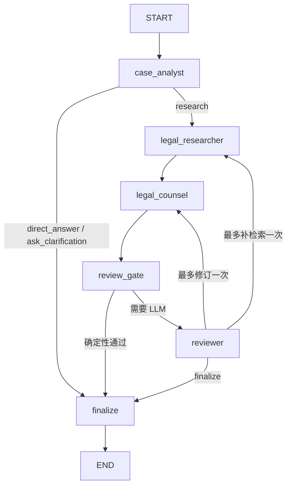

# LawStation 三 Agent 行为与 LangGraph 流程

## 1. 角色划分

LawStation 的“三 Agent”是同一进程、同一 LangGraph 内的角色分工：

| 角色 | 职责 | 能否调用 MCP |
|---|---|---|
| `CaseAnalystAgent` | 分类、案情整理、研究规划和最终复核 | 否 |
| `LegalResearchAgent` | 选择工具与参数、组织证据包 | 是，唯一调用者 |
| `LegalCounselAgent` | 基于案情和 EvidencePacket 形成法律意见 | 否 |

Reviewer 是 Case Analyst 的复核阶段，不是第四个独立服务。核心实现：`backend/app/agent/graph.py::LegalConsultationGraph`。

## 2. 调用层次

```text
AgentService.run                       请求级 facade
→ AgentRuntime.stream                 共享 Graph + 请求级 state
→ LegalConsultationGraph.compiled     LangGraph StateGraph
→ case_analyst
→ legal_researcher（按需）
→ legal_counsel（法律咨询）
→ review_gate
→ reviewer（按需）
→ finalize
```

关键文件：

- `backend/app/agent/service.py::AgentService`
- `backend/app/agent/runtime.py::AgentRuntime`
- `backend/app/agent/state.py::LegalConsultationState`
- `backend/app/agent/schemas.py`

## 3. 状态模型

每轮新建 `LegalConsultationState`：

```text
messages, memory_context
case_analysis
evidence_packet
counsel_draft
review_result
retry_count, revision_count
final_answer, citations, errors
```

身份和计数不混入共享 Graph 字段，而放在请求级 `AgentInvocationContext`：

- 冻结的 `AgentInvocationIdentity`：request、tenant、user、conversation。
- 可变 `AgentInvocationMetrics`：model/tool 次数、tool trajectory、review mode。
- 评测输出与 trace ID。

共享 Graph 不保存用户消息、记忆、数据库 Session 或当前证据。

## 4. Graph 路由



编译位置：`LegalConsultationGraph._compile`。

## 5. Case Analyst

`case_analyst` 调用 DeepSeek，解析为 `CaseAnalysis`：

- `casual_chat`：返回 `direct_answer`，不进入 RAG。
- `insufficient_information`：生成澄清问题，直接 finalize。
- `legal_consultation`：生成法律争议点与 `research_tasks`。

Prompt 明确规定本轮用户最新事实优先于历史和记忆。模型 JSON 无法解析时，代码降级为“把当前问题作为研究任务”，而不是直接中止。

## 6. Legal Research

`LegalConsultationGraph.__init__` 只在存在 MCP tools 时用 `create_agent` 创建 `research_agent`，并绑定：

- `InvocationModelLimitMiddleware`
- `ToolCallLimitMiddleware`
- `ModelCallLimitMiddleware`
- `ToolAuditMiddleware`

模型可以自主选择 `search_laws`、`get_law_article` 和参数。工具结果由 `_tool_documents` 从 MCP content blocks 解析；模型输出的 EvidenceItem 不被直接信任，`_authoritative_evidence` 必须按真实 `chunk_id` 回填法律名称、条号和正文。

### 检索状态

| 状态 | 代码判定 | 后续行为 |
|---|---|---|
| `matched` | 至少一个模型选择的证据能映射到真实工具结果 | 证据模式回答 |
| `no_match` | 工具正常执行，但没有可采纳证据 | 一般性低置信度回答 |
| `tool_unavailable` | 首次工具发现失败，Graph 没有 research agent | 明确工具不可用 |
| `tool_error` | 工具全部失败或研究节点异常 | 明确检索异常 |

`no_match` 是成功完成研究，不抛异常，也不会仅因证据为零回流检索。

## 7. Legal Counsel

`legal_counsel` 接收 CaseAnalysis、EvidencePacket、对话和 memory context，解析为 `CounselDraft`。

### matched 模式

- 具体法律名称、条号必须来自 EvidencePacket。
- 每条 Claim 用 `evidence_chunk_ids` 关联证据。
- `evidence_document_ids` 只用于旧 fixture 兼容。

### no_match 模式

- `confidence=low`。
- 可以给条件化分析和行动建议。
- 不得出现具体法律名称或条号。
- 必须披露当前法规库未检索到可引用法条。
- Counsel 漏写披露时，代码会补充固定说明。

生成失败时，代码产生低置信度安全降级草稿，不把失败伪装成已核验结论。

## 8. Reviewer 与快速路径

`review_gate` 当前只对以下全部满足的情况跳过 LLM Reviewer：

- `AGENT_REVIEW_MODE=auto`；
- 首版草稿，不是修订后草稿；
- Case Analysis 风险为 low；
- `retrieval_status=no_match`；
- 草稿 confidence 为 low；
- 没有法名、条号、缺失披露或证据 ID。

因此，**matched 回答即使低风险也会进入 LLM Reviewer**。这是当前代码事实，与“所有低风险回答均可确定性复核”的宽泛说法不同。

LLM Reviewer 检查覆盖度、证据越界、事实忠实和矛盾；代码随后再执行 `_citation_errors` 和 `_no_match_violations`。代码校验优先于模型的 approved 结果。

## 9. 回流与终止

- matched 且明确证据缺口：最多 `research_again` 一次。
- 表达、论证或证据越界：最多 `revise_draft` 一次。
- no_match/tool_error/tool_unavailable：禁止回流检索，只允许修订一次。
- 达到限制后进入 finalize，不无限循环。

实际调用限制：

- `AGENT_MAX_TOOL_CALLS=4` 为请求级总上限。
- Research Agent 的单次 `ToolCallLimitMiddleware` 取 `min(settings, 2)`；补检索可消耗剩余请求级额度。
- `AGENT_MAX_MODEL_CALLS=10` 由共享 metrics 和 middleware 双重控制。

## 10. Finalize 与引用

`finalize` 是最后一道确定性边界：

- no_match 未批准或违规时，替换成固定安全模板。
- Reviewer 未通过且仍有重大错误时，不输出原草稿，改为已核验材料和风险提示。
- citations 只从 `CounselDraft.claims` 实际使用的 EvidenceItem 生成。
- `chunk_id` 是首选证据 ID；旧 `document_id` 只有在该法条在证据包中仅有一个 chunk 时兼容。
- 模型伪造 ID 或候选但未使用的证据不会进入 citations。

## 11. MCP 工具发现缓存

`AgentRuntime.ensure_ready` 首次请求调用 `MCPToolRegistry.get_tools`。Registry 用锁实现 single-flight，并缓存：

- LangChain `BaseTool` 包装对象；
- 名称映射；
- 版本、状态、加载时间和最近错误。

工具版本变化时，Runtime 在 `_compile_lock` 内原子重建 Graph。缓存不包含工具结果、MCP session 或用户上下文。传输/Schema 类异常可 `invalidate`，冷却后刷新；旧工具存在时刷新失败进入 stale 并继续保留。

## 12. 输出与隐私

- 不向前端输出模型 reasoning。
- 不转发工具完整参数和正文，只发工具名与安全状态。
- 最终草稿在复核前不发送。
- LangSmith 和本地审计接收脱敏 metadata。
- `AgentRuntime.stream` 不再创建咨询根 Trace；它接收路由层生成的 request-scoped Trace config，使 LangGraph、节点、DeepSeek 和 MCP Tool 都成为 `lawstation.consultation` 的子 Run。
- `MCPTraceContextInterceptor` 只在当前 RunTree 存在时发送 LangSmith 分布式追踪头，并保留原请求头；工具发现和未追踪请求不传播上下文。

## 13. 测试证据

`tests/test_agent_runtime.py` 覆盖：

- 并发首请求只发现一次工具；
- 闲聊不检索；
- 完整三 Agent + 引用；
- no_match 不回流；
- chunk 权威重建；
- Reviewer 快速路径；
- 请求级状态不进入共享 Runtime；
- 模型 Key 缺失；
- 证据包外法条拦截。

## 14. 当前风险

- 结构化输出仍采用“Prompt 要求 JSON + 手工解析”，不是模型原生结构化接口；格式波动会进入降级路径。
- matched 链路通常需要 Analyst、Research 多轮、Counsel、Reviewer，多模型调用导致首正文延迟较高。
- 共享 ChatOpenAI 客户端的真实连接池和服务端限流需结合压测确认。
- 模型输出质量仍依赖法规覆盖、检索阈值和 Prompt，确定性校验只能控制证据边界，不能保证法律意见本身完美。
