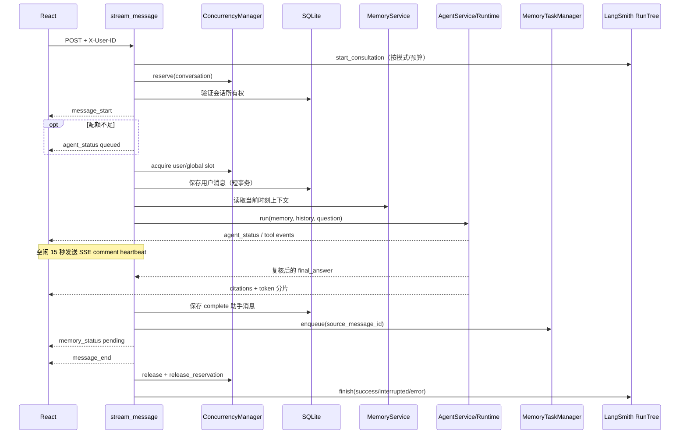
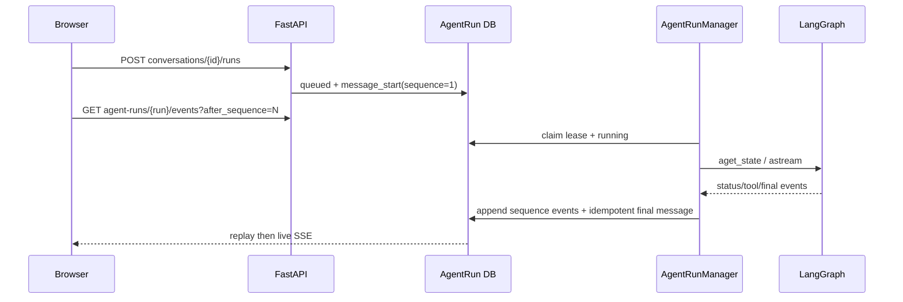

# LawStation API 与聊天主链路

## 1. API 边界

所有业务接口位于 `backend/app/api/routes.py::router`，统一前缀 `/api`。

| 接口 | 用户上下文 | 关键行为 |
|---|---|---|
| `GET /api/users` | 无 | 返回演示用户供页面切换 |
| `GET/POST /api/conversations` | `X-User-ID` | 列出或创建当前用户会话 |
| `GET /api/conversations/{id}/messages` | `X-User-ID` | 所有权校验后读取消息及反馈 |
| `POST /api/conversations/{id}/runs` | `X-User-ID` | 创建持久化咨询任务 |
| `GET /api/agent-runs/{run_id}` | `X-User-ID` | 查询所有权范围内任务状态 |
| `GET /api/agent-runs/{run_id}/events` | `X-User-ID` | sequence SSE 重放与实时订阅 |
| `POST /api/agent-runs/{run_id}/cancel` | `X-User-ID` | 明确取消 queued/running 任务 |
| `GET /api/conversations/{id}/active-run` | `X-User-ID` | 页面恢复当前会话任务 |
| `POST /api/conversations/{id}/messages/stream` | `X-User-ID` | 兼容旧客户端的 legacy SSE |
| `GET/PATCH/DELETE /api/memories` | `X-User-ID` | 当前用户记忆治理 |
| `POST /api/memories/{id}/confirm|reject` | `X-User-ID` | 兼容 pending 记忆治理 |
| `GET /api/memory-jobs/{id}` | `X-User-ID` | 查询后台整理状态 |
| `POST /api/messages/{id}/feedback` | `X-User-ID` | 本地持久化赞踩并异步同步 |
| `GET /api/index/status` | 无 | 查询法规索引状态 |

## 2. 用户上下文

`backend/app/core/context.py::get_user_context` 从 `X-User-ID` 查询演示用户，生成不可变：

```text
RequestUserContext(tenant_id, user_id, request_id)
```

查询 Session 在依赖函数内立即关闭，不会跨越 SSE 生命周期。后续业务只能从该上下文取得所有权字段。

**已验证**：这是租户/用户逻辑隔离，不是身份认证。`GET /api/users` 可公开枚举演示用户，适合演示切换，不适合生产。

## 3. SSE 咨询时序



关键 symbol：`stream_message`、`_prepare_chat`、`_save_assistant`、`with_sse_heartbeat`。

`stream_message` 是线上咨询根 Trace 的所有者。根 Run 覆盖会话预占、排队、记忆快照、Agent Graph、回答保存和记忆任务入队；heartbeat 与 24 字符输出分片不创建 Span。根 Trace ID 同时写入本轮用户消息和助手消息，供反馈与后台记忆任务关联。客户端中断时以 `interrupted` 结束，Trace 中只记录已实际发送的正文长度。

## 4. 短事务设计

主链路不持有一个贯穿模型调用的 SQLAlchemy Session：

1. `_validate_conversation` 独立 Session。
2. `_prepare_chat` 保存用户消息并读取上下文后关闭。
3. Agent/DeepSeek/MCP 阶段没有业务数据库事务。
4. `_save_assistant` 使用新 Session。
5. 工具审计和记忆任务各自使用独立短 Session。

这避免 SQLite 写锁在十几秒的模型调用期间被占用。

## 5. SSE 事件

| 事件 | 产生方 | 前端用途 |
|---|---|---|
| `message_start` | 路由 | 建立本轮请求 |
| `agent_status` | Graph 节点 | 排队、分析、检索、生成、复核、完成 |
| `tool_call_start` | `ToolAuditMiddleware` | 显示安全工具状态 |
| `tool_call_result` | `ToolAuditMiddleware` | 清理或显示失败状态 |
| `citations` | `AgentRuntime` | 绑定最终助手消息引用 |
| `token` | `AgentRuntime` | 追加最终回答分片 |
| `memory_status` | 路由 | 启动后台任务轮询 |
| `message_end` | 路由 | 替换真实消息 ID、结束生成 |
| `error` | 路由 | 非成功状态和重试提示 |

SSE comment `: heartbeat` 不属于应用事件，`frontend/src/sse.ts::parseSseBlock` 会忽略。

## 6. “流式输出”的真实语义

**已验证**：Agent 节点状态、工具状态和 heartbeat 是实时的；最终回答正文不是 DeepSeek token 原样转发。

`backend/app/agent/runtime.py::AgentRuntime.stream` 等待 Graph 完成并取得已复核 `final_answer`，再按 24 个字符发送 `token`。这样不会把未复核草稿、工具参数增量或 reasoning 暴露给用户，代价是首正文延迟等于完整 Agent 链路耗时。

## 7. 取消、异常和持久化

### 用户主动停止或页面断开

- 前端中止指定 `ConversationKey` 的 `AbortController`。
- `with_sse_heartbeat` 取消等待中的异步迭代任务。
- 路由捕获 `CancelledError`，有已发送正文时保存为 `interrupted`。
- 所有配额和 conversation reservation 在 `finally` 中释放。

由于正文只在复核后发送，用户在分析/检索阶段停止时通常没有正文可保存；若已经开始正文分片则保存实际发送部分。

### 业务异常

- 排队超时发送 SSE `error`，不会在获得配额前调用模型或 MCP。
- Agent 失败且已有正文时保存 `interrupted`。
- 缺少 DeepSeek Key 由 `LLMProvider` 抛出配置错误，不保存伪造的 complete 回答。
- 记忆整理失败不会改变已保存助手回答状态。

## 8. 反馈链路

`message_feedback` 用 `tenant_id + user_id + message_id + role=assistant` 查询消息：

1. 先写 `MessageFeedback`，本地数据是事实源。
2. 返回前通过 `BackgroundTasks` 安排 `_sync_message_feedback`。
3. LangSmith 可用且消息有 trace ID 时同步评分。
4. 点踩可进入 Annotation Queue。

LangSmith 不可用时反馈仍保留，`sync_status=unavailable`。

## 9. 已知风险

- 没有请求内容最大长度限制或速率限制。
- `Conversation.updated_at` 不会在新增消息时显式更新，因此会话列表按最近活动排序的语义并不完整。
- 新 AgentRun 链路支持页面刷新后的任务查询与事件重放；legacy `messages/stream` 仍不具备该能力，应逐步下线。
- 正文首 token 延迟较高，尤其 matched 法律问题需多次模型调用。

## 10. 关键测试

- `tests/test_concurrency.py::test_sse_heartbeat_is_emitted_while_agent_is_silent`
- `tests/test_agent_runtime.py::test_agent_service_keeps_request_state_out_of_shared_runtime`
- `tests/test_feedback.py::test_feedback_is_owned_and_persisted_before_export`
- `frontend/src/test/sse.test.ts`
- `frontend/src/test/App.test.tsx`

## 11. AgentRun SSE 时序



客户端断开只终止订阅；服务端任务继续。SSE 以 `id: sequence` 去重，终态后前端重新加载消息表，不把未复核草稿写入事件表。
