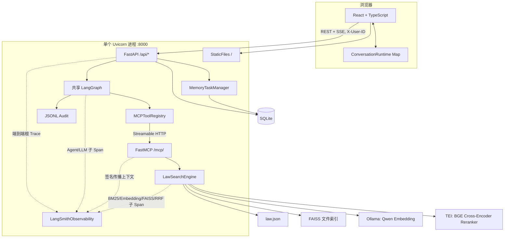
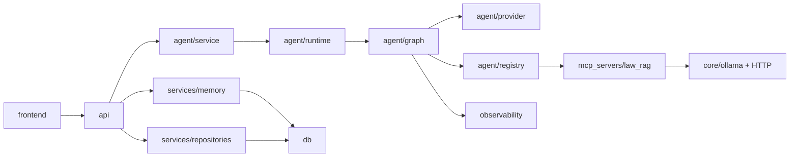

# LawStation 架构总览

## 1. 系统用途

**已验证**：LawStation 是面向中国大陆法律咨询的多用户演示系统。它把会话、分层记忆、三 Agent 协作、法规 RAG、审计和评测整合在一个可本地运行的应用中。

关键入口：

- `run.py::main`：唯一正式启动入口。
- `backend/app/main.py::lifespan`：应用资源生命周期。
- `backend/app/api/routes.py::stream_message`：咨询主入口。
- `backend/app/agent/graph.py::LegalConsultationGraph`：三 Agent 编排。
- `mcp_servers/law_rag/engine.py::LawSearchEngine`：法规索引和查询。

系统当前是演示产品，不是生产身份系统：`X-User-ID` 只验证演示用户是否存在，没有密码、JWT、RBAC 或租户管理员能力。关键 symbol：`backend/app/core/context.py::get_user_context`。

## 2. 运行架构

### 运行边界

| 边界 | 已验证职责 | 关键文件 / symbol |
|---|---|---|
| 前端 | 用户切换、会话缓存、流消费、记忆治理和反馈 | `frontend/src/App.tsx::App` |
| API | 所有权校验、短事务、SSE 协调、回答与任务持久化 | `backend/app/api/routes.py` |
| Agent | 案情分析、法律研究、意见生成、复核 | `LegalConsultationGraph` |
| MCP Client | 工具发现缓存和协议调用 | `MCPToolRegistry` |
| MCP Server | 标准工具定义，不管理用户状态 | `mcp_servers/law_rag/server.py::mcp` |
| RAG | 法规加载、索引构建、混合召回、精确查询 | `LawSearchEngine` |
| Memory | 上下文选择、异步提取、摘要和替换 | `MemoryService`、`MemoryTaskManager` |
| Data | 所有权约束、原始消息、审计和迁移 | `OwnedRepository`、`db/models.py` |
| Evaluation | 进程级追踪、确定性指标、Judge、预算、Codex 源法条挑战集、资格冻结和分组报告 | `LangSmithObservability`、`ReportRun`、`prepare_source_pack` |

## 3. 顶层目录职责

| 目录 | 作用 | 是否进入正式运行链路 |
|---|---|---|
| `backend/app/api/` | REST/SSE 路由 | 是 |
| `backend/app/agent/` | LangChain/LangGraph Agent Runtime | 是 |
| `backend/app/services/` | 记忆和所有权 Repository | 是 |
| `backend/app/db/` | SQLAlchemy、连接和迁移入口 | 是 |
| `backend/app/core/` | 配置、日志、身份、Ollama/TEI 进程管理、预算 | 是 |
| `backend/app/observability/` | LangSmith 生产追踪 | 配置开启时进入 |
| `backend/app/evaluation/` | 离线评测与报告公共模块 | 评测命令进入，正常咨询不进入 |
| `mcp_servers/law_rag/` | 法规 MCP 与 RAG 引擎 | 是 |
| `frontend/src/` | React 工作台 | 构建后由后端托管 |
| `alembic/` | SQLite 版本化迁移 | 启动时进入 |
| `scripts/` | 建库、数据集和评测命令 | 手工命令进入 |
| `evals/` | 数据集、批次、报告与学习指南 | 评测使用 |
| `data/knowledge/` | 法规源数据 | RAG 使用 |
| `data/indexes/` | 生成的向量索引与 staging | RAG 使用，不作为源码分析 |
| `data/runtime/` | SQLite 和资源预算账本 | 运行时使用 |
| `tools/` | 早期/参考工具 | **未进入正式链路** |
| `tests/` | Python 回归测试 | 测试时使用 |

## 4. 模块依赖方向

Agent 没有直接 import `LawSearchEngine`；正式问答通过 MCP Tool 保持协议边界。评测模块 `backend/app/evaluation/targets.py::RetrievalTarget` 会直接创建 `LawSearchEngine` 做 RAG 消融，这是评测专用路径，不是生产 Agent 绕过 MCP。

## 5. 生命周期与状态边界

### 应用级共享

- `LawSearchEngine` 及其 BM25、FAISS。
- `MCPToolRegistry` 的工具定义与包装对象。
- `LLMProvider` 内缓存的聊天模型和记忆模型客户端。
- 已编译 `LegalConsultationGraph`。
- `AgentConcurrencyManager`。
- `MemoryTaskManager` 单 Worker。
- `LangSmithObservability`。

其中 `LangSmithObservability` 只共享 Client、脱敏规则、进程 Session Budget 和随机 Bridge Token；当前 RunTree、Trace config、用户/会话哈希和 RAG 父上下文均为请求级数据。MCP 传播只接受同进程 Client 携带的内存 Bridge Token，外部 MCP 调试请求不会被拼接进咨询 Trace。

创建位置：`backend/app/main.py::lifespan`。

### 请求级隔离

- `RequestUserContext` 和 `AgentInvocationIdentity`。
- `LegalConsultationState`。
- 记忆上下文与近期消息快照。
- `EvidencePacket`、草稿、复核结果和 citations。
- 模型/工具调用计数和 SSE 流。
- 数据库 Session。

关键类型：`backend/app/agent/state.py::AgentInvocationContext`。共享 Graph 中没有保存用户、会话、当前消息或 SQLAlchemy Session。

## 6. 核心技术选型

| 能力 | 选型 | 代码事实 |
|---|---|---|
| Web API | FastAPI + Uvicorn | `backend/app/main.py` |
| 前端 | React + TypeScript + Vite | `frontend/package.json` |
| Agent | LangChain `create_agent` + LangGraph `StateGraph` | `backend/app/agent/graph.py` |
| 主模型 | DeepSeek OpenAI-compatible API | `LLMProvider.get_chat_model` |
| Embedding | Ollama `qwen3-embedding:0.6b`，保留 DashScope Provider | `create_embedding_provider` |
| 精排 | TEI `BAAI/bge-reranker-v2-m3`，原生 `/rerank` | `TEIReranker.rerank` |

TEI 的模型版本采用显式 revision pin：服务返回 `model_sha` 时直接使用，否则回退到 `.env` 固定 revision或项目 Hugging Face 缓存 ref；既兼容 TEI 1.9.x 的空字段，又避免把未确定版本的服务标记为 ready。

`scripts/start_tei_reranker.sh` 提供前台手动调试边界；它启动的 TEI 属于外部进程，`run.py` 只复用、不接管其关闭生命周期。
| 稀疏检索 | Jieba + rank-bm25 | `LawSearchEngine._lexical` |
| 稠密检索 | FAISS `IndexFlatIP` | `LawSearchEngine._build` |
| 协议 | FastMCP Streamable HTTP | `mcp_servers/law_rag/server.py` |
| 数据库 | SQLite + SQLAlchemy 2 + Alembic | `db/session.py`、`alembic/` |
| 流式传输 | POST + SSE + heartbeat | `stream_message`、`with_sse_heartbeat` |
| 观测 | JSONL 审计 + 可选 LangSmith | `core/logging.py`、`observability/langsmith.py` |
| 定向评测 | 600条候选的不可变前缀扩容 + task_id不匹配响应自动续跑 + Gold不变量保护 + Hybrid Top12双干扰资格冻结 + 本地消融/Agent安全门禁 | `evaluation/challenge_datasets.py`、`create_resume_challenge_datasets.py`、`run_resume_rag_challenge_eval.py` |

## 7. 架构评价

### 优点

- 单机部署简单，但 Agent、MCP、RAG 和前端仍保持清晰协议边界。
- 用户域状态和共享基础设施边界明确，适合演示并发隔离。
- RAG、记忆和评测均有失败降级或独立失败语义。
- EvidencePacket 与 chunk 级引用把模型自由生成限制在可验证证据内。

### 当前边界

- 身份仅为演示用户选择，不能视为生产认证。
- SQLite、进程内信号量、单 Worker 和浏览器内任务缓存限定了单机部署。
- 正文是“复核后分片输出”，不是模型实时 token 输出。
- 本地运行增加一个由统一入口管理的 TEI 子进程；没有分布式任务队列或跨刷新流恢复。
