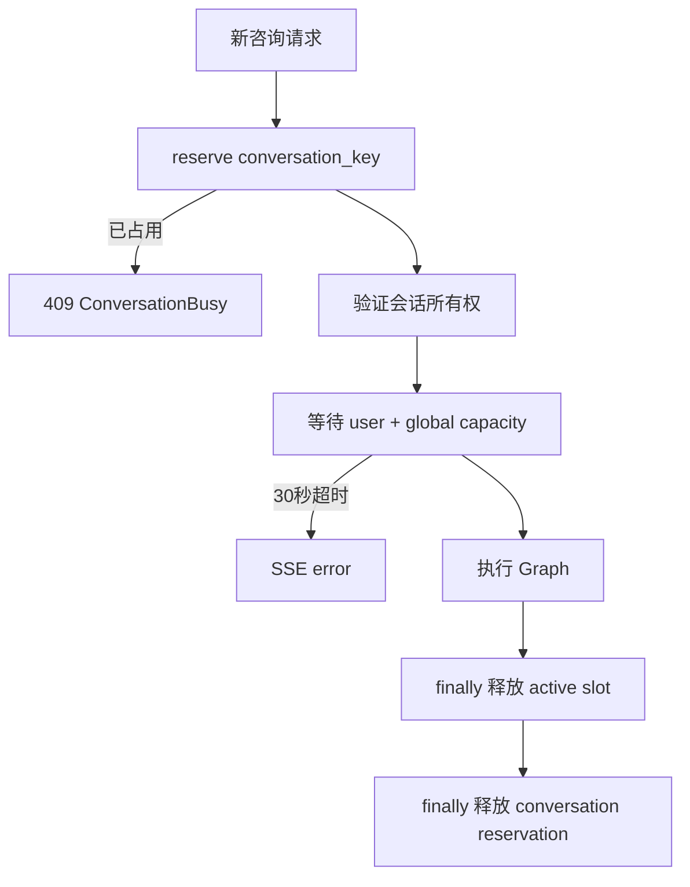

# LawStation 多用户并发与后台会话

## 1. 并发目标

**已验证默认值**：

```text
全局 Agent Graph 并发：6
同一用户并发：2
同一会话并发：1
排队超时：30 秒
```

配置位于 `backend/app/core/config.py::Settings`，实现位于 `backend/app/agent/concurrency.py::AgentConcurrencyManager`。

## 2. 服务端准入模型



Conversation reservation 在进入排队前获得，因此同一会话的第二个请求立即 409，不会排出两条使用相同历史快照的任务。

用户和全局容量在同一个 `asyncio.Condition` 条件下检查；等待用户配额的请求不会提前占用全局 semaphore，避免队首阻塞。

## 3. 记忆快照时间点

`backend/app/api/routes.py::stream_message` 在 `async with concurrency.slot(identity)` 成功后才调用 `_prepare_chat`：

1. 获得用户和全局运行配额；
2. 保存本轮用户消息；
3. 读取当前会话摘要、有效记忆和近期消息；
4. 关闭 Session；
5. 执行 Graph。

因此排队期间同用户其他会话产生并完成的新记忆，在本任务真正开始时可以被读取。Graph 开始后使用固定上下文，不动态注入其他并发会话的新记忆。

## 4. 共享与隔离

### 可共享

- ChatOpenAI 客户端。
- 编译后的 `LegalConsultationGraph`。
- MCP 工具定义缓存。
- BM25/FAISS 法规索引。
- 配置和 LangSmith Client。

### 必须隔离

- `AgentInvocationContext` 与 `LegalConsultationState`。
- `tenant_id/user_id/conversation_id/request_id`。
- 消息、记忆、EvidencePacket、草稿和引用。
- 工具/模型调用计数。
- SSE 流和数据库事务。

测试：`tests/test_agent_runtime.py::test_agent_service_keeps_request_state_out_of_shared_runtime`。

## 5. 前端 ConversationRuntime

`frontend/src/chat/runtimeStore.ts::conversationKey` 使用：

```typescript
`${userId}:${conversationId}`
```

`frontend/src/App.tsx` 分别维护：

- `conversationBuckets[userId]`：各用户会话列表。
- `runtimes[ConversationKey]`：各会话消息和生成状态。
- `controllers[ConversationKey]`：各会话 AbortController。
- `drafts[userId:conversationId]`：各会话输入草稿。
- `loadSequences[ConversationKey]`：阻止迟到的消息加载覆盖新状态。

## 6. 页面切换行为

用户或会话切换时不会遍历并取消其他 controller：

1. 当前选择更新；
2. 新用户显示自己的缓存或 loading；
3. 原会话 `fetch + ReadableStream` 继续；
4. SSE 事件继续写入原 `ConversationKey`；
5. 完成时若不是当前可见会话，设置 `unread=true`；
6. 返回原会话直接显示累计结果。

只有组件卸载/页面关闭时，清理 effect 才会中止全部 controller。

## 7. 迟到事件保护

每轮生成分配递增 `requestToken`，`StreamSnapshot` 保存：

```text
token
ConversationKey
userId
conversationId
assistantMessageId
```

所有 SSE 回调先执行 `isCurrentStream`，验证当前 runtime 的 token。更新操作始终使用 snapshot key，不依赖当前页面选择，因此用户 A 的迟到 token 不会写入用户 B。

消息加载还用 `loadSequences` 防止旧 REST 响应覆盖新的加载或正在运行的流。

场景目录探测也使用独立递增sequence。用户快速切换时，旧用户的数据集响应不能覆盖当前用户的`ScenarioAvailability`。场景并发断言记录两个AgentRun实际同时处于queued/running的证据；仅仅成功创建两个会话不足以判定并发测试通过。

## 8. 取消和释放

“停止生成”只中止当前打开会话的 controller。服务端取消路径：

- 取消 SSE source task；
- 有正文时保存 `interrupted`；
- `slot` 的 finally 释放 user/global active 计数；
- `events` 的 finally 释放 conversation reservation。

一个会话的停止不会取消其他用户或其他会话。

## 9. 心跳和长等待

`with_sse_heartbeat` 每 15 秒无 Agent 事件时发送 comment。浏览器 parser 忽略 comment，但代理和连接能持续收到字节。

延迟审计字段：

- `queue_duration_ms`
- `first_status_duration_ms`
- `first_text_token_duration_ms`
- `total_duration_ms`

## 10. 当前边界

- 并发计数和 reservation 都在进程内；多 Uvicorn worker 不共享。
- 浏览器刷新会中断当前订阅，但不会取消持久化 AgentRun；重新打开会话后通过 active-run 和 sequence SSE replay 恢复。
- 多标签页之间不共享前端 runtime，服务端同会话 reservation 仍能阻止重复 Graph。
- `MemoryTaskManager` 只有一个 Worker，和 Agent 并发配额是两套独立机制。
- SQLite WAL 改善读写并发，但不是分布式锁或高写入吞吐数据库。

## 11. 测试证据

- `tests/test_concurrency.py::test_global_six_and_per_user_two_admission_limits`
- `tests/test_agent_runtime.py::test_concurrency_rejects_duplicate_conversation_and_limits_per_user`
- `tests/test_concurrency.py::test_sse_heartbeat_is_emitted_while_agent_is_silent`
- `frontend/src/test/App.test.tsx`：用户切换、后台流和状态隔离。

## 12. 面试表达

> 我把并发控制拆成会话 reservation、用户配额和全局配额。同会话重复请求立即拒绝，不同会话再按每用户 2、全局 6 排队。记忆快照在真正取得配额后读取，Graph 运行期间保持不变。前端不使用单一 streaming 布尔值，而是按 userId:conversationId 维护 runtime、controller 和 request token，所以切换用户后原任务能继续，事件也只写回自己的会话。

## 13. 租约与重启恢复

`AgentRunManager` 在运行中每 `lease/3` 续约，启动时把遗留 running 任务重新置为 queued，并使用原 `langgraph_thread_id` 从最新 checkpoint 恢复；超过 `AGENT_RUN_RECOVERY_MAX_ATTEMPTS` 后终止。进程正常关闭不会把正在执行任务误标为用户中断。事件和 checkpoint 默认保留 7 天，由启动清理过程删除过期终态 Run 的恢复数据。

## 14. 场景观察的并发语义

场景Actor映射在开始时固定，普通用户/会话切换不改变已运行Run的所有权。`send_message`立即创建后台Run，后续步骤可切换Actor或取消指定会话的Run。`disconnect_stream`仅abort该`ConversationKey`的浏览器controller，服务端Graph继续；`reconnect_stream`从已保存sequence订阅，重复sequence会被标记为观察失败。清理前必须确认所有专用会话没有queued/running Run。
