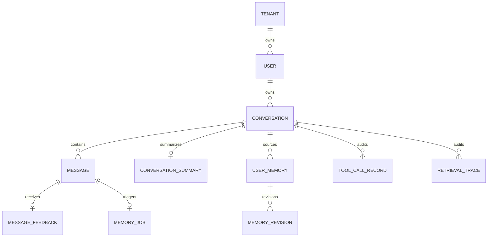

# LawStation 数据模型、事务与用户隔离

## 1. 数据库定位

**已验证**：SQLite 是会话、记忆、工具审计、反馈和索引版本元数据的业务事实源；法规正文和向量不写入 SQLite。

- 默认连接：`sqlite:///./data/runtime/lawstation.db`。
- Session：`backend/app/db/session.py::SessionLocal`。
- 模型：`backend/app/db/models.py`。
- 迁移：`backend/app/db/migrations.py::upgrade_database` + `alembic/versions/`。

连接启用 `foreign_keys=ON`、`busy_timeout=5000` 和 `journal_mode=WAL`。

## 2. 核心数据模型



| 模型 | 用途 | 关键约束 |
|---|---|---|
| `Tenant` | 租户边界 | 演示环境只有默认租户 |
| `User` | 演示用户 | 与 tenant 组成复合所有权目标 |
| `Conversation` | 一个会话/案件边界 | `tenant_id + user_id + id` 唯一 |
| `Message` | 原始用户/助手消息 | 复合外键指向所属会话 |
| `MessageFeedback` | 赞踩与 LangSmith 同步状态 | 每用户每消息唯一 |
| `ConversationSummary` | 当前会话滚动摘要 | 每个用户会话唯一 |
| `UserMemory` | 用户级或会话级长期记忆 | 来源消息+canonical key 幂等 |
| `MemoryRevision` | 修改/替换轨迹 | 删除主记忆时级联删除 |
| `MemoryJob` | 可恢复后台整理任务 | 每来源用户消息唯一 |
| `ToolCallRecord` | 工具元数据审计 | 关联 tenant/user/conversation |
| `RetrievalTrace` | 检索摘要 | 不保存完整法条正文 |
| `IndexManifest` | FAISS 索引版本元数据 | 不存向量 |

## 3. 所有权边界

`RequestUserContext` 是业务层唯一用户来源。`OwnedRepository` 的所有查询同时限定当前 `tenant_id + user_id`，会话级操作再限定 `conversation_id`。

关键方法：

- `OwnedRepository.conversation`
- `OwnedRepository.messages`
- `OwnedRepository.memories`
- `OwnedRepository.context_memories`
- `OwnedRepository.update_memory`
- `OwnedRepository.delete_memory`

按 ID 更新和删除不会先裸查主键再仅靠应用判断；最终 SQL 包含所有权字段。零受影响行统一返回“不存在或无权访问”。

## 4. 会话、消息与反馈

`Conversation` 通过复合外键归属 `User`，`Message` 再通过 tenant/user/conversation 归属会话。API 读取消息前调用 `OwnedRepository.conversation`。

反馈接口额外限定 `Message.id + tenant_id + user_id + role=assistant`，因此其他用户知道消息 ID 也不能提交评分。

## 5. 记忆作用域

### 会话级

`scope=conversation` 还必须等于当前 `conversation_id`，用于案件事实、时间线、人物、诉求和证据状态。

### 用户级

`scope=user` 只允许 `profile_preference` 和 `identity_background`，可在该用户自己的不同会话复用。`ExtractedMemory.restrict_user_scope` 会把其他类型降为 conversation。

### 状态

正式上下文只读取 `status=active` 且未过期的记忆。`pending/rejected/superseded/expired` 不进入 Agent。

当前后台提取会把合法候选直接写为 active；confirm/reject API 主要兼容历史 pending 数据和人工治理流程。

## 6. 乐观并发与幂等

- 用户修改记忆需要提交 `version`；版本变化返回 409。
- 自动替换用 `UserMemory.version == expected_version` 原子更新，冲突后最多重读一次。
- `MemoryJob` 以 `tenant + user + source_message_id` 唯一。
- 候选以 `tenant + user + source_message_id + canonical_key` 唯一。
- 同内容候选是 no-op，不增加版本和修订记录。

关键 symbol：`OwnedRepository.update_memory`、`MemoryTaskManager._replace_memory`。

## 7. 事务边界

所有模型、Embedding 和 MCP 网络调用都在数据库事务之外：

```text
短事务：保存用户消息 + 读取快照
关闭 Session
→ Agent / MCP / DeepSeek
短事务：保存助手消息
短事务：创建记忆任务
后台短事务：领取任务 / 保存候选 / 更新摘要
```

工具审计由 `ToolAuditMiddleware` 使用独立 `SessionLocal`，不会复用路由 Session。

## 8. Alembic 演进

`upgrade_database` 在 SQLite 升级前复制备份，然后运行 Alembic head。当前版本链：

```text
20260820_01 layered_memory
→ 20260820_02 memory_constraints
→ 20260821_03 requeue_memory_json_jobs
→ 20260821_04 langsmith_feedback
```

启动后仍执行 `Base.metadata.create_all`，用于全新数据库兜底；已有表字段演进依赖 Alembic，而不是 create_all。

## 9. 已知风险

- `X-User-ID` 可由客户端自由选择已知演示用户，隔离不等于认证。
- `UserMemory.conversation_id` 是复合外键的一部分；删除来源会话会连带删除 user scope 记忆。
- `MemoryRevision.memory_id ON DELETE CASCADE`，用户物理删除记忆后修订也消失，不是不可篡改审计。
- `Conversation.updated_at` 没有随新消息显式更新。
- `ToolCallRecord` 和 `RetrievalTrace` 没有复合外键到 Conversation，主要依靠应用正确写入所有权字段。
- SQLite 适合当前单进程首版，不提供跨主机并发协调。

## 10. 测试证据

- `tests/test_isolation.py::test_memory_isolation`
- `tests/test_memory.py::test_conversation_memory_confirmation_does_not_supersede_another_case`
- `tests/test_memory.py::test_model_cannot_replace_another_users_memory`
- `tests/test_memory.py::test_user_memory_can_be_replaced_from_another_owned_conversation`
- `tests/test_feedback.py::test_feedback_is_owned_and_persisted_before_export`
- `tests/test_concurrency.py::test_sqlite_uses_wal_foreign_keys_and_busy_timeout`
- `tests/test_migrations.py::test_existing_sqlite_memory_schema_is_backed_up_and_upgraded`

## 11. 面试表达

> 多用户隔离不是在模型 Prompt 中约定，而是从请求头建立不可变用户上下文，所有 Repository 查询和更新都把 tenant、user、conversation 条件写进同一条 SQL。Agent 只接收已经筛选好的记忆文本，不能传 user_id 调记忆工具。模型调用期间不持有数据库事务，SQLite 使用 WAL、busy timeout 和短事务；对记忆更新再用幂等键和 version 乐观锁处理并发。
