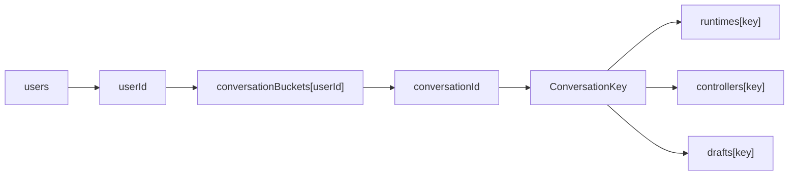
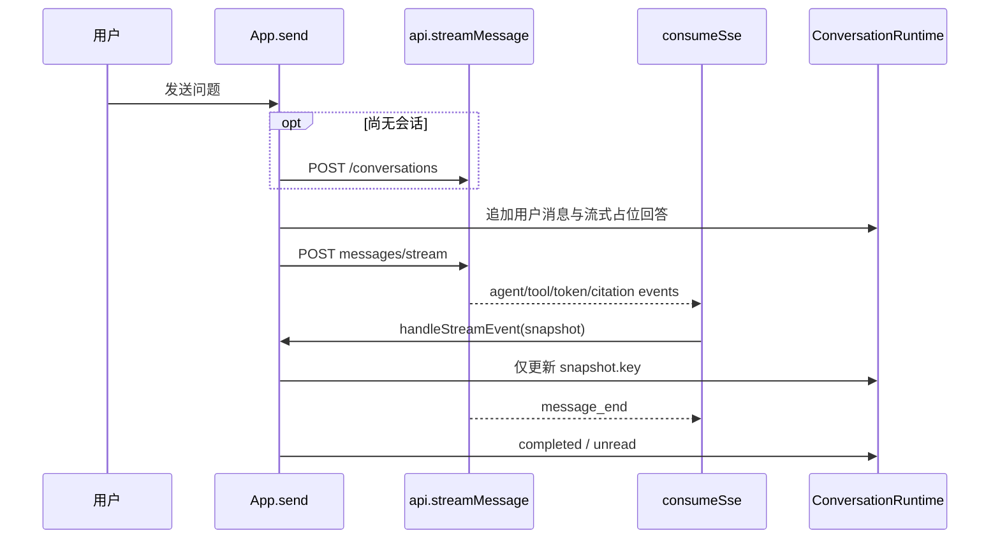

# LawStation 前端结构与交互流程

## 1. 技术与入口

- React + TypeScript + Vite。
- `frontend/src/main.tsx` 挂载 `App`。
- `frontend/src/App.tsx::App` 维护用户、会话、流和页面状态。
- `frontend/src/api.ts::api` 封装同源 `/api` 请求。
- `frontend/src/sse.ts::consumeSse` 解析 POST SSE。
- 样式集中在 `frontend/src/style.css`，使用 CSS Variables 和响应式断点。

依赖 `react-markdown + remark-gfm` 渲染助手 Markdown；没有启用 raw HTML 插件，因此不会直接执行回答中的 HTML。

## 2. 组件职责

| 组件 | 职责 |
|---|---|
| `Sidebar` | 用户切换、法律咨询场景、新对话、会话状态和记忆入口 |
| `ChatHeader` | 品牌、当前会话和索引状态 |
| `MessageList` | 欢迎空态、Markdown、引用、自动滚动和赞踩 |
| `Composer` | 多行输入、Enter/Shift+Enter、发送/停止 |
| `StatusNotice` | 索引、Agent、工具、记忆、错误和重试状态 |
| `MemoryPanel` | 有效用户/案件记忆的读取、修正和删除 |

## 3. 页面状态模型

`ConversationRuntime` 包含消息、Agent 阶段、工具状态、记忆提示、错误、request token、未读状态和更新时间。关键类型位于 `frontend/src/types.ts`。

## 4. 初始化流程

1. `api.users()` 加载演示用户并默认选择第一位。
2. index effect 每 2.5 秒请求 `/api/index/status`。
3. userId 变化时清空当前 conversationId、关闭抽屉和记忆面板。
4. 使用新 AbortController 加载该用户会话列表。
5. 原用户正在执行的 stream controller 不被取消。

新用户不会临时复用旧用户的 messages；其内容来自独立 bucket/runtime。

## 5. 打开会话

`App.openConversation`：

- 立即切换选择并清除 unread。
- 如果已有消息缓存或正在生成，直接使用 runtime。
- 否则调用 `api.messages`。
- `loadSequences` 防止同 key 的旧响应覆盖新响应。
- 若加载期间流已启动，REST 消息响应不会覆盖流状态。

## 6. 发送流程

空问题、用户未加载、同一 runtime 活跃或已有 controller 时不发送，防止重复生成。

## 7. SSE 解析与事件处理

`parseSseBlock`：

- 支持多行 data；
- 尝试 JSON 解析，失败保留字符串；
- 忽略空行和 `:` comment；
- 没有明确 event 的普通 message 被忽略。

`handleStreamEvent`：

- token 只追加到本轮占位助手消息；
- agent_status 清除旧 toolActivity；
- skill_status 只更新当前 `ConversationKey` 的 `skillActivity`，展示服务端安全状态文本；

- 成功 tool result 清除检索中提示；
- citations 绑定当前助手消息；
- memory_status 启动 MemoryJob 轮询；
- message_end 强制清理 Agent 和工具状态；
- message_end、error 或新一轮 Run 同时清理 Skill 状态，避免旧能力提示残留；
- error 暂存，流结束后统一进入失败状态。

### 7.1 场景观察

场景观察模式是“每次点击一步”的人工观察器，不是自动连续Runner。前端先把后端能力探测建模为`checking/ready/disabled/error`：只有明确404才隐藏；其他异常会在顶部栏和侧栏显示可重试诊断，避免接口异常被误认为功能不存在。`ScenarioPanel`负责数据集/类别/场景选择、Actor和预期/实际展示；`ScenarioExecutor`创建`[场景]`专用会话，并逐步执行发送、用户/会话切换、等待、取消、SSE断开/重连和消息/记忆检查。

普通聊天与场景共用`startRun/attachRun/followRun`、`consumeSse`和`ConversationRuntime`，避免复制第二套状态机。`disconnect_stream`只停止浏览器订阅；重连记录subscription epoch、连接游标和首个接收sequence，并要求服务端在断开期间已经形成可重放事件。未知预期、缺少安全Outcome或来源消息时返回`inconclusive`，不会空检查后误判通过。记忆检查以真实消息ID和`source_message_id`验证最新事实与会话隔离。Fixture不注入真实服务，仅依赖Fixture的结果显示`inconclusive`。`ScenarioSession`独立保存步骤游标和对照结果；页面刷新后AgentRun仍可在普通会话恢复，但场景游标不自动恢复。

## 8. 记忆面板

`MemoryPanel.load` 并行读取：

- 当前用户的 user scope 记忆；
- 当前会话的 conversation scope 记忆。

界面只展示 active，支持带 version 的修正和物理删除。新记忆自动生效，因此不显示确认按钮；后端 confirm/reject 接口没有被当前面板调用。

## 9. Markdown、引用与反馈

- 用户消息按纯文本 `
` 输出。
- 助手消息用 ReactMarkdown + GFM。
- citations 仅展示法律名称和条号，不暴露 chunk ID 或完整工具结果。
- complete 且有真实服务端消息 ID 的助手回答显示赞踩。
- 点踩可补充说明，反馈先由后端本地持久化。

## 10. 滚动和响应式

MessageList 仅在用户距离底部不足 96px 时维持自动滚动；主动向上阅读后暂停追随新内容。

桌面使用浅色卡片侧栏和居中阅读区；窄屏侧栏转为抽屉。图标统一使用 lucide-react，并为关键按钮提供 aria-label。

## 11. 当前边界与风险

- 状态全部位于顶层 `App`，功能继续增长时可维护性会下降。
- 页面 runtime 本身仍在内存中，但服务端 AgentRun 可查询；刷新后重新打开会话会查询 active-run，并从 sequence 0 或已知 sequence 重放。
- index 固定每 2.5 秒轮询，即使 ready 也继续请求。
- MemoryJob 最多轮询 30 秒，超时后界面不再自动更新。
- Citation 类型没有声明 `chunk_id`、quoted excerpt 和 data version，虽然前端有意只展示法名条号，但类型与后端完整结构不对称。
- 反馈提交失败只通过 Promise 抛出，MessageBubble 没有独立错误提示。
- `latest` React/Vite 依赖降低版本可复现性，虽然 package-lock 能锁定当前安装。

## 12. 测试证据

- `frontend/src/test/sse.test.ts`
- `frontend/src/test/App.test.tsx`
- `frontend/src/test/components.test.tsx`
- `frontend/src/test/MemoryPanel.test.tsx`
- `frontend/src/test/scenarioExecutor.test.ts`

生产构建命令：`npm run build`；组件测试命令：`npm test`。

Skill 状态由 `frontend/src/types.ts::SkillActivity` 表示，`StatusNotice` 在工具状态之后、Agent 状态之前展示。前端不接收 Skill Prompt、工具策略或结构化 Skill 输出；测试明确验证页面只出现“正在审查证据准备情况”等安全文案。

## 13. 持久化任务恢复

`ConversationRuntime` 新增 `runId/lastEventSequence/serverStatus/reconnecting`。发送链路改为 `api.createRun()` 后调用 `api.runEvents()`；`parseSseBlock` 解析 SSE `id`，旧事件按 sequence 去重。网络断开时订阅自动重连，用户切换不 abort 其他 ConversationKey；停止按钮先调用 `cancelRun`，再终止本地订阅。终态后重新读取服务端消息，避免客户端拼接结果成为事实源。
