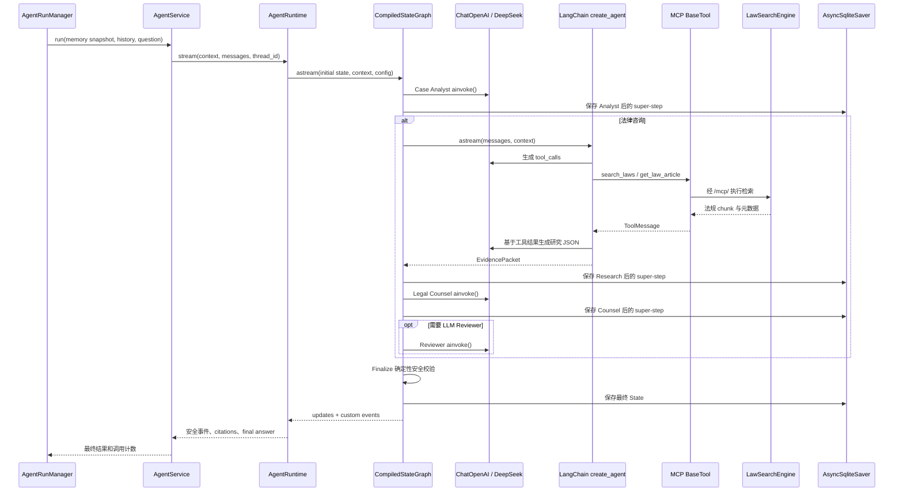
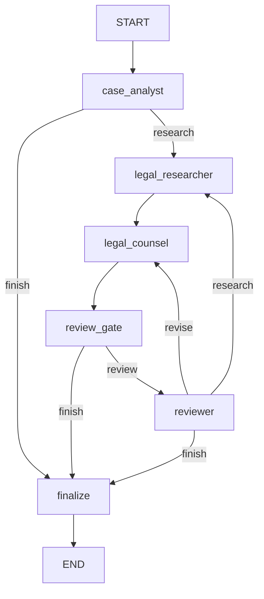

# LawStation 的 LangChain 与 LangGraph 实现详解

> Review 基线：2026-09-01 当前工作区。本文件只描述代码中已经接通的能力，不把规划中的框架功能写成已实现。核心代码位于 `backend/app/agent/` 和 `backend/app/services/agent_runs.py`。

## 1. 一句话结论

LawStation 不是简单地调用一次大模型，而是采用两层 Agent 编排：

```text
外层：LangGraph StateGraph
├── 管理案情分析、法律研究、意见生成、复核和最终校验
├── 传递结构化 State
├── 根据节点结果执行条件路由
└── 通过 AsyncSqliteSaver 保存节点级 Checkpoint

内层：LangChain create_agent
└── 仅在 Legal Research 节点中执行
    ├── DeepSeek 判断是否调用工具
    ├── MCP Tool 执行法规检索
    ├── ToolMessage 返回工具结果或错误
    └── DeepSeek 根据工具结果继续生成研究 JSON
```

这种设计把“业务流程控制”和“模型—工具自主循环”分开：LangGraph 决定咨询经过哪些业务阶段，LangChain Agent 只负责研究阶段如何使用法律检索工具。

## 2. 依赖及其用途

依赖声明位于 `pyproject.toml`：

| 依赖 | 当前版本范围 | 项目用途 |
|---|---|---|
| `langchain` | `>=1.3.14,<2` | `create_agent`、Agent Middleware、模型和工具循环 |
| `langchain-core` | `>=1.5.4,<2` | Message、`BaseTool` 等基础协议 |
| `langchain-openai` | `>=1.1,<2` | 用 `ChatOpenAI` 连接 DeepSeek OpenAI-compatible API |
| `langgraph` | `>=1.1,<2` | `StateGraph`、节点、条件边、Runtime 和流式执行 |
| `langgraph-checkpoint-sqlite` | `>=3,<4` | `AsyncSqliteSaver` 节点级持久化 |
| `langchain-mcp-adapters` | `>=0.3,<1` | 把标准 MCP 工具转换为 LangChain `BaseTool` |

项目没有使用 LangChain 的内置向量库、文档加载器或 Text Splitter。法规切分、BM25、FAISS、RRF 和 BGE 精排均由 `mcp_servers/law_rag/` 自行实现，再通过 MCP 暴露给 LangChain Agent。

## 3. 完整调用链



业务入口关系：

```text
AgentRunManager._execute
→ AgentService.run
→ AgentRuntime.stream
→ LegalConsultationGraph.compiled.astream
```

对应文件：

- `backend/app/services/agent_runs.py::AgentRunManager._execute`
- `backend/app/agent/service.py::AgentService.run`
- `backend/app/agent/runtime.py::AgentRuntime.stream`
- `backend/app/agent/graph.py::LegalConsultationGraph`

## 4. LangChain 使用方式

### 4.1 `ChatOpenAI` 连接 DeepSeek

`backend/app/agent/provider.py::LLMProvider` 集中创建两类 LangChain 模型客户端。

主 Agent 模型：

```python
ChatOpenAI(
    model=settings.deepseek_model,
    api_key=settings.deepseek_api_key,
    base_url=settings.deepseek_base_url,
    streaming=True,
    temperature=settings.llm_temperature,
    timeout=settings.llm_request_timeout_seconds,
    max_retries=settings.llm_max_retries,
)
```

它既可以被 Analyst、Counsel、Reviewer 直接 `ainvoke()`，也可以传给 Research 的 `create_agent()`。`LLMProvider` 缓存的是无用户状态的客户端配置，不缓存消息、案件、证据或回答。

记忆模型仍使用 `ChatOpenAI`，但使用独立实例：

- `streaming=False`；
- 显式关闭 Thinking；
- 不绑定任何 Tool；
- 通过 `bind(response_format={"type": "json_object"})` 请求 JSON Output。

因此回答 Agent 和记忆整理共享 Provider 设计，但不共享调用链和用户状态。

### 4.2 LangChain Message 协议

项目使用：

| Message | 用途 |
|---|---|
| `SystemMessage` | 注入节点职责、证据边界和输出协议 |
| `HumanMessage` | 携带用户消息或序列化后的结构化 payload |
| `AIMessage` | 表示历史助手消息及模型完整响应 |
| `ToolMessage` | 把 MCP 工具结果或错误反馈给 Research 模型 |
| `BaseMessage` | Graph State 中各种消息的共同类型 |

`AgentService.run()` 把 SQLAlchemy `Message` 转换为 LangChain Message。ORM Session 在转换后关闭，不会进入异步 Graph。

当前问题最后追加为 `HumanMessage`，使其在时间顺序上晚于历史消息；配合 Prompt 和事实边界校验，实现“用户最新事实优先”。

### 4.3 直接 `ainvoke()` 的结构化节点

Case Analyst、Legal Counsel、Reviewer、Evidence Selector 和 `case-intake` Skill 不需要自主调用工具，因此不使用 `create_agent()`，而统一走：

```text
检查本轮模型调用额度
→ SystemMessage + HumanMessage
→ ChatOpenAI.ainvoke()
→ 取得完整 AIMessage
→ 提取 JSON
→ Pydantic model_validate
→ 返回结构化对象
```

实现位于 `LegalConsultationGraph._invoke_json()`。

这里的“结构化输出”采用 Prompt 约束、JSON 提取和 Pydantic 校验，而不是 `with_structured_output(function_calling)`。原因是当前 DeepSeek Thinking 配置与 `tool_choice` 存在兼容边界。解析或 Schema 失败后，由各节点决定受控降级，而不是直接相信模型文本。

### 4.4 `create_agent()` 的研究子 Agent

`LegalConsultationGraph.__init__()` 只为 Research 创建 LangChain Agent：

```python
self.research_agent = create_agent(
    model=model,
    tools=tools,
    context_schema=AgentInvocationContext,
    middleware=[...],
    name="legal-research-agent",
)
```

各参数的实际作用：

- `model`：共享的 DeepSeek `ChatOpenAI`；
- `tools`：MCP Adapter 发现并包装的 `BaseTool`；
- `context_schema`：让 Middleware 读取本轮身份、计数和审计设置；
- `middleware`：限制调用、设置工具超时、记录审计并把错误转成 `ToolMessage`；
- `name`：用于运行标识和 Trace 层级。

`create_agent()` 返回的是一个可执行的 LangChain Agent Graph。构造时不会调用模型或工具；只有 `legal_researcher()` 执行 `research_agent.astream()` 时才开始循环。

Research 的内部循环大致为：

```text
模型读取研究任务
→ 产生 search_laws/get_law_article tool_call
→ LangChain 调用 BaseTool
→ MCP Adapter 经 HTTP 执行 /mcp/
→ 工具结果形成 ToolMessage
→ 模型读取 ToolMessage
→ 必要时继续调用工具
→ 输出 EvidencePacket JSON
```

项目不手写 `for` 循环、不手工执行每个 `tool_call`，这些由 `create_agent()` 接管。

### 4.5 MCP Tool 如何进入 LangChain

`backend/app/agent/registry.py::MCPToolRegistry` 使用：

```python
MultiServerMCPClient(...).get_tools()
```

`langchain-mcp-adapters` 根据 MCP 的工具名称、描述和输入 Schema 生成 LangChain `BaseTool`。当前 Research 获得的法律工具是标准 `/mcp/` 协议工具，而不是直接调用 `LawSearchEngine` handler。

Registry 缓存：

- `BaseTool` Wrapper；
- 工具名称映射；
- 工具目录版本和加载状态。

Registry 不缓存：

- 法规查询结果；
- `ToolMessage`；
- MCP Session；
- 用户或会话上下文。

工具目录变化后，Registry `version` 进入 AgentRuntime 的 Graph Cache Key，触发绑定新工具 Schema 的 Graph 原子重编译。

### 4.6 Agent Middleware

Research Agent 使用四层 Middleware：

| Middleware | 作用 |
|---|---|
| `InvocationModelLimitMiddleware` | 把 Research 内部模型调用计入整个咨询的请求级总数 |
| `ToolCallLimitMiddleware` | 限制一次 Research Agent 运行中的工具调用，当前为 `min(AGENT_MAX_TOOL_CALLS, 2)` |
| `ModelCallLimitMiddleware` | 防止 Research 内部模型—工具循环无限运行 |
| `ToolAuditMiddleware` | 包装真实工具调用，执行总量检查、超时、错误转换、安全事件和数据库审计 |

`ToolAuditMiddleware.awrap_tool_call()` 包裹每一次真实 Tool Call：

```text
检查请求级工具总量
→ 发布 tool_call_start
→ asyncio.wait_for(handler(request))
→ 成功或错误 ToolMessage
→ 记录 ToolCallRecord / RetrievalTrace
→ 发布 tool_call_result
→ 更新 tool_trajectory
```

工具超时、业务错误和传输异常均返回 `ToolMessage(status="error")`，让模型有机会基于失败状态生成受控回答。传输或协议异常还会把 MCP Registry 标记为 stale，但不会自动重放本次工具调用。

### 4.7 LangChain Streaming 的实际语义

Research 使用：

```python
research_agent.astream(
    {"messages": [...]},
    context=runtime.context,
    stream_mode=["updates", "custom"],
    version="v2",
)
```

- `updates`：读取 Agent 的模型消息和 `ToolMessage`，用于组装 EvidencePacket；
- `custom`：转发 Middleware 写出的安全工具状态；
- 工具完整参数、法规正文和 reasoning 不直接发送前端。

项目没有把模型 token 原样透传给浏览器。外层 Graph 完成 Finalize 后，`AgentRuntime.stream()` 才把已经通过复核的 `final_answer` 每 24 个字符切分为业务 `token` 事件。这保证草稿、工具参数和内部推理不会提前泄露。

## 5. LangGraph 使用方式

### 5.1 `StateGraph` 定义业务工作流

`LegalConsultationGraph._compile()` 创建：

```python
StateGraph(
    LegalConsultationState,
    context_schema=AgentInvocationContext,
)
```

两个类型承担不同职责：

| 类型 | 生命周期 | 是否进入 Checkpoint | 内容 |
|---|---|---:|---|
| `LegalConsultationState` | 单个 AgentRun | 是 | 消息、分析、证据、草稿、复核、计数和最终答案 |
| `AgentInvocationContext` | 单次执行请求 | 否 | 不可变身份、可变 metrics、Trace 配置和评测摘要 |

Graph 对象在应用级复用，但每次 `compiled.astream()` 都收到独立 State 和 Context，因此不会把某个用户的案件状态保存到共享 Graph 实例中。

### 5.2 Graph State 包含什么

`backend/app/agent/state.py::LegalConsultationState` 主要字段：

```text
输入：messages, memory_context
分析：case_analysis, current_fact_overrides
研究：evidence_packet
生成：counsel_draft
复核：review_result
循环：retry_count, revision_count
恢复计数：model_call_count, tool_call_count, tool_trajectory
输出：final_answer, citations, errors
```

State 只保存可以被 JsonPlus/msgpack 序列化的 Message、Pydantic 对象和普通容器。SQLAlchemy Session、HTTP Client、MCP Session、LangSmith Client 和 API Key 不允许进入 State。

### 5.3 节点与条件边

当前 Graph：



节点注册：

- `add_node()` 把节点名称绑定到异步执行函数；
- `add_edge()` 声明无条件后继节点；
- `add_conditional_edges()` 先调用路由函数，再根据字符串映射选择节点；
- `compile(checkpointer=...)` 生成可供多请求复用的 `CompiledStateGraph`。

`compile()` 只建立拓扑，不调用 DeepSeek、MCP 或 RAG。

### 5.4 每个节点的职责

| LangGraph 节点 | 是否调用 LLM | 是否调用 Tool | 主要 State 输出 |
|---|---:|---:|---|
| `case_analyst` | 是 | 否 | `case_analysis`、事实覆盖、active Skills |
| `legal_researcher` | 是，内部可能多次 | 是，唯一节点 | `evidence_packet`、工具计数和轨迹 |
| `legal_counsel` | 是 | 否 | `counsel_draft`、Skill 输出 |
| `review_gate` | 否 | 否 | 确定性 ReviewResult 或进入 Reviewer 的决定 |
| `reviewer` | 是 | 否 | `review_result`、补检索或改稿动作 |
| `finalize` | 否 | 否 | `final_answer`、chunk 级 citations |

路由函数 `after_analysis()`、`after_review_gate()` 和 `after_review()` 本身不调用模型，只读取 State 并返回条件边的 key。

### 5.5 `Runtime` 与 `stream_writer`

每个节点参数中的：

```python
runtime: Runtime[AgentInvocationContext]
```

由 LangGraph 注入。节点通过：

- `runtime.context` 读取请求级身份、模型/工具计数和 Trace 信息；
- `runtime.stream_writer()` 写出 `agent_status` 和工具安全状态。

这些 custom event 经 `AgentRuntime.stream()` 补充 request/user/conversation 快照，再由 `AgentRunManager` 持久化为有 sequence 的事件。内部 State update 不直接发给前端，因为其中可能包含草稿、证据正文和内部结构化结果。

### 5.6 外层 Graph 的流模式

`AgentRuntime.stream()` 执行：

```python
graph.compiled.astream(
    graph_input,
    context=context,
    config=config,
    stream_mode=["updates", "custom"],
    version="v2",
)
```

处理规则：

- `custom`：转换为安全业务事件并向上游 yield；
- `updates`：仅在服务端合并成 `final_state`；
- Graph 完成后：生成评测摘要、citations、最终正文和 `agent_final`。

因此 LangGraph Streaming 在本项目中的主要价值是节点状态和工具状态传递，而不是直接展示模型逐 token 推理。

## 6. LangGraph Checkpoint 与任务恢复

### 6.1 `AsyncSqliteSaver`

FastAPI lifespan 通过 `backend/app/agent/checkpoint.py::checkpoint_saver()` 创建：

```python
AsyncSqliteSaver(
    aiosqlite_connection,
    serde=JsonPlusSerializer(pickle_fallback=False),
)
```

Checkpoint 单独存放在：

```text
data/runtime/langgraph-checkpoints.db
```

不与业务数据库共用文件，避免节点 Checkpoint 写入和消息、记忆事务竞争同一 SQLite 锁。`pickle_fallback=False` 禁止任意 Pickle 反序列化回退。

### 6.2 Thread 与根图 Namespace

每个 AgentRun 使用：

```text
thread_id = agent-run:<run_id>
```

不能直接使用 `conversation_id`，因为 Checkpoint 只负责一次长任务的恢复。如果跨多轮共用 conversation thread，LangGraph State 会成为 SQL 消息与 MemoryService 之外的第二套会话记忆。

根 Graph invocation 不设置 `checkpoint_ns`。它不是业务版本标签，而是 LangGraph 用于定位嵌套子图的内部路径；根图实际 namespace 为空字符串。若业务层传入任意非空版本名，`compiled.aget_state()` 会按子图查找并在不存在时抛出 `Subgraph ... not found`。版本信息继续记录在 Trace metadata、SPEC 和实验 manifest 中。

### 6.3 新任务和恢复任务

新任务：

```text
构造完整初始 State
→ compiled.astream(state, ...)
```

服务重启后的恢复任务：

```text
compiled.aget_state(config)
→ 读取最近 Checkpoint
→ 恢复模型/工具计数、轨迹和 Graph State
→ compiled.astream(None, ...)
→ 从下一个未完成 super-step 继续
```

`None` 的含义是沿用已有 thread 的 Checkpoint，而不是重新提交初始 State。

Graph 完成后的 `checkpoint_info()` 只负责取得 checkpoint ID。该非关键读取失败时返回空元数据并继续保存回答；恢复执行前的 `aget_state()` 失败则必须终止当前 attempt，避免丢失计数后重复调用模型或工具。

Checkpoint 通常位于 super-step 边界，不是每个 token 都保存。因此当前执行语义是：

```text
Graph 节点：至少一次
节点之间：Checkpoint 恢复
最终消息与 SSE token：业务层幂等
```

如果 Research 在 MCP 调用完成后、节点 Checkpoint 写入前崩溃，该只读检索可能再次执行。当前 MCP 法律工具都是只读操作，因此可以接受；未来具有副作用的 Tool 必须增加幂等键。

### 6.4 Checkpoint 不是业务任务系统

LangGraph Checkpoint 不负责：

- 租户和用户所有权；
- queued/running/completed 状态；
- 同会话唯一活动任务；
- Worker lease；
- 用户取消；
- SSE sequence 和事件重放；
- 最终消息幂等落库。

这些由 `AgentRunManager`、`AgentRun` 和 `AgentRunEvent` 负责。两层组合后，页面断开只会结束订阅，不会终止后台 Graph；服务重启后 Worker 可以回收过期 lease，并使用相同 `thread_id` 从 Checkpoint 继续。

### 6.5 已使用的 Checkpoint API

| API | 使用位置 | 用途 |
|---|---|---|
| `AsyncSqliteSaver.setup()` | lifespan | 初始化 Checkpoint 表 |
| `compiled.aget_state()` | Runtime | 恢复最新 State 或读取安全结果摘要 |
| `compiled.astream()` | Runtime | 新执行或从 Checkpoint 续跑 |
| `checkpointer.adelete_thread()` | Runtime | 清理已授权测试会话或过期 Run 的 Checkpoint |

当前业务链路没有使用 `interrupt()`、`Command(resume=...)` 或人工审批节点，也没有把 `aget_state_history()` 暴露成产品功能。

## 7. LangGraph 的精简运行边界

产品运行时 Skill 已移除，不再作为 LangGraph State、Prompt 或事件的一部分。Case Analyst 只执行一次 `_invoke_json()`；Legal Research 仍是唯一使用 LangChain `create_agent` 并绑定 MCP Tool 的节点。仓库 `.agents/skills/` 只服务 SDD 开发流程，与 LangGraph 运行时无关。

## 8. LangGraph 与 LangSmith 的关系

LangSmith 不承担 Graph State、Checkpoint 或任务状态。项目把请求级 Trace config 传入：

```text
AgentRun 根 Trace
→ AgentRuntime config
→ CompiledStateGraph
→ LangGraph 节点
→ ChatOpenAI
→ LangChain Research Agent
→ MCP Tool
```

LangChain/LangGraph 的标准调用可以形成嵌套 Trace；MCP HTTP 边界通过 Interceptor 传播签名后的父上下文。Trace 故障采用 fail-open，不影响 Graph、工具和消息保存。

## 9. 没有使用或刻意没有使用的能力

为了避免面试时过度表述，需要明确：

- 没有把三个业务角色分别做成三个 `create_agent()`；只有 Research 使用它；
- 没有使用 LangGraph Checkpointer 作为跨轮聊天记忆；
- 没有使用 LangGraph Store 保存长期记忆；
- 没有使用 LangGraph `interrupt()` 实现 Human-in-the-loop；
- 没有使用 LangChain Retriever 或 VectorStore 封装 FAISS；
- 没有让 Agent 直接访问 RAG 内部函数，仍经过标准 MCP；
- 没有把模型原始 reasoning 或草稿 token 输出到前端；
- 没有依靠 LangSmith 作为任务或审计事实源。

这些不是缺陷，而是清晰的系统边界：业务消息和记忆由 SQLAlchemy/SQLite 管理，长任务由 AgentRun 管理，节点恢复由 LangGraph 管理，工具互操作由 MCP 管理，Trace 由 LangSmith 管理。

## 10. 设计收益

### 可控性

LangGraph 把 Agent 路由显式化；补检索和改稿各有次数限制，Finalize 还能执行不依赖模型的证据边界校验。

### 工具安全

只有 Research 绑定 `BaseTool`。工具调用经过 Middleware 的总量、超时、审计和错误转换，模型无法绕过所有权边界指定任意用户。

### 并发隔离

Compiled Graph、ChatOpenAI 和 Tool Wrapper 可以共享；State、Context、Checkpoint thread、metrics、消息和证据按 AgentRun 隔离。

### 故障恢复

AsyncSqliteSaver 保存 super-step State，AgentRun 保存租约和事件；二者结合后支持节点级恢复、最终消息幂等和 SSE 重放。

### 可观测性

Graph 节点、模型、工具和 MCP/RAG 阶段可以进入同一 Trace，同时业务事件表仍保留可重放的用户安全输出。

## 11. 当前不足与后续方向

1. 直接模型节点仍采用手工 JSON 提取，模型格式波动会触发降级；后续可在模型兼容后评估原生结构化输出。
2. matched 路径通常包含 Analyst、Research 多轮、Counsel 和 Reviewer，首正文延迟较高；当前通过确定性 Review Gate 只优化安全的低风险 `no_match`。
3. SQLite Checkpointer 适合当前单机项目；若扩展到多实例部署，需要评估支持并发 Worker 的持久化后端和分布式任务协调。
4. 当前没有 Human-in-the-loop。未来若增加高风险审批或副作用工具，可在明确节点使用 LangGraph `interrupt()`，但不能为了展示框架而无业务必要地引入。
5. 节点语义是至少一次，未来接入写操作 Tool 时必须补充业务幂等键和补偿策略。

## 12. 面试讲解建议

推荐按以下顺序说明：

1. **为什么分两层**：LangGraph 控制业务状态机，LangChain `create_agent` 只解决研究节点的模型—工具循环。
2. **为什么只有 Research 有 Tool**：通过最小权限减少法条幻觉和越权面。
3. **State 与 Context 的区别**：State 可持久化，Context 只服务本轮运行依赖；共享 Graph 不保存用户状态。
4. **Checkpoint 与任务表的区别**：Checkpoint 恢复节点，AgentRun 管理所有权、租约、取消和 SSE。
5. **为什么不是原始 token 流**：先完成复核和 Finalize，再发送批准正文，换取证据安全边界。
6. **如何防无限循环**：条件路由计数、LangChain Model/Tool Middleware 和请求级 metrics 三层限制。

可用于简历的表述：

> 基于 LangGraph StateGraph 编排案情分析、法律检索、意见生成、确定性复核与 LLM Reviewer 节点，在 Legal Research 节点内使用 LangChain `create_agent` 与 MCP Adapter 实现 DeepSeek—工具—ToolMessage 自主循环；通过请求级 Context、Pydantic State、模型/工具 Middleware 和 chunk 级证据校验控制调用边界，并引入 AsyncSqliteSaver 与 AgentRun 租约/事件日志，实现节点级故障恢复、最终消息幂等和 SSE 断线重放。

## 13. 关键代码阅读顺序

1. `backend/app/agent/state.py`：先理解 State、Identity、Metrics、Context。
2. `backend/app/agent/graph.py::LegalConsultationGraph._compile`：理解节点和路由。
3. `backend/app/agent/graph.py::legal_researcher`：理解内层 `create_agent`。
4. `backend/app/agent/middleware.py`：理解模型/工具调用治理。
5. `backend/app/agent/registry.py`：理解 MCP Tool 如何成为 `BaseTool`。
6. `backend/app/agent/runtime.py::AgentRuntime.stream`：理解执行、流和恢复。
7. `backend/app/agent/checkpoint.py`：理解 `AsyncSqliteSaver` 生命周期。
8. `backend/app/agent/service.py`：理解业务消息到 LangChain Message 的转换。
9. `backend/app/services/agent_runs.py::AgentRunManager._execute`：理解持久任务、租约、幂等和 SSE 事件。
