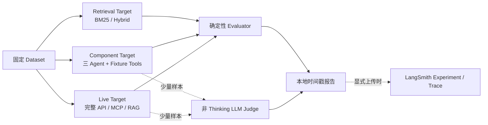

# LawStation LangSmith 使用与简历数据指南

> 适用代码基线：2026-08-24 当前工作区。本文描述的是仓库中已经存在的命令和约束，不把规划中的在线 Judge Worker 当成已实现能力。

## 1. 这套评测解决什么问题

LawStation 的评测不是只看“回答像不像正确”，而是把系统拆成三类可定位目标：



- `retrieval`：只测检索器，定位分词、阈值、过滤、Dense 和 RRF 的问题。
- `component`：使用固定工具结果测三 Agent 编排，避免真实检索波动干扰 Prompt 和路由判断。
- `live`：测真实 MCP 与完整应用链路，用于最后确认，不适合作为日常高频测试。

关键实现：

- `scripts/run_langsmith_eval.py::run`：单次评测入口。
- `scripts/run_staged_langsmith_eval.py::main`：记录实际用量的分阶段对比入口；上传仍需显式确认。
- `backend/app/evaluation/targets.py::RetrievalTarget`：检索评测目标。
- `backend/app/evaluation/targets.py::agent_target`：组件/完整 Agent 目标。
- `backend/app/evaluation/evaluators.py::DETERMINISTIC_EVALUATORS`：确定性指标。
- `backend/app/evaluation/judge.py::LegalQualityJudge`：一次调用返回八项语义评分。
- `backend/app/core/resource_budget.py::MonthlyResourceBudget`：进程安全的月度用量账本；生产Trace仍使用限额接口，评测使用无限额的实际用量追加。
- `backend/app/evaluation/reporting.py::ReportRun`：时间戳报告与原子写入。

LangSmith 官方把一次根 Run 及其所有子 Span 计作一条 Trace；三 Agent、模型和工具子节点不会各自再计成一条根 Trace。`upload_results=False` 时，应用与 evaluator 的 Trace 都不会上传。官方参考：[Usage](https://docs.langchain.com/langsmith/view-usage)、[Local evaluation](https://docs.langchain.com/langsmith/local)。

## 2. 开始前准备

### 2.1 使用项目 Conda 环境

所有命令均从仓库根目录运行：

```bash
cd /Users/Admin1/Files/LawStation
conda run -n LawStation python --version
```

项目禁止创建仓库内 `.venv`。评测完成后也不会默认启动 LawStation；只有显式执行分阶段 `compare/release`，脚本才会按流程临时启动并在 `finally` 中关闭自己创建的进程。

### 2.2 `.env` 最小配置

仅学习确定性 evaluator 时无需 LangSmith 或模型密钥。需要上传 Trace 时配置：

```dotenv
LANGSMITH_ENABLED=true
LANGSMITH_API_KEY=<your-key>
LANGSMITH_ENDPOINT=https://api.smith.langchain.com
LANGSMITH_WORKSPACE_ID=<your-workspace-id>
LANGSMITH_PROJECT=lawstation
LANGSMITH_ENVIRONMENT=development
LANGSMITH_ID_HASH_SECRET=<独立随机密钥>
```

运行真实 Agent 还需要现有 DeepSeek 配置。启用 Judge 时可以使用独立配置：

```dotenv
LANGSMITH_EVALUATOR_MODEL=
LANGSMITH_EVALUATOR_BASE_URL=
LANGSMITH_EVALUATOR_API_KEY=
LANGSMITH_EVALUATOR_TEMPERATURE=0
```

未配置 Judge Key 时，`LegalQualityJudge` 会回退使用 `DEEPSEEK_API_KEY` 和 Agent 模型，但仍创建独立、关闭 Thinking、无工具的模型实例。

建议面试实验使用脱敏或合成样本，并优先设置：

```dotenv
LANGSMITH_CAPTURE_CONTENT=false
```

只有确认数据授权与隐私边界后才上传咨询正文。API Key、Authorization、Cookie、数据库 URL 和 `reasoning_content` 无论此开关如何都会被项目过滤。

### 2.3 线上全链路 Trace

临时排查线上用户与 AI 的端到端链路时，使用进程参数，而不是修改 `.env`：

```bash
python run.py --langsmith-trace-all
python run.py --langsmith-trace-all --langsmith-trace-limit 50
```

启动器会在启动前验证 LangSmith 配置和网络鉴权。成功后，每轮咨询在 Agent 项目中只占一个根 Trace，可展开查看排队、MemorySnapshot、Case Analyst、Legal Research、MCP、RAG 的 BM25/Ollama/FAISS/RRF、Counsel、Review Gate/Reviewer、Finalize 和回答保存。后台记忆 Job 进入 memory 项目，占用另一根 Trace并通过 `linked_consultation_trace_id` 关联。

排查完成后重启并使用默认配置，或显式关闭：

```bash
python run.py --no-langsmith-trace
```

`/health` 的 `langsmith` 字段用于确认 `runtime_mode`、导出状态和本次进程额度。达到额度或运行期网络故障后业务继续；不要把 `degraded/exhausted` 误判为咨询失败。

### 2.4 资源预算

默认月度上限：

```dotenv
LANGSMITH_MONTHLY_PRODUCTION_TRACE_BUDGET=20
```

账本位于：

```text
data/runtime/eval-resource-budget.json
```

脚本会先按 `AGENT_MAX_MODEL_CALLS` 预留最坏用量，成功后再按实际调用结算；失败运行保守保留已经预留或发生的用量。不要手工删除或改写账本来绕过限额。

## 3. 推荐学习顺序

### 第一步：零成本理解 evaluator

```bash
conda run -n LawStation python scripts/run_langsmith_eval.py --profile learn
```

真实行为：

- 固定抽取 6 个类别样本：`casual/clarification/matched/no_match/tool_error/memory`；
- 使用 fixture 输出运行全部确定性 evaluator；
- 不调用 DeepSeek、Judge、Ollama 或 LangSmith；
- 生成 `learn.json`、`learn.csv` 和 `run-manifest.json`。

重点阅读 `learn.json.details`：它会并列展示输入、期望、实际 fixture 输出、每个指标的分数与失败原因。此阶段用于学习指标，不产生可描述模型效果的成绩。

### 第二步：只查看云端计划

```bash
conda run -n LawStation python scripts/run_staged_langsmith_eval.py \
  --profile compare --plan-only
```

该命令只打印：

- 检索、Reviewer、E2E 样本数；
- 预计根 Trace 数；
- Judge 调用数；
- Agent 模型调用最坏上限。

它不会创建报告目录、启动服务、调用模型或上传数据。每次准备做云端实验前都先运行该命令。

### 第三步：本地真实 Smoke

```bash
conda run -n LawStation python scripts/run_langsmith_eval.py --profile smoke
```

真实行为：

- 执行 6 条真实三 Agent `component` 调用；
- 法律工具使用 fixture，不依赖真实 MCP 和法规召回；
- 会调用 DeepSeek；
- 强制 `upload_results=false`、`repetitions=1`、`concurrency=1`；
- 默认不调用 Judge，不消耗 LangSmith Trace。

若只想学习一次 Judge：

```bash
conda run -n LawStation python scripts/run_langsmith_eval.py \
  --profile smoke --judge --judge-max-examples 1
```

一次 Judge 请求同时返回法律问题覆盖、证据一致性、事实忠实、风险校准、完整性、可执行性、清晰度和帮助程度八个维度，不能为八项分别发起八次模型请求。

### 第四步：本地 RAG 回归

BM25 与 Hybrid 应使用同一数据集、同一种子和同一 `top_k`。先检查正式索引与 Ollama 模型 digest 是否匹配；Hybrid 必须满足 `dense_enabled=true`。

小样本调试示例：

```bash
conda run -n LawStation python scripts/run_langsmith_eval.py \
  --profile smoke \
  --dataset lawstation-live-retrieval-v1 \
  --mode retrieval \
  --rag-mode bm25 \
  --max-examples 10 \
  --sample-categories matched,no_match \
  --sample-seed 42

conda run -n LawStation python scripts/run_langsmith_eval.py \
  --profile smoke \
  --dataset lawstation-live-retrieval-v1 \
  --mode retrieval \
  --rag-mode hybrid \
  --max-examples 10 \
  --sample-categories matched,no_match \
  --sample-seed 42
```

`smoke` 强制本地运行，因此两次都不上传 Trace。比较时确认两个报告的 `batch.examples[].content_sha256` 完全一致。

扩展到完整 100 条源数据派生集后，可以得到工程检索回归数据；但该集合当前 `human_verified=false`，只能表述为“基于真实法规 ID 的源数据派生基准”，不能称为律师人工标注准确率。

### 第五步：初始化 LangSmith Dataset

首次云端实验前执行一次：

```bash
conda run -n LawStation python scripts/seed_langsmith_datasets.py
```

脚本上传 `evals/datasets/*.jsonl`。如果同名远端 Dataset 的 `source_sha256` 与本地不同，脚本会拒绝静默覆盖；应创建新的版本化数据集名称，而不是改变旧基准的含义。

LangSmith 的离线评测由 Dataset、Target 和 Evaluator 组成；每次 Target 在 Dataset 上运行形成 Experiment。官方参考：[Evaluation quickstart](https://docs.langchain.com/langsmith/evaluation-quickstart)、[Evaluation concepts](https://docs.langchain.com/langsmith/evaluation-concepts)。

### 第六步：小样本云端 Compare

确认预算和数据后，才执行：

```bash
conda run -n LawStation python scripts/run_staged_langsmith_eval.py \
  --profile compare --confirm-upload --sample-seed 42
```

默认比较：

| 实验 | Baseline | Candidate | 样本/组 | Judge |
|---|---|---|---:|---:|
| RAG | BM25 | BM25 + Dense + RRF | 10 | 0 |
| Reviewer | 始终 LLM Reviewer | 自动确定性 Fast Path | 3 | 每个输出一次 |
| E2E | BM25 + 始终 LLM Reviewer | Hybrid + Fast Path | 2 | 每个输出一次 |

脚本具有以下保护：

1. 没有 `--confirm-upload` 立即拒绝；
2. 先检查 Key、数据、索引和依赖测试；
3. 只在需要时启动 Ollama 和 LawStation；
4. Hybrid 实际降级为 BM25 时停止；
5. 安全门禁失败时停止后续阶段；
6. `finally` 只关闭本次脚本创建的进程；
7. 中途失败仍保留已完成报告和失败阶段。

`release` 会扩大见证样本，只在重要 Prompt、Graph、模型或检索策略变更且 `compare` 通过后手工执行：

```bash
conda run -n LawStation python scripts/run_staged_langsmith_eval.py \
  --profile release --confirm-upload --sample-seed 42
```

不要把 `release` 当作日常命令。

## 4. 如何查看结果

### 4.1 本地报告

每次非 `plan-only` 运行写入：

```text
evals/reports/runs/YYYYMMDD-HHMMSS-ffffff-<profile>/
```

常用文件：

- `run-manifest.json`：状态、时区、完成产物、失败阶段和复用来源；
- `<experiment>.json`：样本量、指标、运行参数、版本和资源用量；
- `<experiment>.csv`：便于复制到表格或绘图；
- `EVAL_REPORT.md`：分阶段对比汇总；
- `experiment-manifest.json`：Baseline/Candidate 实验映射。

快捷索引：

```text
evals/reports/runs/latest.json
evals/reports/runs/latest-success.json
```

判断一组数字能否写进简历时检查：

| 字段 | 含义 |
|---|---|
| `sample_size` | 实际唯一样本数 |
| `run_count` | 含重复次数的实际运行数 |
| `missing_required_metrics=[]` | 该模式强制指标齐全 |
| `local_reproducible=true` | 完整本地检索结果有数据/索引/代码版本依据 |
| `langsmith_witness_complete=true` | 预期小样本 Trace 已完整上传 |
| `resume_eligible=true` | 在报告声明的范围内具备引用条件 |
| `resource_usage` | Trace、Agent、Judge、缓存和预算余量 |

`resume_eligible=false` 不一定代表系统失败。例如本地 Agent Smoke 没有上传见证 Trace，所以适合调试但不应作为最终简历统计。

### 4.2 LangSmith 页面

进入项目后按以下顺序查看：

1. 在 Tracing Project 查看一轮咨询的根 Trace；
2. 展开 Case Analyst、Legal Research、MCP Tool、Legal Counsel 和 Reviewer 子 Span；
3. 核对 metadata 中的 Graph、Prompt、模型、索引版本和脱敏身份标识；
4. 在 Datasets & Experiments 选择同一 Dataset；
5. 勾选 Baseline 与 Candidate，点击 Compare；
6. 用 feedback key 筛选退化样本，再进入 Trace 对照中间步骤。

LangSmith 支持同一 Dataset 下多实验并排比较，并标识各 feedback key 的改善或退化。官方参考：[Compare experiment results](https://docs.langchain.com/langsmith/compare-experiment-results)。

Token 和成本可在单条 Trace、项目统计或 Dashboard 中查看；OpenAI-compatible 模型若无法自动映射价格，成本字段可能为空或为零，此时应报告 Token，不要自行伪造成本。官方参考：[Cost tracking](https://docs.langchain.com/langsmith/cost-tracking)。

## 5. 当前指标如何解释

### RAG 指标

- `retrieval_recall_at_k`：前 5 个结果覆盖多少期望 `document_id`；适合衡量“有没有召回”。
- `retrieval_mrr`：第一个正确法规的排名倒数；适合衡量“是否排在前面”。
- `exact_article_hit`：期望 `chunk_id` 是否进入前 5；适合验证长法条的 chunk 级证据。
- `retrieval_status_correctness`：是否正确区分 `matched/no_match`。
- `mean_retrieval_duration_ms`：目标函数记录的检索耗时；与 LangSmith 根 Trace 延迟的口径不同，报告时必须注明。

### Agent 安全与正确性指标

- `route_correctness`：Case Analyst 的下一步与参考路由一致。
- `schema_validity`：结构化 State 满足基本契约。
- `citation_grounding`：最终引用均能映射到本轮 EvidencePacket。
- `no_match_safety`：无法条时引用为空、不编造法名条号且明确披露。
- `tool_trajectory`：只有 Legal Research Agent 调用工具。
- `loop_limit`：工具、模型、检索回流和修改次数没有越界。
- `latest_fact_priority`：当前消息覆盖冲突历史事实。
- `tenant_isolation`：回答不包含测试定义的其他用户禁用事实。
- `completion_success`：链路产生非空最终回答且没有错误。

### 质量与效率指标

- `judge_*`：八项 Judge 评分已归一化到 `0–1`；样本少时只用于发现问题和展示方法，不能声称总体准确率。
- `mean_model_calls`：每个问题平均模型调用数。
- `mean_tool_calls`：每个问题平均工具调用数。
- `llm_review_rate`：实际进入 LLM Reviewer 的比例。
- `project_stats.latency_p50/p95`：LangSmith 实验根 Run 延迟。
- `project_stats.total_tokens/total_cost`：只有 SDK/模型返回可识别 usage 和价格时才可信。

## 6. 如何设计一组能写进简历的实验

### 6.1 RAG 消融：最值得优先完成

目标：证明 Hybrid 是否比 BM25 更好，而不是只证明“接入了向量数据库”。

控制变量：

- 同一 100 条检索集；
- 同一 `top_k=5`；
- 同一法规文件、chunk 参数和过滤逻辑；
- 只改变 `rag_mode=bm25|hybrid`；
- 固定 `sample_seed`，保存 Dataset SHA256、索引指纹和 Git Commit。

应记录：

- Recall@5、MRR、exact article hit；
- `no_match` 状态准确率；
- 平均检索耗时，最好补充 p50/p95；
- Hybrid 相对 BM25 的绝对变化和相对变化。

如果 Hybrid 只提高 MRR、没有提高 Recall，也可以诚实表述为“改善正确法条排序”，不要写成“召回率显著提高”。

### 6.2 Reviewer 消融：体现 Agent 工程能力

目标：证明确定性 Fast Path 在不降低安全指标时减少模型调用和延迟。

控制变量：只改变 `review_mode=always-llm|auto`，其余模型、Prompt、fixture evidence 和样本完全一致。

应记录：

- `mean_model_calls`；
- `llm_review_rate`；
- 端到端 p50/p95；
- `citation_grounding/no_match_safety/loop_limit`；
- 少量 Judge 的证据一致性和风险校准。

只有 Candidate 的硬安全指标不低于 Baseline 时，才能把效率收益写进简历。

### 6.3 三 Agent Trace：体现可观测性

选 2–4 条代表性见证样本：

- `matched`：能看到 Research 调 MCP、EvidencePacket、Counsel 和 Reviewer；
- `no_match`：能看到空结果正常进入一般性回答；
- `tool_error`：能看到错误分类而不是伪装为 `no_match`；
- `memory`：能看到最新事实优先，但不要上传真实敏感案情。

这一部分主要是架构与诊断证据，不需要追求大样本。可以量化节点耗时、模型调用数和工具调用数，但不要把 2–4 条样本的 Judge 分数称为系统准确率。

### 6.4 记忆与隔离：优先使用确定性测试

用户隔离、会话隔离、最新事实覆盖本质上更适合代码测试和确定性 evaluator，而不是昂贵 Judge。可报告：

- 隔离/越权测试用例数与通过率；
- `latest_fact_priority` 通过率；
- 同会话互斥和跨会话快照测试结果。

但“100%”必须同时给出样本数和测试范围，不能推导为生产环境绝对无泄漏。

## 7. 简历写法建议

### 7.1 可直接使用的结构

每条项目描述采用：

```text
动作/设计 + 对比基线 + 数据集规模 + 实测指标变化 + 安全约束
```

不要写：

```text
使用 LangSmith 提升了系统准确率。
```

推荐在实验完成后用真实数字替换占位符：

```text
- 构建基于 LangSmith 的三 Agent 质量闭环，将检索、编排与端到端链路拆分评测；
  在 N 条真实法规 ID 派生基准上，对比 BM25 与 BM25+Dense+RRF，Recall@5 从 X 提升至 Y，
  MRR 从 A 提升至 B，并以 chunk 级引用归属和 no-match 安全规则作为发布门禁。

- 设计确定性 Reviewer Fast Path，并通过 N 条固定分层样本与 always-LLM 基线对照；
  在引用归属率和 no-match 安全率保持 X% 的前提下，将平均模型调用从 A 降至 B，
  LLM Reviewer 调用率降低 C%，端到端 p95 降低 D%。

- 接入 LangSmith 嵌套 Trace，覆盖 Case Analyst、Legal Research、MCP、Legal Counsel 和 Reviewer；
  通过 HMAC 身份标识、敏感字段过滤、2% 生产采样与月度资源预算实现可控观测，
  并建立时间戳报告、Dataset SHA256、索引指纹和 Git Commit 可追溯机制。

- 建立确定性 evaluator + 小样本 LLM Judge 的分层评测体系，硬规则覆盖路由、Schema、
  chunk 引用归属、no-match、防循环和租户隔离，语义 Judge 一次输出 8 个质量维度，
  避免为每个评分项重复消耗模型调用。
```

### 7.2 简历数字采用规则

可以使用：

- 完整、固定本地检索集上的 Recall@5/MRR/延迟；
- 同一批次 Baseline/Candidate 的绝对和相对变化；
- 完整上传的 LangSmith 见证样本的 Trace 数、节点结构与调用数据；
- 明确标注样本量的 Judge 分数；
- 自动测试覆盖的确定性安全规则。

不可以使用：

- `THRESHOLDS` 中的门禁目标值冒充实际成绩；
- `run_count` 与远端项目统计不一致的旧报告；
- `missing_required_metrics` 非空的结果；
- `resume_eligible=false` 的报告作为最终量化成绩；
- 源数据派生集冒充律师人工标注数据；
- 小样本 Judge 结果外推为生产准确率；
- 无法识别模型定价时自行推算 LangSmith `total_cost`。

### 7.3 当前历史报告的使用提醒

仓库根层 `evals/reports/*.json` 中有部分报告生成于低资源 Profile、严格导出完整性和 `resume_eligible` 字段落地之前。它们可用于排查历史实验，但不能直接作为最终简历数字。

当前时间戳 Smoke 报告也可能出现 `resume_eligible=false`，原因通常是它按设计不上传 LangSmith 见证 Trace；这属于正常的本地调试结果。最终简历数据应来自：

1. 新版完整本地 retrieval 报告；或
2. `missing_required_metrics=[]` 且 `langsmith_witness_complete=true` 的新版 Compare/Release 报告。

## 8. 建议的最低成本执行路线

```text
第 1 天：learn，理解每个 evaluator，成本 0
第 2 天：smoke 6 条，不开 Judge，定位 Agent Schema/路由问题
第 3 天：本地 100 条 BM25 与 Hybrid 检索消融，不上传 LangSmith
第 4 天：compare --plan-only，确认预算和固定样本
第 5 天：compare 上传 30 条根 Trace、运行 10 次 Judge
之后：只重跑发生变化的 Candidate；Baseline 和新确定性 evaluator 尽量复用既有实验
```

若预算不足，优先级为：

```text
完整本地 RAG 指标
> 2–4 条 LangSmith 三 Agent 见证 Trace
> Reviewer 小样本对比
> 更大规模 Judge
```

对简历而言，“可复现的指标口径和公平的消融设计”比上传大量 Trace 更有说服力。

## 9. 常见问题

### 配置了 API Key，为什么没有上传？

脚本默认安全：`learn/smoke` 强制本地运行；其他上传还必须同时提供 `--upload-results --confirm-upload`，分阶段脚本则必须显式 `--confirm-upload`。仅配置 Key 不构成上传授权。

### 为什么报告没有 Token 或成本？

本地运行不产生 LangSmith 项目统计；OpenAI-compatible 模型的 usage 或价格映射也可能不完整。先确认 `project_stats.run_count` 与预期一致，再决定 Token/成本字段是否可用。

### 为什么有分数但不能写进简历？

检查样本量、必需指标、版本信息和 `resume_eligible`。Fixture 学习分数、缺失指标、上传不完整和不可复现旧报告都不应作为最终成绩。

### 为什么 BM25 和 Hybrid 结果不能直接比较？

先核对 `batch.examples[].content_sha256`、Dataset SHA256、seed、法规索引指纹和 `top_k`。任何一个不同都可能让变化来自样本或版本，而不是检索算法。

### LangSmith 故障会影响咨询吗？

生产观测采用 fail-open；导出失败只写本地审计。评测命令则会将上传不完整视为实验失败，避免生成虚假的成功报告。

## 10. 面试讲解顺序

推荐用 90 秒说明：

1. 法律 Agent 的风险不只是语言质量，还有引用越界、空结果幻觉、工具循环和用户隔离；
2. 因此先用确定性 evaluator 做 100% 硬门禁，再用少量 Judge 测帮助程度与风险校准；
3. 通过 retrieval/component/live 分层定位 RAG、Prompt 和集成问题；
4. 用 Baseline/Candidate 单变量消融证明优化收益；
5. 用 Dataset SHA256、索引指纹、Git Commit 和时间戳报告保证数字可追溯；
6. 用显式上传确认、分层小样本和实际用量账本控制评测资源；生产 Trace 继续使用月度保护。

这比只说“接入了 LangSmith”更能体现 Agent 质量工程、实验设计和生产安全意识。
