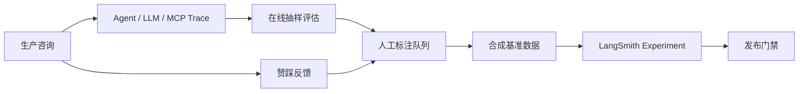
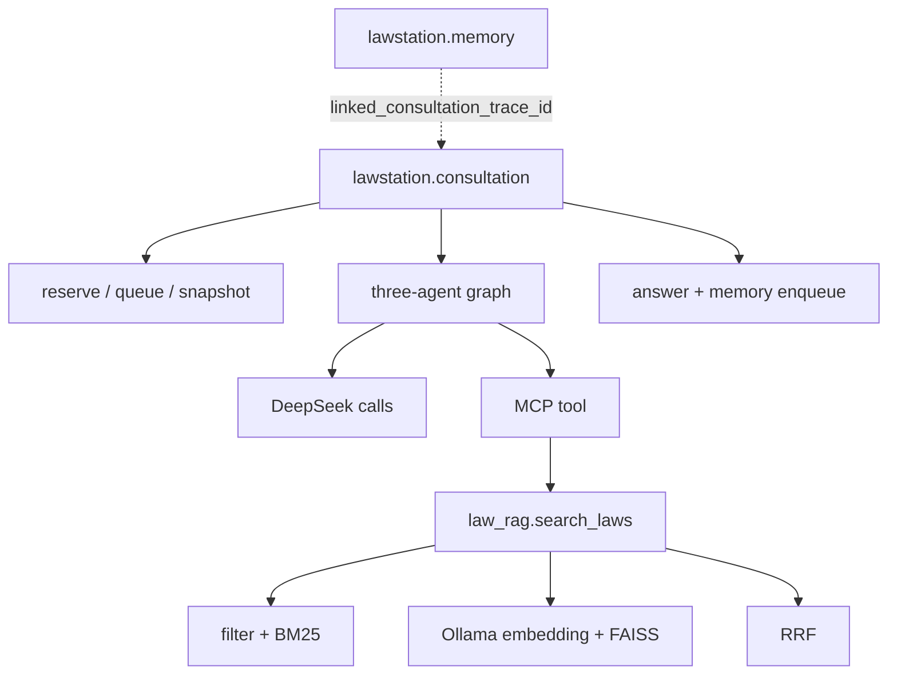

# LawStation：LangSmith 可观测与评估设计

> Review 状态：进程级线上开关、咨询端到端根 Trace、签名 MCP/RAG 传播、记忆 Job 根 Trace、反馈同步、离线 evaluator、资源预算和时间戳报告均为**已验证**；独立的线上 LLM evaluator 调度器为**部分实现**，当前只有配置项，没有持续执行 Worker。

实际配置、命令、报告解读及简历指标采用规则见 [LangSmith 使用与简历数据指南](langsmith-usage-guide.md)。

## 项目亮点

我为三 Agent 法律咨询系统建立了从运行追踪、离线回归、线上监控到用户反馈回流的质量闭环，而不是只记录一次 LLM 请求。



## 设计与实现

- 使用应用级 `LangSmithObservability` 统一创建 Client、Tracer、采样配置、根 Trace 预算和隐私处理，避免业务节点散落 SDK 调用。
- `stream_message` 手工创建 `lawstation.consultation` 根 Run，覆盖会话预占、排队、MemorySnapshot、三 Agent、回答持久化与记忆任务入队；Agent Runtime 只消费 request-scoped callback config，不再重复创建根 Trace。
- `MCPTraceContextInterceptor` 通过 `langsmith-trace`/`baggage` 传播当前父上下文；MCP ASGI 包装层还要求本进程内存 Bridge Token。RAG 内部以 retriever/chain 子 Span 展示 filter、BM25、Ollama Query Embedding、FAISS 和 RRF。
- 每个 Memory Job 只创建一个 `lawstation.memory` 根 Trace，提取、替换/创建、摘要和持久化为子 Span；它通过来源消息的咨询 Trace ID 关联，但不会延长已经结束的 SSE 根 Trace。
- 用 `request_id` 关联本地 JSONL 审计；租户、用户和会话 ID 经 HMAC-SHA256 后上报。
- 即使允许记录咨询原文，也强制过滤密钥、Authorization、Cookie、数据库地址和模型内部 `reasoning_content`。
- `all` 模式启动预检 fail-fast；服务已运行后的导出、反馈同步和关闭故障采用 fail-open，不能影响 SSE、MCP 和记忆整理。

## 线上运行开关与预算

```bash
python run.py
python run.py --langsmith-trace-all
python run.py --langsmith-trace-all --langsmith-trace-limit 500
python run.py --no-langsmith-trace
```

四条命令依次对应 `config`、默认上限 200 的 `all`、自定义上限的 `all` 和 `off`。CLI 不写回 `.env`。全量模式在前端构建、Ollama、Uvicorn 前校验 Key、HMAC、Workspace 和远端鉴权。咨询与记忆共享线程安全的 `SessionTraceBudget`：第 N 条允许创建，第 N+1 条停止新增 Trace 并只审计一次告警；Agent、LLM、MCP 和 RAG 子 Span 不重复扣减。`GET /health` 可查看 mode、ready/degraded/off、limit/used/remaining/exhausted，不返回凭证。



## 评测体系

首期建立 60 条合成 E2E、30 条分层 Agent 基准，并从 `law.json` 派生 100 条使用真实
document/chunk ID 的检索回归集。检索、组件和 live 三种模式分别隔离 RAG、Agent 编排与
真实 MCP 链路；源数据派生集明确不冒充律师人工标注。

确定性指标覆盖路由与 Schema、Recall@5/MRR、引用归属、`no_match` 安全、工具轨迹、循环上限、最新事实覆盖和租户隔离。独立、可配置的非 Thinking Judge 只依据问题、EvidencePacket 和回答，评价证据一致性、事实忠实、风险校准和帮助程度。

通过 `BM25-only vs BM25 + Dense + RRF` 和 `始终 LLM Reviewer vs 确定性快速复核`
两组单变量消融实验，报告样本数、延迟、Token 和安全指标。评测采用四级渐进策略：日常用
零外部调用的确定性回归，Smoke 不上传 Trace，Compare 只上传固定分层见证样本，Release 才
按预算放量。月度账本为生产 Trace、评测 Trace、Agent 模型和 Judge 分别设置硬上限。

完整本地 RAG 指标以数据集 SHA256、索引指纹和 Git Commit 保证可复现；LangSmith 用于查看
少量代表性三 Agent Trace。LLM Judge 只处理确定性规则无法判断的边界样本，一次请求同时返回
8 个质量维度。这样的设计把可重复工程回归与昂贵语义评审分开，避免为了展示可观测性而消耗
大量 Trace 和模型额度。

每次评测使用 `YYYYMMDD-HHMMSS-ffffff-<profile>` 独立目录归档 JSON、CSV、Manifest 和
Markdown 汇总，避免覆盖历史实验。分阶段失败仍保留已完成产物，最近运行与最近成功运行使用
两个原子索引区分；跨运行复用 Baseline 时校验数据集、样本哈希、种子、Graph/Prompt 和索引
版本，并在新报告中保留来源。这使面试中展示的指标可以追溯到一次确定的代码、数据和实验运行。

## 用户反馈闭环

回答赞踩先按 `tenant_id + user_id + message_id` 写入 SQLite，再异步同步 LangSmith。其他用户即使猜到消息 ID 也不能提交反馈。点踩 trace 可进入 Annotation Queue，经人工脱敏和标注后回流离线数据集。

## 当前边界

- `LANGSMITH_ONLINE_EVAL_SAMPLE_RATE` 已配置，但代码没有独立线上 evaluator 调度器，不能声称生产请求会自动持续运行 Judge。
- `LANGSMITH_CAPTURE_CONTENT=true` 允许上传咨询正文；生产启用前必须完成隐私、数据驻留和授权评估。
- Compare/Release 的小样本只能作为见证实验，不能替代大规模人工法律标注。
- LangSmith 不是业务数据库或安全审计事实源，本地 JSONL 与 SQLite 反馈才承担可恢复记录。
- 开关是进程级参数；运行时不提供动态开启 API，切换必须重启服务。
- Bridge Token 仅证明调用来自本进程，存在于内存中，不是用户身份认证手段。

## 面试表达

> 我没有把 LangSmith 当作简单日志面板，而是围绕三 Agent 的结构化状态建立质量工程体系。线上 trace 能看到分析、检索、生成和复核的完整轨迹；线下通过固定检索结果区分 Prompt 问题和 RAG 波动，并用引用归属、no-match 安全、事实一致性等确定性指标做强门禁，再用独立 Judge 评价回答质量。用户反馈本地优先持久化，LangSmith 故障不会影响主链路，低分案例经人工审核后回流为下一轮回归样本。

> 为控制成本，我又把评测拆成零成本学习、本地 Smoke、小样本云端对比和按需 Release 四层。完整检索指标本地可复现，LangSmith 只保存固定见证 Trace；上传需要显式确认，并由月度预算在调用前拦截。这样既保留了实验对比与链路可观测能力，也把日常评测资源控制在可预测范围内。

## 关键代码

- `backend/app/observability/langsmith.py::LangSmithObservability`
- `backend/app/observability/langsmith.py::RootTrace`
- `backend/app/observability/langsmith.py::SessionTraceBudget`
- `backend/app/api/routes.py::stream_message`
- `backend/app/agent/registry.py::MCPTraceContextInterceptor`
- `mcp_servers/law_rag/server.py::MCPTracePropagationApp`
- `mcp_servers/law_rag/engine.py::LawSearchEngine.search`
- `backend/app/services/memory_tasks.py::MemoryTaskManager._process`
- `backend/app/evaluation/evaluators.py::DETERMINISTIC_EVALUATORS`
- `backend/app/evaluation/judge.py::LegalQualityJudge`
- `backend/app/evaluation/reporting.py::ReportRun`
- `scripts/run_langsmith_eval.py`
- `scripts/run_staged_langsmith_eval.py`
- `backend/app/api/routes.py::message_feedback`
