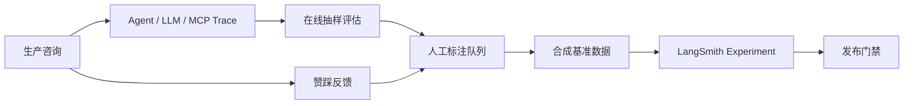

# LawStation：LangSmith 可观测与评估设计

## 项目亮点

我为三 Agent 法律咨询系统建立了从运行追踪、离线回归、线上监控到用户反馈回流的质量闭环，而不是只记录一次 LLM 请求。

## 设计与实现

- 使用应用级 `LangSmithObservability` 统一创建 Client、Tracer、采样配置和隐私处理，避免业务节点散落 SDK 调用。
- 一轮咨询形成 Case Analyst、Legal Research、Legal Counsel、Reviewer、Finalize 的嵌套 trace；MCP 工具和 DeepSeek 调用自动成为子 Run。
- 记忆提取与摘要进入独立 memory pipeline，不污染咨询 Agent 的模型调用、耗时和质量统计。
- 用 `request_id` 关联本地 JSONL 审计；租户、用户和会话 ID 经 HMAC-SHA256 后上报。
- 即使允许记录咨询原文，也强制过滤密钥、Authorization、Cookie、数据库地址和模型内部 `reasoning_content`。
- LangSmith 采用 fail-open：初始化、网络、反馈同步和关闭失败不能影响 SSE、MCP 和记忆整理。

## 评测体系

首期建立五类、60 条合成基准：路由、检索、回答、记忆和端到端。组件模式使用固定 MCP 返回以隔离检索波动；live 模式运行真实 DeepSeek、MCP、BM25 和 FAISS。

确定性指标覆盖路由与 Schema、Recall@5/MRR、引用归属、`no_match` 安全、工具轨迹、循环上限、最新事实覆盖和租户隔离。独立、可配置的非 Thinking Judge 只依据问题、EvidencePacket 和回答，评价证据一致性、事实忠实、风险校准和帮助程度。

## 用户反馈闭环

回答赞踩先按 `tenant_id + user_id + message_id` 写入 SQLite，再异步同步 LangSmith。其他用户即使猜到消息 ID 也不能提交反馈。点踩 trace 可进入 Annotation Queue，经人工脱敏和标注后回流离线数据集。

## 面试表达

> 我没有把 LangSmith 当作简单日志面板，而是围绕三 Agent 的结构化状态建立质量工程体系。线上 trace 能看到分析、检索、生成和复核的完整轨迹；线下通过固定检索结果区分 Prompt 问题和 RAG 波动，并用引用归属、no-match 安全、事实一致性等确定性指标做强门禁，再用独立 Judge 评价回答质量。用户反馈本地优先持久化，LangSmith 故障不会影响主链路，低分案例经人工审核后回流为下一轮回归样本。

## 关键代码

- `backend/app/observability/langsmith.py::LangSmithObservability`
- `backend/app/evaluation/evaluators.py::DETERMINISTIC_EVALUATORS`
- `backend/app/evaluation/judge.py::LegalQualityJudge`
- `scripts/run_langsmith_eval.py`
- `backend/app/api/routes.py::message_feedback`
