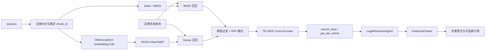

# LawStation RAG 模块设计与实现

> Review 状态：**已验证**。本文按 2026-08-25 当前实现更新；正式 Agent 经 MCP 调用 RAG，只有评测专用 `RetrievalTarget` 会直接创建 `LawSearchEngine`。

## 1. 模块定位

LawStation 的 RAG 模块面向中国法律咨询场景，为三 Agent 咨询链路提供可核验的法规证据。它不是把向量搜索直接写进 Agent，而是将法规切分、索引构建、混合召回和精确法条查询封装为独立 MCP Server，由 `LegalResearchAgent` 通过标准工具协议调用。

核心目标：

- 使用 BM25 处理法律名称、条号和关键词等精确匹配；
- 使用 Dense Embedding 处理自然语言咨询与法条表述之间的语义差异；
- 使用 RRF 融合两路召回，避免依赖单一检索算法；
- 使用 TEI `bge-reranker-v2-m3` 对融合候选执行批量 Cross-Encoder 精排；
- 使用本地 Ollama Embedding，避免全量建库产生云端 token 成本；
- 启动时幂等检查索引，数据、模型或切分参数不变时不重复建库；
- 建库中断后能够按批次恢复，失败时不破坏旧索引；
- Dense 不可用或正在构建时仍提供 BM25 降级检索；
- 以 `chunk_id` 建立从工具结果到最终回答引用的证据链，防止模型伪造法条。



## 2. 数据加载与法条切分

默认数据源由 `LAW_DATA_PATH` 配置，当前使用全量：

```dotenv
LAW_DATA_PATH=./data/knowledge/law/law.json
```

`mcp_servers/law_rag/engine.py::load_chunks` 将 JSON 对象中的每个键解析为法律名称和条号，例如：

```text
中华人民共和国劳动合同法第八十二条
→ law_name = 中华人民共和国劳动合同法
→ article_number = 第八十二条
```

切分规则：

- 普通法条一条记录对应一个 chunk；
- 超过 1,000 字时优先在换行、句号或分号处切分；
- 相邻 chunk 默认重叠 150 字，避免边界处丢失语义；
- `document_id` 对原始法条名称做 SHA-1，表示法条级身份；
- `chunk_id` 由 `document_id + chunk_index + content_hash` 生成，表示证据片段级身份；
- 内容不变时 ID 稳定，内容或切分结果变化时 ID 自动变化。

每个 chunk 的核心结构为：

```text
document_id
chunk_id
chunk_index
law_name
article_number
content
text = 法律名称与条号 + 法条正文
```

`document_id` 用于表示同一法条，`chunk_id` 用于检索结果、EvidencePacket 和 Citation 的精确对应。这样长法条命中后半部分时，不会错误引用该法条的第一个片段。

## 3. Embedding Provider 抽象

`mcp_servers/law_rag/embeddings.py::EmbeddingProvider` 定义统一接口：

```python
prepare() -> EmbeddingDescriptor
embed_documents(texts) -> np.ndarray
embed_query(query) -> np.ndarray
close()
```

`EmbeddingDescriptor` 保存：

- provider；
- 模型标签；
- 模型 digest；
- 向量维度。

当前默认实现是 `OllamaEmbeddingProvider`：

```dotenv
EMBEDDING_PROVIDER=ollama
EMBEDDING_MODEL=qwen3-embedding:0.6b
EMBEDDING_DIMENSION=1024
OLLAMA_EMBEDDING_BATCH_SIZE=8
```

文档和查询使用非对称编码：

- 法规文档直接送入 Embedding 模型；
- 查询增加检索任务指令：

```text
Instruct: Given a legal consultation query, retrieve relevant Chinese laws and regulations that answer the query
Query: <用户查询>
```

请求通过 Ollama `/api/embed` 完成，并携带：

```text
dimensions=1024
truncate=false
keep_alive=30m
```

返回向量必须同时满足：

- 行数与输入文本数量一致；
- 维度等于 1024；
- 能转换为 `float32`；
- 所有数值均为有限值。

项目仍保留 `DashScopeEmbeddingProvider` 作为显式可选实现，但默认 Ollama 链路不会自动回退云端，从而避免本地全量建库意外消耗云端额度。

## 4. Ollama 生命周期管理

统一启动入口通过 `backend/app/core/ollama.py::OllamaProcessManager` 管理本地 Embedding 服务：

1. 探测 `OLLAMA_BASE_URL/api/version`；
2. 已有 Ollama 可用时直接复用；
3. 不可用且允许自动启动时执行 `ollama serve`；
4. 使用文件锁防止两个 LawStation 进程重复启动 Ollama；
5. 调用 `/api/tags` 精确校验模型标签并读取 digest；
6. 调用 `/api/embed` 预热并验证 1024 维输出；
7. 完成后才启动 Uvicorn。

进程所有权规则：

- 启动前已经存在的 Ollama 不归 LawStation 管理，退出时不会关闭；
- 由本次 `run.py` 创建的 Ollama 使用独立进程组；
- LawStation 退出时先发送 SIGTERM，超时后只终止该进程组；
- 不使用 `pkill`，避免误杀用户的其他 Ollama 进程；
- 子进程环境只传入基础系统变量和必要的 `OLLAMA_*` 配置，不传 DeepSeek、DashScope 或 LangSmith 密钥。

统一启动模式下，Ollama、模型或预热失败会阻止应用启动；独立 MCP 调试模式下，Embedding 不可用时检索引擎可以退化为 BM25。

## 5. 索引指纹与幂等建库

`LawSearchEngine._fingerprint` 将以下信息组合后计算 SHA-256：

```text
law.json SHA256
chunker version
chunk 最大长度与重叠长度
Embedding provider
模型标签
模型 digest
Embedding 维度
查询指令版本
```

模型 digest 进入指纹很重要：即使模型名称没有变化，本地模型重新下载或版本发生变化，也会触发重建，避免查询向量与索引向量来自不同模型版本。

正式索引目录为：

```text
data/indexes/law/
├── manifest.json
├── chunks.jsonl
├── embeddings.npy
└── law.faiss
```

只有满足以下条件才会直接复用：

- manifest 指纹等于当前指纹；
- chunk 元数据数量等于当前 chunk 数量；
- `embeddings.npy` shape 正确；
- FAISS `ntotal` 等于 chunk 数；
- FAISS 维度等于配置维度；
- 所有文件均可正常读取。

仅有一个旧 `law.faiss` 文件不视为有效索引。验证失败后进入后台重建，页面和 API 仍可使用已经初始化的 BM25。

## 6. 可恢复、原子化的全量建库

新索引先写入指纹专属 staging：

```text
data/indexes/.staging-<fingerprint>/
```

构建流程：

1. 获取跨进程 `.build.lock`；
2. 写入并验证 `chunks.jsonl`；
3. 每批最多 8 个 chunk 调用 Ollama；
4. 每个批次保存为独立 `batch-XXXXXXXX.npy`；
5. 批次先写临时文件，再通过 `os.replace` 原子替换；
6. 每批更新 checkpoint 和索引进度；
7. 重启时验证已有批次，只补建缺失或损坏的批次；
8. 使用 NumPy memmap 写入完整 `embeddings.npy`；
9. 每批执行 L2 归一化并增量加入 `faiss.IndexFlatIP`；
10. 完整校验 staging 后再原子切换正式目录。

全量合并不使用 `np.vstack`，避免同时保留所有批次数组和完整矩阵造成额外内存峰值。

切换时先把原索引移动为 `.law-backup`，新目录替换失败则恢复旧索引。只有新索引校验通过后，内存中的 FAISS 实例才会在 `_dense_lock` 内热切换，因此建库失败不会覆盖上一个有效索引。

Embedding 重试策略：

- HTTP 408、429、5xx、连接错误和超时进行指数退避并加入随机抖动；
- 默认最多重试 5 次；
- 鉴权、模型不存在和参数错误等确定性 4xx 立即失败；
- 失败保留同指纹 staging，下一次启动继续处理；
- `--force` 只清理当前指纹 staging 后重新生成。

## 7. BM25 与 Dense 混合召回

### 7.1 BM25

法规标题和正文使用 Jieba 分词，再由 `rank_bm25::BM25Okapi` 建立词法索引。BM25 擅长处理：

- 法律名称；
- 条号；
- “二倍工资”“诉讼时效”等法律术语；
- 用户问题与法条正文共享的明确关键词。

`LawSearchEngine._lexical` 同时返回文档索引和原始 BM25 分数，低于 `RAG_BM25_MIN_SCORE` 的候选直接丢弃，避免无关查询也固定返回一批零分文档。

### 7.2 Dense

查询经 Ollama 编码后执行 L2 归一化，使用 `faiss.IndexFlatIP` 做内积搜索。因为文档和查询向量都已归一化，内积等价于余弦相似度。

低于 `RAG_DENSE_MIN_SCORE` 的结果不会进入融合阶段。Dense 擅长处理用户口语与法规正式表述不同的情况，例如用户描述“公司一直没和我签合同”，法条正文使用“未订立书面劳动合同”。

### 7.3 法律名称前置过滤

引擎启动时建立标准化法律名称到 chunk index 的映射。标准化会去掉空格、书名号和“中华人民共和国”前缀。

当工具传入：

```json
{"filters": {"law_name": "劳动合同法"}}
```

系统先确定该法律对应的候选范围，再执行 BM25 和 Dense 排序，而不是先取全库 top N 后再过滤。这样目标法律即使不在全库前 30，也不会得到错误空结果。

当前只支持 `law_name`。未知过滤字段或错误类型会直接返回参数错误，不会静默忽略。

### 7.4 RRF 融合

两路候选使用 Reciprocal Rank Fusion：

```text
score(document) += 1 / (61 + rank)
```

同一 chunk 同时被 BM25 和 Dense 命中时会累加两路排名得分。融合结果低于 `RAG_RRF_MIN_SCORE` 时继续过滤；启用精排后先保留最多 12 个候选，精排完成后才截断为调用方要求的 `top_k`。

返回结果带有：

```text
retrieval_sources = [bm25, dense]
retrieval_scores.bm25
retrieval_scores.dense
retrieval_scores.rrf
rank
data_version
dense_enabled
index_status
```

这些字段既支持 Agent 判断，也便于后续使用 LangSmith 数据集标定阈值。

### 7.5 TEI BGE Cross-Encoder 精排

`mcp_servers/law_rag/reranker.py::TEIReranker` 调用独立的 Hugging Face Text Embeddings Inference 服务。TEI 加载 `BAAI/bge-reranker-v2-m3`，一次 `/rerank` 请求批量提交查询和前 12 个 RRF 候选，直接返回 Cross-Encoder 相关性分数。

关键约束：

- 默认候选数 12，所有候选在一个 HTTP 请求中评分；
- 请求使用 `truncate=true`、`raw_scores=false`、`return_text=false`；
- 响应必须完整覆盖每个候选，且索引唯一、无越界、分数为有限的 0～1 数值；
- 分数相同时使用 RRF 分数和稳定索引顺序打破平局；
- 首版 `RAG_RERANK_MIN_SCORE=0`，只改变顺序，不改变既有 no-match 边界；
- 任一候选缺失、重复、响应异常、HTTP 失败或整体超时，整批放弃并返回原始 RRF Top K；
- 故障进入 60 秒冷却期，不会把服务异常伪装成检索空结果；
- TEI 模型 revision 按 `/info.model_sha → .env 固定 revision → Hugging Face 缓存 ref` 解析并进入 `ranking_version` 和评测 metadata；它不进入 FAISS 指纹，更换精排模型不触发全量重建。该兼容层处理 TEI 对 BGE 返回 `model_sha=null` 的情况，但没有可验证 revision 时仍拒绝标记 ready。

结果增加 `retrieval_scores.rerank`、`rerank_applied`、`ranking_version` 和精排耗时/候选数。MCP Tool Schema、EvidencePacket 与 chunk 级 Citation 均保持兼容。

## 8. 精确法条查询

`LawSearchEngine` 启动时构建：

```text
(normalized_law_name, normalized_article_number) -> chunks
```

`get_law_article` 不再遍历全部 55,000 余条记录，而是通过内存映射近似 O(1) 查找。

- 普通法条直接返回单个 chunk；
- 长法条返回该法条的全部 chunks；
- 法律名称支持有无“中华人民共和国”前缀；
- 未找到时返回结构化错误。

## 9. MCP 工具边界

RAG 通过 `mcp_servers/law_rag/server.py` 暴露两个标准工具：

```text
search_laws(query, top_k=8, filters=None)
get_law_article(law_name, article_number)
```

`initialize_engine` 使用应用级异步锁，确保法律数据、BM25 和 FAISS 只初始化一次。MCP Server 可以挂载到 FastAPI `/mcp/`，也可以独立运行用于协议调试。

Agent API 不直接导入 `LawSearchEngine.search`，而是通过 `langchain-mcp-adapters` 调用标准 MCP 工具。应用级 `MCPToolRegistry` 缓存工具名称、描述和参数 Schema，避免每轮对话重新发现工具，但每次工具执行仍保持独立 MCP session。

只有 `LegalResearchAgent` 可以调用法规工具，Case Analyst、Legal Counsel 和 Reviewer 不具备 MCP 工具权限。

## 10. EvidencePacket 与引用防幻觉

检索结果不会直接成为最终法条引用，而要经过三层约束：

### 10.1 研究 Agent 选择

`LegalResearchAgent` 可以从工具返回的候选中选择与争议点相关的 `chunk_id`，形成 `EvidencePacket`。

### 10.2 服务端权威重建

`backend/app/agent/graph.py::_authoritative_evidence` 不信任模型回填的法律名称、条号和正文，只使用模型选择的 `chunk_id` 到真实 ToolMessage 候选中重新取值。

如果模型只返回旧版 `document_id`，仅当该法条在本轮候选中只有一个 chunk 时兼容；多个 chunk 时拒绝歧义选择。

### 10.3 最终引用收敛

Legal Counsel 的每个 claim 必须记录实际使用的 `evidence_chunk_ids`。`finalize` 只把以下交集转换成 Citation：

```text
CounselDraft 实际引用的 chunk_id
∩ EvidencePacket 中已核验的 chunk_id
```

检索到但回答没有使用的候选不会出现在 citations。确定性校验还会扫描回答中的法律名称和条号，发现不属于 EvidencePacket 的引用时要求修改草稿或输出安全兜底回答。

## 11. 空结果与错误语义

研究结果严格区分：

| 状态 | 含义 | 后续行为 |
|---|---|---|
| `matched` | 找到可采纳证据 | 基于 EvidencePacket 回答并生成引用 |
| `no_match` | 工具正常执行，但没有达到阈值或可采纳证据 | 低置信度一般性分析，不引用具体法条 |
| `tool_unavailable` | MCP 工具没有加载 | 披露检索能力不可用 |
| `tool_error` | 超时、传输、协议或执行异常 | 披露检索失败，不冒充空结果 |

`no_match` 是正常业务结果，不会抛异常、重复搜索或耗尽工具调用额度。低风险 `no_match` 回答通过确定性边界校验后可以跳过 LLM Reviewer，以减少一次模型调用；中高风险、存在法规证据或工具异常时仍执行完整复核。

## 12. 并发、降级与可观测性

- BM25 计算、FAISS 搜索和精确法条匹配放入线程池，避免阻塞 FastAPI 事件循环；
- FAISS 热切换和查询使用 `_dense_lock` 保护；
- 建库使用文件锁，防止多进程同时写同一索引；
- Dense 未完成时 `search_laws` 继续返回 BM25 结果；
- `/api/index/status` 展示 checking、building、ready、degraded 或 failed，以及进度、provider、模型 digest 和 Dense 状态；
- 工具调用受超时和单轮次数限制；
- 连接、协议和 Schema 错误会使 MCP 工具注册表进入 stale，后续按冷却策略重新发现；
- JSONL 审计记录工具名称、耗时、结果数量、document ID、chunk ID、法律名称和条号，不记录完整法条正文；
- `RetrievalTrace` 使用 `tenant_id + user_id + conversation_id` 关联本轮咨询；
- LangSmith 全链路模式通过签名的 MCP HTTP 传播上下文，把 `law_rag.search_laws` 作为 retriever 子 Span 接回咨询根 Trace；其下细分 filter、BM25、query embedding、FAISS 与 RRF。查询向量和 FAISS 对象不上传，Dense 候选明细最多记录 100 条，检索算法本身不因此截断。
- `MCPTracePropagationApp` 只接受带本进程随机 Bridge Token 的 `langsmith-trace`/`baggage`；普通或伪造的外部 MCP 请求不会创建独立 RAG Trace。

## 13. 测试体系

RAG 相关测试全部使用临时文件和 mock Provider，不调用真实 Ollama 或云端 Embedding：

- 有效指纹第二次启动不调用 Embedding；
- 数据、模型、digest 或切分参数变化触发重建；
- 长法条生成稳定 chunk ID；
- 损坏或缺失批次只重建对应批次；
- Ollama 每批不超过 8 条；
- 429、超时和 5xx 重试，确定性 4xx 不重试；
- 向量数量、维度或有限值异常时拒绝落盘；
- 全量合并不使用 `np.vstack`；
- 无关词法查询返回正常空结果；
- `law_name` 在排序前过滤；
- 未知过滤字段被拒绝；
- 精确法条映射返回长法条全部 chunks；
- 模型伪造或歧义 chunk 不能进入 EvidencePacket；
- `no_match` 不产生 citations；
- Ollama 复用、自动启动、预热和进程所有权均有单元测试。

## 14. 设计取舍与当前边界

### 为什么选择 BM25 + Dense

法律检索同时存在精确术语和自然语言语义需求。只用 BM25 容易漏掉口语化咨询，只用 Dense 又可能弱化法律名称、条号等精确匹配，因此采用双路召回。

### 为什么选择 RRF

BM25 分数和余弦相似度不在同一尺度，直接线性加权需要额外归一化和大量参数标定。RRF 只依赖排名，首版更稳定、容易解释。

### 为什么选择 FAISS IndexFlatIP

当前约 55,000 个 chunk，精确内积搜索的性能和内存仍可接受，且不会引入近似索引召回损失。法规规模继续增长后，可以评估 HNSW 或 IVF。

### 为什么本地部署 Embedding

全量法规建库需要大量向量请求。使用 Ollama 本地模型可以避免云端 token 成本、限流和敏感法规数据外发，同时仍保留 Provider 接口支持未来替换模型。

### 当前未实现

- BGE 阈值、候选数和 macOS Metal/生产 GPU 延迟仍需用冻结基准持续标定；
- Jieba 使用通用词典，尚未增加法律领域词典；
- 阈值已有配置和测试，但仍需基于真实 retrieval 数据集持续标定；
- 法规元数据尚缺少效力状态、生效日期、发布机关和地域层级；
- `embeddings.npy` 与 FAISS 同时保存向量，换取可验证性但占用更多磁盘空间。
- 全量索引最后的 memmap 写入、FAISS 组装和目录切换主要在事件循环线程执行；后台建库期间可能短时影响健康检查延迟，仍需用真实全量构建压测验证。

## 15. 定向检索挑战集

`backend/app/evaluation/challenge_datasets.py` 与
`scripts/create_resume_challenge_datasets.py` 把简历展示所需的定向压力测试和通用回归分开：

- Dense 集固定300条，不出现法名、条号或连续超过6字符的法条原文，覆盖语义改写、生活化案情、后果描述和口语噪声；
- Reranker 候选由300条以不可变前缀方式扩充到600条，旧问题、Gold ID、顺序和内容哈希不得改变；只有 Gold 在未开启 BGE 的 Hybrid Top12 中、且至少两个预声明相邻干扰 chunk 同时命中时，才按冻结顺序选前200条；
- 生成续跑自动重做 task_id 与当前修复任务不匹配的历史响应；冻结构建保留旧300条原记录，只向后追加新候选。盲修复导致的问题措辞漂移和新增模型元数据不会覆盖旧记录，但 Gold、task_id、源内容哈希和干扰项等不变量仍须完全一致；
- Gold ID、来源正文 SHA、Prompt SHA、数据集 SHA、索引指纹和 BGE `model_sha` 均进入可审计产物；
- 报告除 Recall@5/MRR 外，还比较 Hit@1、Top3、Gold 平均排名，并按类别与难度输出绝对/相对变化；
- `human_verified=false` 是强制事实，挑战集只能说明特定困难查询上的能力，不代表真实用户总体准确率。

`scripts/run_resume_rag_challenge_eval.py` 是量化评测的统一本地编排入口。正式运行前先执行6个
RAG/报告相关 Pytest 文件和挑战集静态校验；候选不足600条时会在启动Ollama/TEI前终止并给出
扩容命令。最终200条精排集缺失时，使用未启用 BGE 的 Hybrid Top12 自动完成资格冻结。资格检查
处理全部600条，每25条保存与候选SHA、索引指纹、阈值和Top12配置绑定的checkpoint，并产出逐条
结果、拒绝原因和分组汇总。随后在同一时间戳目录执行100条通用回归、300条 Dense 挑战、200条
Reranker 挑战的六组 Baseline/Candidate，以及 casual、clarification、matched、no_match、
tool_error、memory 各1条的 Agent Fixture 冒烟。

报告同时保存 Git Commit/dirty 状态、法规 SHA、索引指纹、Embedding digest、BGE revision、
样本哈希、硬门禁和性能告警。Dense 要求 Recall@5 不回退且 MRR/Hit@1 至少一项提升；BGE
要求 Recall@5、Exact Article Hit、Hit@3 不回退，MRR/Hit@1 至少一项提升、Gold 平均排名改善，
且精排应用率100%、降级率0%。Agent 冒烟的路由、Schema、引用归属、no-match、防循环、隔离和
完成状态必须全部通过。自动生成的简历语句只引用实际报告数字，并明确表述为“从600条源法条约束
的合成候选中，按预先冻结的Hybrid Top12与双干扰项规则筛选200条排序挑战样本”。

## 16. 面试表达

### 简历描述

> 设计并实现法律法规 RAG 服务：对 5.5 万余条法规执行稳定法条切分，使用本地 Ollama Qwen Embedding、FAISS、BM25 与 RRF 完成混合召回，并通过 TEI 部署 BGE Cross-Encoder 对候选进行批量精排；以响应完整性校验、阶段超时、冷却和 RRF fail-open 保证精排故障不影响检索。通过 staging、批次 checkpoint、模型 digest 指纹和原子切换实现幂等建库与恢复，以 chunk 级 EvidencePacket 和确定性引用校验约束模型引用。

### 口头回答

> 这个项目的 RAG 分成离线建库和在线检索。离线侧按法条生成稳定 chunk ID，用数据、模型和切分参数形成指纹，并通过 checkpoint 与原子切换完成可恢复建库。在线侧先做 BM25 与 FAISS Dense 召回和 RRF 融合，再把前 12 个候选一次提交给 TEI 中的 BGE Cross-Encoder。服务端严格校验候选索引和分数完整性，任一异常就整批回退 RRF，避免部分分数破坏排序。最终 Agent 只能选择真实 chunk ID，服务端再重建 EvidencePacket 和 Citation。

### 可继续追问的亮点

1. **为什么不用纯向量检索？** 法条名称、条号和专业术语需要 BM25 的精确匹配能力。
2. **如何避免重复建库？** 使用包含数据 SHA、模型 digest、维度和切分参数的指纹，并校验完整 manifest。
3. **建库中断怎么办？** 每批独立保存并校验，重启只补损坏或缺失批次。
4. **如何避免模型虚构法条？** 模型只选择真实 chunk ID，服务端重新组装 EvidenceItem，并对最终引用取交集。
5. **搜索不到法条怎么办？** 空结果是 `no_match`，继续给出低置信度一般性建议，但禁止具体法条引用。
6. **为什么使用本地 Embedding？** 避免全量数据的云端费用、限流和外发风险。
7. **如何保证切换索引不中断查询？** 新索引在 staging 完整构建和校验，通过后在锁内原子替换内存 FAISS；构建期间继续使用 BM25。

## 16. 关键代码

- `mcp_servers/law_rag/engine.py::LawSearchEngine`
- `mcp_servers/law_rag/engine.py::load_chunks`
- `mcp_servers/law_rag/engine.py::LawSearchEngine._build`
- `mcp_servers/law_rag/engine.py::LawSearchEngine.search`
- `mcp_servers/law_rag/embeddings.py::EmbeddingProvider`
- `mcp_servers/law_rag/embeddings.py::OllamaEmbeddingProvider`
- `backend/app/core/ollama.py::OllamaProcessManager`
- `mcp_servers/law_rag/server.py::search_laws`
- `mcp_servers/law_rag/server.py::get_law_article`
- `backend/app/agent/graph.py::LegalConsultationGraph.legal_researcher`
- `backend/app/agent/graph.py::_authoritative_evidence`
- `backend/app/agent/graph.py::LegalConsultationGraph.finalize`
- `backend/app/agent/middleware.py::ToolAuditMiddleware`
