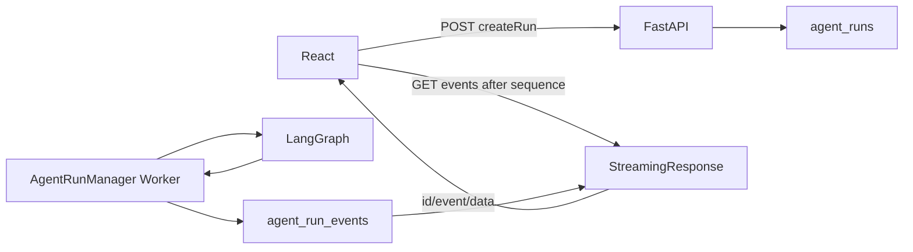

# LawStation SSE 代码导读

> 本文沿实际代码调用顺序，说明 LawStation 如何使用 FastAPI `StreamingResponse`、SQLite `AgentRunEvent`、前端 `fetch + ReadableStream` 实现可重放的 Agent 事件流。SSE 的通用协议原理见 [SSE 技术原理](sse-technology.md)。

## 1. 先看整体结构

当前正式聊天不是“一个 POST 请求边生成边返回”，而是两个阶段：

```text
POST /api/conversations/{conversation_id}/runs
→ 创建持久化 AgentRun，立即返回 202

GET /api/agent-runs/{run_id}/events?after_sequence=N
→ 重放历史 AgentRunEvent
→ 等待并推送新事件
→ 任务终态且事件追平后关闭
```

后台执行和 SSE 订阅彼此独立：



设计结果：关闭浏览器流只会停止订阅，不会取消后台 Graph。用户必须调用 Cancel API 才能停止任务。

## 2. 建议阅读顺序

1. `backend/app/db/models.py::AgentRun/AgentRunEvent`：任务与事件的数据结构。
2. `backend/app/api/routes/agent_runs.py::create_agent_run`：任务如何创建。
3. `backend/app/services/agent_runs.py::AgentRunManager`：Worker 如何执行和写事件。
4. `backend/app/api/routes/agent_runs.py::agent_run_events`：事件如何转换为 SSE。
5. `frontend/src/sse.ts`：字节流如何解析。
6. `frontend/src/App.tsx::followRun/handleStreamEvent`：重连、游标和 UI 更新。

## 3. 第一步：前端创建持久任务

前端发送消息最终进入 [App.tsx](../frontend/src/App.tsx#L655) 的 `startRun()`：

```typescript
const run = await api.createRun(ownerId, targetConversationId, question);
return attachRun(ownerId, targetConversationId, question, run);
```

[api.ts](../frontend/src/api.ts#L82) 使用普通 JSON POST：

```http
POST /api/conversations/{conversation_id}/runs
X-User-ID: <user>
Content-Type: application/json

{"content":"用户问题"}
```

后端入口是 [agent_runs.py](../backend/app/api/routes/agent_runs.py) 的 `create_agent_run()`：

1. 构造当前请求的并发身份；
2. 预占会话，防止同会话并发创建两个任务；
3. 在线程中调用同步 SQLAlchemy 任务创建；
4. 返回 HTTP `202 Accepted`。

`202` 仅表示任务已进入队列，不表示回答已经生成。这样 HTTP 请求可以快速返回，耗时 Agent 工作由后台 Worker 接管。

## 4. 第二步：创建初始可重放事件

[AgentRunManager.create()](../backend/app/services/agent_runs.py#L125) 在同一个数据库事务中创建：

- `AgentRun(status=queued)`；
- `message_start(sequence=1)`；
- `agent_status queued(sequence=2)`。

每个 Run 都有独立的 `last_event_seq`。事件由 `_append_event_in_session()` 分配下一个 sequence，再写入 `AgentRunEvent`。

数据模型见 [models.py](../backend/app/db/models.py#L210)：

```text
AgentRun
├── status/current_stage
├── last_event_seq
├── user_message_id/assistant_message_id
└── owner + cancel + lease + checkpoint 信息

AgentRunEvent
├── run_id
├── sequence
├── event_type
└── payload_json
```

`UniqueConstraint(run_id, sequence)` 是数据库层的顺序唯一性保护。事件查询索引同时包含所有权和 sequence，服务端不需要把全部事件加载后再在 Python 中过滤。

## 5. 第三步：Worker 独立执行 Agent

[AgentRunManager.start()](../backend/app/services/agent_runs.py#L89) 通过 `asyncio.create_task()` 启动后台轮询 Worker。这个 Task 属于应用生命周期，不属于某个浏览器 SSE 请求。

单个任务的执行入口是 [_execute()](../backend/app/services/agent_runs.py#L361)：

```text
获取并发配额
→ claim queued Run
→ 启动 lease heartbeat
→ 保存用户消息并读取 MemorySnapshot
→ 执行 AgentService / LangGraph
→ 持久化安全状态事件
→ 幂等保存最终回答
→ 写 token/citations/memory_status/message_end
```

Graph 运行期间：

- `agent_status`、`tool_call_start`、`tool_call_result` 等安全状态立即写事件表；
- 内部推理、Prompt、工具完整正文不写 SSE；
- 最终正文先缓冲，只有 Graph Finalize 完成后才写入可重放 `token` 事件。

因此项目中的 `token` 不是 DeepSeek 原始实时 token，而是经过完整生成和复核后的最终答案分片。

## 6. 第四步：事件如何写入数据库

业务事件通过 [_append_event()](../backend/app/services/agent_runs.py#L679) 进入短事务，最终调用 [_append_event_in_session()](../backend/app/services/agent_runs.py#L689)：

```python
run.last_event_seq += 1
event.sequence = run.last_event_seq
db.add(event)
```

序号更新和事件插入共享调用方事务。提交完成后 `_notify()` 通过 `asyncio.Condition.notify_all()` 唤醒正在等待的 SSE 订阅者。

这里的 Condition 只是单进程低延迟通知：

- 事件事实源仍是 SQLite；
- 即使通知丢失，下一次心跳超时后也会重新查库；
- 它不是跨进程消息总线。

## 7. 最终正文为什么延迟写入

[_complete()](../backend/app/services/agent_runs.py#L565) 先幂等创建助手消息，再检查本 Run 是否已经存在 `token` 事件：

```text
没有 token
→ 每 24 字符写一条 token 事件
→ 可选写 citations

已有 token
→ 恢复/重试时不重复写正文
```

随后 `_finish_completed()` 写：

```text
memory_status
message_end(status=completed)
```

这形成两层保护：

- `assistant_message_id` 防止重复创建最终助手消息；
- 已存在 token 的检查防止恢复后重复生成整段 SSE 正文。

## 8. 第五步：后端把事件表变成 SSE

订阅入口是 [agent_runs.py](../backend/app/api/routes/agent_runs.py) 的 `agent_run_events()`。

### 8.1 建连前校验

服务端先完成：

1. `after_sequence >= 0` 参数校验；
2. `Last-Event-ID` 转整数；
3. 取两个游标的较大值；
4. 按当前用户所有权查询 Run。

任务不存在和无权访问统一返回 404，不会先建立流再暴露事件。

### 8.2 历史重放

[AgentRunManager.events()](../backend/app/services/agent_runs.py#L195) 查询：

```text
同一个 run_id
+ 当前 tenant/user
+ sequence > cursor
+ ORDER BY sequence
```

每条数据库事件由 `persisted_sse()` 编码为：

```text
id: <sequence>
event: <event_type>
data: <JSON>

```

### 8.3 等待实时事件

历史事件发送完后，如果任务仍未终止，路由调用：

```python
await manager.wait_for_events(sse_heartbeat_seconds)
```

Worker 写入新事件会唤醒 Condition；若等待超时且没有事件，服务端发送：

```text
: heartbeat

```

Heartbeat 不进入 `AgentRunEvent`，不增加 sequence，也不参与断线重放。

### 8.4 何时关闭连接

只有同时满足以下条件才结束 generator：

```text
Run 已进入 completed/interrupted/failed
AND
当前 cursor 已追上 run.last_event_seq
```

这避免任务刚变成终态、但最后几条持久事件尚未发送时提前关闭连接。

### 8.5 响应头

[agent_runs.py](../backend/app/api/routes/agent_runs.py) 返回：

```text
Content-Type: text/event-stream
Cache-Control: no-cache
Connection: keep-alive
X-Accel-Buffering: no
```

其中 `X-Accel-Buffering: no` 防止常见 Nginx 部署把小事件缓冲后批量发送。

## 9. 第六步：前端为什么不用 EventSource

[api.ts](../frontend/src/api.ts#L92) 使用 `fetch()` 请求事件接口：

```typescript
fetch(`/agent-runs/${runId}/events?after_sequence=${afterSequence}`, {
  headers: { 'X-User-ID': userId },
  signal,
});
```

选择 `fetch + ReadableStream` 的直接原因是：

- 请求必须携带自定义 `X-User-ID`；
- 需要使用 `AbortController` 精确停止某个会话订阅；
- 项目要自行控制 sequence 重连和错误展示；
- 同一页面可能同时维护多个用户/会话的后台流。

原生 EventSource 不能方便地满足这些自定义请求头和控制需求。

## 10. 第七步：字节流如何解析

[sse.ts](../frontend/src/sse.ts#L24) 的 `consumeSse()` 处理浏览器 `ReadableStream`：

```text
reader.read()
→ TextDecoder 增量解码
→ 追加到 buffer
→ 按空行切分完整 SSE block
→ 保留最后一个不完整 block
→ parseSseBlock()
```

保留不完整 block 很关键。例如网络可能返回：

```text
第一次：event: tok
第二次：en\ndata: "法律"\n\n
```

如果每次 `read()` 都独立解析，就会丢失这个事件。

[parseSseBlock()](../frontend/src/sse.ts#L3) 只处理本项目需要的字段：

- `event`；
- 数字 `id`；
- 一行或多行 `data`；
- 忽略空行和 `:` Comment；
- `data` 优先按 JSON 解析，失败则保留字符串。

它不实现 `retry` 字段，因为重连等待由 `followRun()` 固定控制。

## 11. 第八步：事件如何更新 UI

[App.tsx](../frontend/src/App.tsx#L423) 的 `handleStreamEvent()` 是前端事件分发中心。

| 事件 | UI 行为 |
|---|---|
| `token` | 追加到临时助手消息 |
| `agent_status` | 更新当前 Agent、阶段和状态文案 |
| `tool_call_start` | 显示工具运行状态 |
| `tool_call_result` | 清除成功状态或展示失败/超时 |
| `citations` | 绑定最终引用 |
| `memory_status` | 展示后台记忆整理并轮询 MemoryJob |
| `message_end` | 写入真实消息 ID和终态，清理活动状态 |
| `error` | 保存安全错误文案，由订阅层结束处理 |

处理带 `id` 的事件时，前端执行：

```typescript
lastEventSequence = Math.max(lastEventSequence, item.id)
```

这使下一次订阅能够从已处理的最大序号继续。

## 12. 第九步：断线自动重连

[App.tsx](../frontend/src/App.tsx#L548) 的 `followRun()` 使用循环管理订阅：

```text
读取 lastEventSequence
→ GET events?after_sequence=N
→ consumeSse
→ 网络异常时显示 reconnecting
→ 等待 750ms
→ 带新游标重新请求
```

后端先返回 `sequence > N` 的历史事件，再等待新事件。因此恢复不是“只重新连上”，而是能补齐断线期间已经写入数据库的事件。

流正常结束后，前端还会调用 `GET /agent-runs/{run_id}` 确认服务端终态；若已完成，再重新加载消息表。最终数据库消息才是页面完成态的事实源，客户端拼接的 token 只是即时展示。

## 13. 页面刷新如何恢复

重新打开会话时，[App.tsx](../frontend/src/App.tsx#L365) 并行读取：

- 已持久化消息；
- `/conversations/{conversation_id}/active-run`。

如果存在 queued/running Run，前端重新创建本地 `ConversationRuntime` 和临时助手消息，再调用 `followRun()` 订阅事件。

当前实现会从 `lastEventSequence=0` 开始重放该 Run 的安全事件，然后依靠同一临时消息聚合 token。任务本身没有因刷新而重启；只有浏览器观察状态被重建。

## 14. 取消与断开不是一回事

前端停止按钮进入 [App.tsx](../frontend/src/App.tsx#L692) 的 `stopCurrentStream()`：

```text
POST /api/agent-runs/{run_id}/cancel
→ 服务端设置 cancel_requested / 取消本进程 Task
→ 本地 AbortController.abort()
```

而网络异常或场景测试的 `disconnect_stream` 只 abort 本地订阅，不调用 Cancel API，服务端 Worker 继续运行。

后端取消入口是 [agent_runs.py](../backend/app/api/routes/agent_runs.py)。Worker 在 Graph 事件边界检查 `cancel_requested`；被取消后写 `interrupted` 状态和 `message_end`。

## 15. 事件契约

前端类型定义位于 `frontend/src/types.ts::SseEventName`：

```text
message_start
agent_status
tool_call_start
tool_call_result
token
citations
memory_status
message_end
error
```

运行时 Skill 已移除，因此新任务不会产生 `skill_status`。数据库里的历史未知事件仍可能被 parser 解析，但没有对应 UI 分支时只会被忽略，不影响后续序号推进。

## 16. Legacy POST SSE

项目仍保留 [chat.py](../backend/app/api/routes/chat.py) 的：

```http
POST /api/conversations/{conversation_id}/messages/stream
```

它在一个请求中完成并发等待、MemorySnapshot、Agent Graph、消息保存和事件输出，并通过 `with_sse_heartbeat()` 保活。

该链路的行为是“执行依附于 SSE 请求”：客户端断开会触发 `CancelledError`，释放配额并可能保存已发送的部分回答。它不具备 AgentRun 事件表、sequence 重放和页面刷新恢复能力。

因此两条链路的定位是：

| 链路 | 定位 | 断线后任务 | 历史重放 |
|---|---|---|---|
| `createRun + GET events` | 当前正式链路 | 继续运行 | 支持 |
| `POST messages/stream` | 旧客户端兼容 | 与请求绑定 | 不支持 |

## 17. 并发与所有权边界

SSE 不绕过业务隔离：

- 创建 Run 时校验会话所有权；
- 查询 Run 时限定当前租户和用户；
- 读取事件时再次限定 Run、租户和用户；
- 同一会话的 queued/running 唯一索引阻止两个活动任务；
- 前端以 `userId:conversationId` 隔离本地 runtime；
- `requestToken` 防止迟到流写入已被新请求替换的界面状态。

需要强调：`X-User-ID` 当前是演示身份选择，不是生产级认证。SSE 事件隔离已经实现，但上线仍需要真实认证与授权层。

## 18. 失败语义

### 建连前

- 无权访问或不存在：404；
- 同会话已有任务：409；
- 非法游标：400。

这些错误由 `consumeSse()` 在读取响应体前转换成可展示异常。

### 建连后

- Worker 业务失败：持久化 `error` 和 `message_end(status=failed)`；
- 用户取消：`message_end(status=interrupted)`；
- 网络断线：不改变 Run 状态，前端自动重连；
- 记忆整理失败：不回滚完成的助手回答，只影响 memory 状态。

## 19. 测试如何证明实现

[frontend/src/test/sse.test.ts](../frontend/src/test/sse.test.ts) 验证：

- Comment heartbeat 被忽略；
- 一个事件跨多个 ReadableStream chunk 时仍能解析；
- 多个连续事件能够逐一分发；
- 非 2xx 响应能提取后端 `detail`。

后端与集成测试还覆盖：

- 长时间无 Agent 输出时发送 heartbeat；
- sequence 事件重放；
- 页面恢复与 active Run；
- Cancel 和终态；
- 所有权隔离；
- 场景观察模式中的断线、缺口、重连和重复序号检查。

## 20. 当前实现的边界

1. 任务与事件基于单机 SQLite，Condition 不能跨进程通知。
2. 事件会按保留策略清理；超过保留期后不能继续完整重放。
3. `fetch` 客户端自行重连，不使用 SSE `retry` 字段。
4. 正文是审核后分片，不是模型原始 token 流，首正文延迟较高。
5. Legacy POST SSE 仍存在两套语义，长期应逐步下线以减少维护面。
6. 当前演示身份头不等同于生产认证。
7. `handleStreamEvent()` 会把最新游标更新为 `max(current, event.id)`，但没有在处理正文前显式丢弃 `id <= current` 的重复事件；当前后端使用 `sequence > cursor` 通常不会重发，若未来接入多实例代理或采用更强的至少一次投递语义，前端应增加明确的重复 ID 短路判断。

## 21. 面试表达

> LawStation 将 Agent 执行与浏览器连接解耦：REST 创建持久化 AgentRun，后台 Worker 独立执行 LangGraph，并将安全状态和最终正文按 Run 内 sequence 写入 SQLite Event Log；FastAPI SSE 接口先重放游标后的历史事件，再通过 Condition 等待实时事件，空闲时发送 comment heartbeat。React 使用 fetch + ReadableStream 支持自定义身份头和 AbortController，保存 last sequence 并自动重连，终态后回读消息表。该设计实现了页面刷新、短暂断网后的进度恢复，同时把“断开观察”和“明确取消任务”分成两种语义。

## 22. 一句话串起源码

```text
App.startRun
→ api.createRun
→ routes.create_agent_run
→ AgentRunManager.create/_execute
→ AgentRunEvent(sequence)
→ routes.agent_run_events
→ sse.consumeSse
→ App.handleStreamEvent/followRun
```
