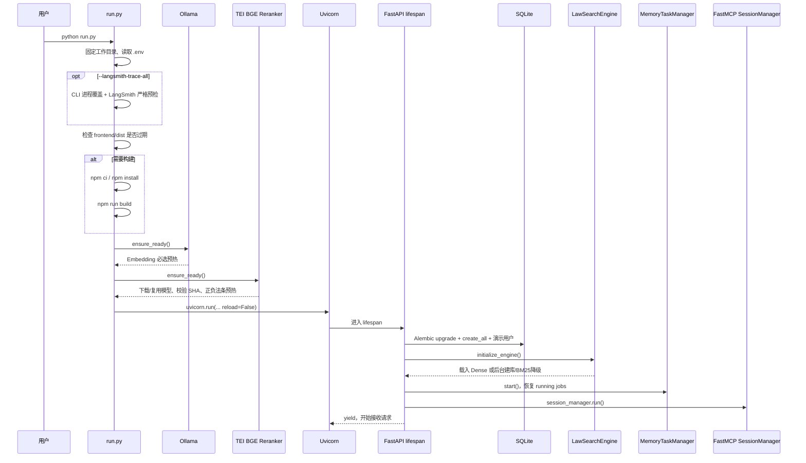

# LawStation 启动与应用生命周期

## 1. 正式入口

**已验证**：正式启动命令是：

```bash
conda activate LawStation
python run.py
```

`run.py::main` 是唯一面向用户的统一入口，负责前端、Ollama、TEI Reranker 和 Uvicorn。直接启动 `backend.app.main:app` 属于调试路径，并且缺少 `frontend/dist/index.html` 时会在 import 阶段失败。

## 2. 启动时序



## 3. 前端构建判断

关键 symbol：`run.py::frontend_sources`、`frontend_is_stale`、`build_frontend`。

- `frontend/dist/index.html` 不存在时视为过期。
- `package.json`、lock、Vite/TS 配置、HTML 或 `src/` 文件更新时间晚于 dist 时重建。
- 缺少 `node_modules` 时优先执行 `npm ci`，无 lock 才执行 `npm install`。
- `--rebuild` 强制构建。
- `--no-build` 遇到缺失或过期 dist 时明确退出。
- 有有效 dist 时，即使系统没有 npm 也能启动。

## 4. Ollama 管理

关键 symbol：`backend/app/core/ollama.py::OllamaProcessManager`。

1. 请求 `/api/version` 探测现有 Ollama。
2. 不可达且 `OLLAMA_AUTO_START=true` 时，用文件锁协调后执行 `ollama serve`。
3. 子进程只接收白名单系统变量和 `OLLAMA_*`，不会继承 DeepSeek、DashScope 或 LangSmith 密钥。
4. `/api/tags` 精确匹配 `qwen3-embedding:0.6b` 并取得 digest。
5. `/api/embed` 预热并验证单条、1024 维、有限数值。
6. 外部 Ollama 只检测、不修改其环境。
7. 只终止本次启动器创建的进程组；外部已有 Ollama 不关闭。

**已验证**：Embedding 模型缺失或预热失败会阻止正式入口启动。

**边界**：若绕过 `run.py` 直接启动 Uvicorn，`LawSearchEngine.initialize_index` 会把 Embedding 不可用处理为 BM25 降级，而不是阻止服务启动。

## 5. TEI Reranker 管理

关键 symbol：`backend/app/core/tei.py::TEIRerankerProcessManager`。

1. 请求 `/health` 探测现有 TEI，并通过 `/info` 验证模型和 Reranker 类型；revision 优先读取 `/info.model_sha`，字段为空时使用 `.env` 的固定 revision 或项目 Hugging Face 缓存 ref，三者均缺失才判定不可审计并降级。
2. 不可达且允许自动启动时，用文件锁协调后执行 `text-embeddings-router`。
3. 首次运行自动把 BGE 模型下载到 `data/models/huggingface`；配置固定 revision 时同步传给 TEI `--revision`，程序不会自动安装 TEI。
4. 启动器最多等待 900 秒，再以正、负法条调用 `/rerank`，要求正例得分更高。
5. 失败且 `required=false` 时停止失败子进程并使用 RRF；required 模式才阻止启动。
6. 只关闭本次启动器创建的 TEI 进程组；外部服务只复用、不关闭。

macOS 原生 TEI 通过 Homebrew 安装并使用 Metal；Docker 中关闭自动启动，通过 `host.docker.internal:8081` 访问宿主 TEI。

手动调试入口是 `scripts/start_tei_reranker.sh`。它以前台方式执行与当前 `.env` 对齐的 `text-embeddings-router` 命令，固定 BGE revision、项目模型缓存、回环地址和批处理参数；`Ctrl+C` 由操作者显式停止。随后启动的 `run.py` 将其识别为外部 TEI，因此不会在 LawStation 退出时误杀该进程。

## 6. FastAPI lifespan

`backend/app/main.py::lifespan` 顺序：

1. `setup_logging()`。
2. 创建并校验应用级 `LangSmithObservability`，把随机 MCP Trace Bridge Token 绑定到 MCP ASGI 包装层。
3. `initialize_database()`：运行 Alembic、补建表、创建默认租户与张三/李四。
4. 若`TEST_SCENARIOS_ENABLED=true`，`ScenarioCatalog`加载并校验项目内白名单JSONL/manifest；任一路径越界、Schema或SHA错误都阻止测试模式启动。关闭时不读文件。
5. `initialize_engine()`：在线程中构造全量 BM25，引导 Dense 检查或后台建库。
6. 创建应用级 `MCPToolRegistry` 和 `LLMProvider`；Registry 注入 Trace Interceptor。
7. 打开独立`AsyncSqliteSaver`，创建`AgentRuntime`、`AgentConcurrencyManager`和`AgentRunManager`。
8. 创建并启动`MemoryTaskManager/AgentRunManager`。
9. 进入`mcp.session_manager.run()`后才`yield`。

MCP 工具发现没有在 lifespan 中通过 HTTP 自调用；它在首个需要 Agent 的请求中由 `MCPToolRegistry.get_tools` 懒加载，避免服务尚未开始监听时自调用死锁。

场景观察推荐通过`python run.py --test-scenarios`按进程启用，`--no-test-scenarios`可强制覆盖`.env`关闭。启动器在任何本地模型进程之前构造一次`ScenarioCatalog`做严格预检，成功后打印Dataset ID、24条样本和顶部栏/侧栏入口；CLI不会写回配置文件。

## 7. 路由挂载顺序

`backend/app/main.py` 先注册：

- `/api/*`
- `/health`
- `/mcp`

最后才把 `frontend/dist` 挂到 `/`。因此根静态应用不会吞掉 API、健康检查或 MCP 路由。

## 8. 关闭流程

```text
停止接收请求
→ MemoryTaskManager.close
→ AgentRuntime.close / MCPToolRegistry.close
→ LangSmithObservability.close（限时 flush）
→ LawSearchEngine.close（取消后台建库、关闭 Embedding/Reranker Client）
→ 退出 MCP session manager
→ run.py finally 中关闭本次托管的 TEI
→ 关闭本次托管的 Ollama
```

注意：`MemoryTaskManager.close` 等待当前 Worker 结束，没有显式取消正在进行的记忆模型调用；模型长期不返回时可能延长关闭时间。

## 9. 参数与偏差

支持：

```bash
python run.py --rebuild
python run.py --no-build
python run.py --host 0.0.0.0
python run.py --port 9000
python run.py --langsmith-trace-all
python run.py --langsmith-trace-all --langsmith-trace-limit 500
python run.py --no-langsmith-trace
```

LangSmith 三模式分别为 `config/all/off`。CLI 开关只写当前进程环境并清除 Settings 缓存，不修改 `.env`；两个开关互斥，上限只能用于 `all` 且必须为正数。`all` 模式在构建前端、启动 Ollama 和 Uvicorn 前验证 API Key、HMAC、Workspace 与远端鉴权，失败即退出；运行期故障仍 fail-open。

**文档偏差/风险**：`--port 9000` 只改变 Uvicorn 端口，默认 `MCP_LAW_SERVER_URL=http://127.0.0.1:8000/mcp/` 不会自动改为 9000。除非 `.env` 同步设置，首轮工具发现会访问错误端口。

## 10. Docker

`Dockerfile` 使用 Node 构建阶段生成 `frontend/dist`，Python 最终镜像只安装后端依赖；容器执行：

```text
python run.py --no-build --host 0.0.0.0 --port 8000
```

容器不启动 Ollama 或 TEI，而是连接 `host.docker.internal:11434` 和 `host.docker.internal:8081`。`docker-compose.yml` 只有一个 LawStation 容器并挂载 `./data:/app/data`。

## 11. 测试与风险

相关测试：

- `tests/test_run.py`：dist 新旧判断与 `--no-build`。
- `tests/test_ollama_manager.py`：复用、拉起、预热、环境过滤和退出。
- `tests/test_tei_manager.py`：TEI 复用、模型校验、拉起、预热、环境过滤和退出。
- `tests/test_index_manager.py`：启动索引校验与后台构建。
- `tests/test_migrations.py`：旧 SQLite 升级前备份。

当前风险：非默认端口配置未联动、直接 Uvicorn 启动语义与正式入口不同、记忆 Worker 关闭没有硬超时。
