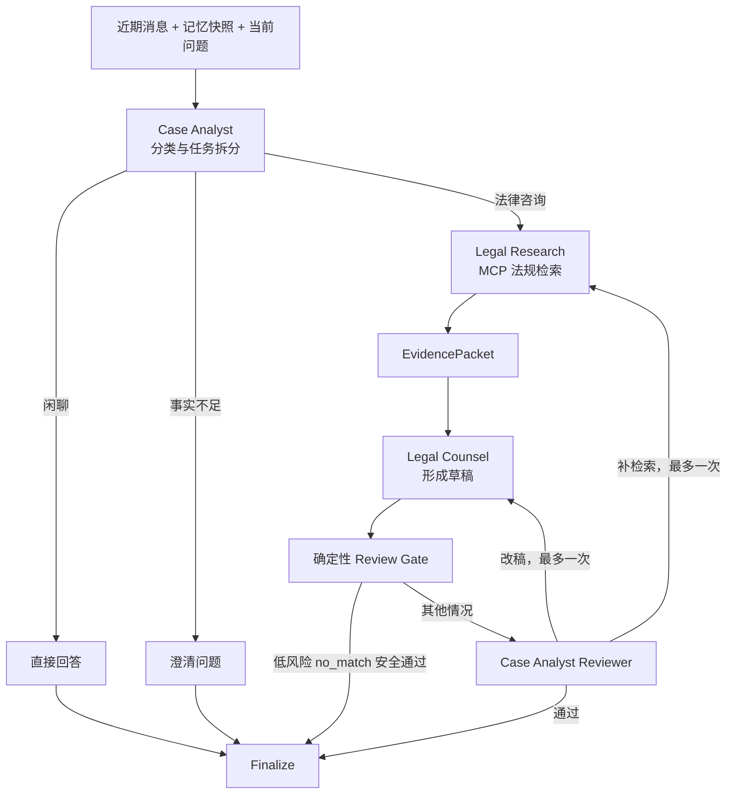

# LawStation 三 Agent 行为与协作机制详解

> Review 基线：2026-09-01 当前工作区。本文以 `backend/app/agent/graph/`、`schemas.py`、`state.py`、Middleware 和自动化测试为依据，只描述已经接入正式回答链路的行为。

## 1. 三 Agent 的真实边界

LawStation 的三个 Agent 是同一个 LangGraph 中的职责角色，不是三个进程、微服务或彼此自由通信的自治实体。

| Agent | 核心职责 | 模型调用方式 | MCP 工具权限 | 主要输出 |
|---|---|---|---:|---|
| `CaseAnalystAgent` | 请求分类、案情整理、任务拆分、Skill 建议、最终复核 | `ChatOpenAI.ainvoke()` | 无 | `CaseAnalysis`、`ReviewResult` |
| `LegalResearchAgent` | 执行法规查询、筛选真实证据、生成证据包 | LangChain `create_agent().astream()` | 有，唯一调用者 | `EvidencePacket` |
| `LegalCounselAgent` | 根据案情和证据形成用户可读法律意见 | `ChatOpenAI.ainvoke()` | 无 | `CounselDraft` |

两个容易误解的角色：

- `reviewer` 节点是 Case Analyst 的复核阶段，不是第四个独立 Agent；
- `evidence_selector` 是 Research 在候选归属不明确时的一次无工具辅助模型调用，也不是独立 Agent。

三个 Agent 共享编译后的 Graph、模型客户端和工具定义，但不共享当前用户的 State、Invocation Context、证据或回答。

## 2. 协作总流程



核心原则：

1. Analyst 决定“要不要研究”，但不检索法规；
2. Research 决定“本轮有哪些可验证法规证据”，但不直接给用户法律意见；
3. Counsel 决定“如何组织回答”，但不能自行添加 EvidencePacket 外的法条；
4. Reviewer 用代码检查证据、最新事实和空检索边界，Finalize 再执行空检索、复核结果和最终引用校验；
5. 前端只会收到安全状态和最终批准正文，不接收内部推理过程。

## 3. Agent 之间通过什么交流

Agent 不直接互相发送网络消息，而是通过 `LegalConsultationState` 的结构化字段交接结果：

```text
Case Analyst
→ case_analysis
→ current_fact_overrides

Legal Research
→ evidence_packet
→ tool_call_count / tool_trajectory

Legal Counsel
→ counsel_draft

Case Analyst Reviewer
→ review_result

Finalize
→ final_answer / citations
```

节点返回的是 State 增量字典。LangGraph 合并后，下一节点从同一轮 State 中读取；启用 Checkpoint 时，节点完成后的 State 会被保存。

### 公共输入 `_payload()`

模型节点不会拿到完整服务端对象，而是通过 `_payload(state)` 获得有限上下文：

- 最近 12 条 LangChain Message；
- 已经按预算构建的 `memory_context`；
- 当前 `CaseAnalysis`；
- 当前 `EvidencePacket`；
- 当前 `CounselDraft`；
- 当前 `ReviewResult`；
- 已验证的事实覆盖；
- 已激活 Skill 的公开信息和已验证输出。

它不包含 SQLAlchemy Session、HTTP Client、MCP Session、API Key 或完整 Checkpoint 对象。

## 4. CaseAnalystAgent：分析、路由与复核

### 4.1 角色定位

Case Analyst 是整个咨询的协调者，承担两个阶段：

```text
前置阶段：理解问题并决定下一步
后置阶段：检查 Counsel 草稿是否可以输出
```

它不调用 MCP，也不直接取得法规检索工具，从权限设计上避免“分析者凭常识补法条”。

关键实现：

- `LegalConsultationGraph.case_analyst()`；
- `LegalConsultationGraph.after_analysis()`；
- `LegalConsultationGraph.review_gate()`；
- `LegalConsultationGraph.reviewer()`；
- `LegalConsultationGraph.after_review()`。

### 4.2 输入

前置分析读取：

- 当前用户问题；
- 当前会话近期消息；
- 服务端生成的记忆上下文；
- Skill 摘要目录；
- 当前 AgentRun 的身份和模型调用计数。

Prompt 明确要求：如果当前用户消息与历史消息、摘要或长期记忆冲突，以当前用户最新明确陈述为准。

### 4.3 结构化输出 `CaseAnalysis`

| 字段 | 行为用途 |
|---|---|
| `request_type` | 区分闲聊、法律咨询和事实不足 |
| `case_summary` | 给后续 Agent 的案情摘要 |
| `jurisdiction` | 当前默认中国大陆，可由模型结构化识别 |
| `legal_domain` | 劳动、婚姻、合同等领域分类 |
| `key_facts` | 当前可用关键事实 |
| `missing_facts` | 影响分析但尚未提供的信息 |
| `legal_issues` | 需要回答的法律争议点 |
| `research_tasks` | Research 要执行的查询任务 |
| `risk_level` | `low/medium/high`，影响是否必须 LLM 复核 |
| `next_action` | `direct_answer/ask_clarification/research` |
| `direct_answer` | 闲聊的直接回答 |
| `clarification_questions` | 事实不足时的澄清清单 |
| `current_fact_overrides` | 本轮明确修正的旧记忆事实 |

所有输出先经过 JSON 提取和 Pydantic 校验，不能把任意模型文本直接写入 State。

### 4.4 三类路由行为

#### 普通闲聊

```text
request_type=casual_chat
next_action=direct_answer
→ 写入 final_answer
→ 跳过 Research 和 Counsel
→ Finalize
```

例如问候、系统能力询问等，不应浪费 MCP 和多 Agent 调用。

#### 事实不足

```text
request_type=insufficient_information
next_action=ask_clarification
→ 使用 clarification_questions 或 missing_facts
→ 生成简洁问题清单
→ Finalize
```

此时不应在关键事实缺失时强行生成确定性法律结论。

#### 法律咨询

```text
request_type=legal_consultation
next_action=research
→ 生成 legal_issues 和 research_tasks
→ after_analysis 返回 research
→ Legal Research
```

### 4.5 Research Task 如何产生

每个 `ResearchTask` 包含：

```text
issue_id：争议点稳定标识
query：给法规检索工具使用的查询语句
purpose：为什么需要核验
```

Analyst 负责把长案情转成可以检索的具体问题，但真正的检索词和工具调用仍由 Research Agent 在 MCP 权限内决定。

### 4.6 最新事实覆盖

模型可建议 `CurrentFactOverride`：

```text
canonical_key
new_value
old_value
replaced_memory_id
confidence
```

`replaced_memory_id` 只是模型建议，服务端会在同一条 SQL 中验证：

- `tenant_id`；
- `user_id`；
- `status=active`；
- 用户级记忆，或属于当前 `conversation_id` 的会话级记忆。

无效 ID 会被丢弃且不泄露目标是否存在。合法 override 只写入本轮 Graph State，使 Research、Counsel 和 Reviewer 立即采用新事实；长期记忆数据库的原位替换仍由回答后的 `MemoryTaskManager` 异步完成。

### 4.7 单次分析边界

运行时 Skill 已移除。Case Analyst 每次节点执行只进行一次 `CaseAnalysis` 结构化模型调用，不再追加案情整理模型请求；复杂事实仍通过 `key_facts`、`missing_facts`、`research_tasks` 和 `current_fact_overrides` 交接给后续节点。

### 4.8 Analyst 失败语义

当模型 JSON 解析失败、Schema 错误或触发本轮运行限制时，代码采用保守策略：

```text
把当前问题视为 legal_consultation
→ 创建一个默认 research task
→ 进入 Legal Research
→ 把错误写入 AgentError
```

这样可以减少法律问题被误分类成闲聊而直接回答的风险。其他未被该局部异常分支捕获的 Provider 故障会向任务层传播并使 AgentRun 失败，不会伪装成成功回答。

## 5. LegalResearchAgent：工具调用与证据边界

### 5.1 角色定位

Legal Research 是唯一允许调用 MCP 的 Agent。它负责：

- 读取 Analyst 的争议点和研究任务；
- 让模型自主选择 `search_laws` 或 `get_law_article`；
- 收集真实 `ToolMessage`；
- 判断候选是否直接支持争议点；
- 输出结构化 `EvidencePacket`。

它不负责形成面向用户的最终法律意见。

### 5.2 为什么使用 `create_agent()`

Research 的“搜索—观察结果—必要时精确查询—形成研究结论”需要模型和工具多轮交互，因此使用 LangChain：

```python
create_agent(
    model=DeepSeek ChatOpenAI,
    tools=MCP BaseTools,
    context_schema=AgentInvocationContext,
    middleware=[...],
)
```

LangChain 接管：

- 模型产生 `tool_calls`；
- 根据工具名和 Schema 执行 MCP Tool；
- 把结果封装成 `ToolMessage`；
- 把 ToolMessage 重新放回模型上下文；
- 判断何时结束模型—工具循环。

项目不再手写工具调用循环。

### 5.3 可用工具

当前通过 MCP Adapter 获得：

- `search_laws`：根据法律咨询语义检索候选法规 chunk；
- `get_law_article`：根据法律名称和条号做精确核验。

工具 Wrapper 由应用级 `MCPToolRegistry` 缓存，但每次执行仍经过标准 `/mcp/` HTTP 协议。Research 不直接 import 或调用 `LawSearchEngine`。

### 5.4 调用限制和 Middleware

| 限制 | 当前行为 |
|---|---|
| 请求级工具总上限 | `AGENT_MAX_TOOL_CALLS=4` |
| 单次 Research Agent 工具上限 | `min(AGENT_MAX_TOOL_CALLS, 2)` |
| 请求级模型总上限 | `AGENT_MAX_MODEL_CALLS=10` |
| 单次工具超时 | `MCP_TOOL_TIMEOUT_SECONDS`，默认 30 秒 |

Middleware 负责：

- 把 Research 内部模型调用计入整轮指标；
- 阻止超额模型或工具调用；
- 发布安全的工具开始/结果事件；
- 把超时和执行异常转成 `ToolMessage(status="error")`；
- 写入脱敏 `ToolCallRecord` 和 `RetrievalTrace`；
- 传输或协议异常时将工具 Registry 标记为 stale。

错误 ToolMessage 会反馈给模型，但当前工具调用不会自动重试，避免未来接入副作用工具时重复执行。

### 5.5 Research 的输入

Research 获取：

- Analyst 的 `legal_issues` 和 `research_tasks`；
- 当前对话与记忆上下文；
- 已验证的最新事实覆盖；
- Reviewer 补充研究时的 `revision_instruction`；
- 允许 `legal_researcher` 使用的 Skill 指令。

当前只有 `procedure-roadmap` 可以进入 Research，并且仍只能使用已授权的两个 MCP 法律工具。

### 5.6 如何处理 LangChain 流

Research 调用：

```text
research_agent.astream(stream_mode=[updates, custom])
```

- `custom`：接收 Middleware 产生的安全工具状态，并转发给外层 Graph；
- `updates`：读取模型消息和 `ToolMessage`；
- 同一个 ToolMessage 可能在多个 update 中出现，因此按 `tool_call_id` 去重；
- 成功 ToolMessage 用于提取候选，错误 ToolMessage 用于判定工具异常；
- 最后一条模型消息应包含研究 JSON。

完整工具参数、检索正文和模型 reasoning 不直接发送前端。

### 5.7 `EvidencePacket` 的三层状态

Research 不只用一个布尔值描述结果：

| 字段 | 值 | 含义 |
|---|---|---|
| `candidate_status` | `matched/no_match` | 检索工具是否返回候选 |
| `evidence_status` | `accepted/rejected/unavailable/error` | 候选是否成为可引用证据 |
| `retrieval_status` | `matched/no_match/tool_unavailable/tool_error` | 交给后续 Agent 的业务终态 |

`EvidencePacket` 还包含：

- 原始研究任务；
- 已接受的 `EvidenceItem`；
- `accepted_chunk_ids`；
- 明确拒绝的候选及原因；
- 未解决争议点；
- 冲突和研究摘要。

### 5.8 四种研究结果

#### `matched`

至少一个模型选择的证据能映射到真实 MCP 候选 chunk。后续 Counsel 可以使用这些证据生成具体法条引用。

#### `no_match`

工具正常完成，但没有候选，或候选均不足以作为当前争议点的有效证据。这是成功业务结果：

- 不抛异常；
- 不自动重复相同检索；
- 进入 Counsel 的低置信度一般分析模式；
- 最终 citations 必须为空。

#### `tool_unavailable`

首次 MCP 工具发现失败，Graph 没有可绑定的 Research Agent。节点直接生成工具不可用的 EvidencePacket。

#### `tool_error`

所有工具结果失败，或 Research 节点执行、解析发生异常。后续 Counsel 必须披露法规核验未完成，不能冒充正常空结果。

### 5.9 为什么不能直接相信模型证据

Research 模型生成的 `EvidenceItem` 只表示“模型想选择哪个证据”。代码还会执行 `_authoritative_evidence()`：

```text
模型 EvidenceItem
→ 用 chunk_id 查找本轮真实 MCP 候选
→ 从工具候选回填 document_id、法名、条号、正文和数据版本
→ 丢弃不存在或伪造的 ID
```

其中：

- `document_id` 表示原始法条；
- `chunk_id` 表示本轮命中的具体法条片段；
- 只有证据包中某个 document 仅有一个 chunk 时，才兼容旧 `document_id` 引用；
- 模型生成的法名、条号和正文不会被直接采信。

### 5.10 Evidence Selector

如果 MCP 已返回候选，但 Research 模型既没有接受证据，也没有给出拒绝理由，系统追加一次受限、无工具的 Evidence Selector：

```text
输入：本轮争议点 + 已有候选
输出：accepted_chunk_ids + rejected_candidates
限制：只能选择输入中已存在的 chunk_id
```

Selector 输出通过 Pydantic 后，还会再次与真实候选 ID 集合求交集。它不能发起新检索，也不能生成新的法条证据。

### 5.11 补充检索行为

Reviewer 只有在已有 `matched` 证据、明确指出证据缺口并且 `retry_count < 1` 时，才能把 Graph 送回 Research。

`no_match`、`tool_unavailable` 和 `tool_error` 不会因证据为空而重新检索。补检索时，Reviewer 的简短 `revision_instruction` 作为 supplemental instruction 进入 Research，避免重复完全相同的目标。

## 6. LegalCounselAgent：回答生成与证据使用

### 6.1 角色定位

Legal Counsel 是面向用户组织法律意见的角色。它不能调用 MCP，只能读取：

- Analyst 整理的案情；
- 本轮 EvidencePacket；
- 当前用户最新事实覆盖；
- 记忆快照和近期对话；
- Reviewer 的修改要求；
- 已激活且授权给 `legal_counsel` 的 Skill。

该节点生成的是待复核 `CounselDraft`，不是已经保存到 `messages` 的最终回答。

### 6.2 结构化输出 `CounselDraft`

| 字段 | 用途 |
|---|---|
| `answer` | Markdown 法律意见正文 |
| `claims` | 单项论证和对应证据 ID |
| `confidence` | `low/medium/high` |
| `limitations` | 证据、事实或服务限制 |
| `follow_up_questions` | 后续需要补充的信息 |

每个 `CounselClaim` 使用 `evidence_chunk_ids` 关联 EvidencePacket。旧 `evidence_document_ids` 只保留用于历史 Fixture 兼容。

### 6.3 matched 回答模式

当 `retrieval_status=matched`：

- 可以说明具体法律名称和条号；
- 每条法律论证应关联 EvidencePacket 中的 chunk；
- 不得引用模型常识中记得、但本轮工具没有返回的法条；
- 草稿后续必须经过 LLM Reviewer；
- Finalize 只为草稿实际使用的 chunk 生成 Citation。

检索到的所有候选不会自动展示为引用，只有 Counsel Claim 实际使用且通过边界校验的证据才会出现在最终 citations。

### 6.4 no_match 回答模式

当 `retrieval_status=no_match`：

- 仍提供一般性、条件化分析；
- 可以提示影响结论的事实因素；
- 可以建议保存证据、协商、咨询律师或补充材料；
- `confidence` 强制为 `low`；
- 必须说明当前法规库未检索到可引用法条；
- 不得出现具体法律名称、司法解释名称或条号；
- claims 不得携带证据 ID；
- citations 最终必须为空。

如果模型遗漏检索说明，代码会自动追加固定披露。Reviewer/Finalize 仍会用正则检查具体法名和条号。

### 6.5 工具异常回答模式

`tool_unavailable/tool_error` 与 `no_match` 不同：前者表示法规核验能力异常，Counsel 必须明确说明服务状态，不能说成“检索正常但没有结果”。

回答可以保留一般风险提示和行动建议，但不得声称已完成法规核验。

### 6.6 Counsel 失败语义

模型请求、JSON 解析或 Schema 失败时：

1. `no_match` 使用确定性安全回答模板；
3. 其他模式只输出研究摘要、明确限制和重试/律师建议；
4. 生成低置信度 `CounselDraft`；
5. 写入 `AgentError`；
6. 继续进入 Review Gate，而不是直接把异常或半成品草稿交给用户。

## 7. Case Analyst 的复核阶段

### 7.1 为什么 Reviewer 不算第四个 Agent

Reviewer 使用 Case Analyst 的“最终复核”职责：

- 前端事件仍标识 `case_analyst`；
- 不持有工具；
- 读取 Analyst、Research、Counsel 的结构化结果；
- 输出 `ReviewResult` 决定结束、补检索或改稿。

因此项目对外保持三 Agent 分工，同时在 Graph 内增加独立 Reviewer 节点，使复核逻辑可观察、可路由和可 Checkpoint。

### 7.2 确定性 Review Gate

`review_gate` 不调用模型。只有同时满足以下条件才跳过 LLM Reviewer：

```text
AGENT_REVIEW_MODE=auto
第一次草稿
risk_level=low
retrieval_status=no_match
confidence=low
没有具体法名和条号
包含未检索到可引用法条的披露
claims 不包含证据 ID
```

这条 Fast Path 只优化安全的低风险 no_match。以下情况仍执行 LLM Reviewer：

- matched 回答；
- 中高风险问题；
- 工具异常；
- 修订后的第二版草稿；
- no_match 边界校验失败；
- `AGENT_REVIEW_MODE=always-llm`。

### 7.3 `ReviewResult`

| 字段 | 用途 |
|---|---|
| `approved` | 草稿是否允许进入 Finalize |
| `unsupported_claims` | 没有证据支持的论断 |
| `missing_issue_ids` | 尚未覆盖的争议点 |
| `citation_errors` | 证据 ID 或法条引用错误 |
| `contradictions` | 事实或论证矛盾 |
| `revision_instruction` | 给 Research/Counsel 的简短修改要求 |
| `next_action` | `finalize/research_again/revise_draft` |

### 7.4 模型复核后的代码校验

即使 Reviewer 模型返回 `approved=true`，代码还会执行：

#### 引用边界

- Claim 中的 chunk ID 必须存在于 EvidencePacket；
- 回答中出现的 `《法律名称》第X条` 必须能映射到证据包；
- 不明确的多 chunk `document_id` 不能作为有效引用。

#### no_match 边界

- 不得出现具体法律名称或条号；
- 必须披露未检索到可引用法条。

#### 最新事实边界

- 回答不得继续使用本轮已经明确替换的旧金额、日期、姓名等值。

任何确定性错误都会覆盖模型的批准结论，改为 `revise_draft`，不会因为表达问题重新检索。

### 7.5 回流限制

| 场景 | 最大次数 | 路由 |
|---|---:|---|
| matched 且明确缺少证据 | 补检索 1 次 | Reviewer → Research |
| 表达、事实或引用需要修改 | 改稿 1 次 | Reviewer → Counsel |
| no_match | 不补检索 | 最多改稿 1 次 |
| tool_error/tool_unavailable | 不补检索 | 最多改稿 1 次 |

`retry_count` 和 `revision_count` 保存在 Graph State 和 Checkpoint 中，服务重启恢复后不会重新获得循环额度。

Reviewer 自身失败时，系统生成未批准但 `next_action=finalize` 的结果，并要求最终回答保留风险提示，不会无限重试 Reviewer。

## 8. Finalize：三 Agent 之后的确定性出口

Finalize 不是 Agent，不调用模型或 MCP。它负责把三 Agent 的结果收敛为用户真正能看到的回答。

### 8.1 正文来源

- 闲聊和澄清：使用 Analyst 的 `final_answer`；
- 法律咨询：通常使用 `CounselDraft.answer`。

### 8.2 安全替换

- no_match 未批准或仍含法条幻觉：替换为固定 no_match 安全模板；
- matched 等模式复核未通过且存在重大问题：不输出原草稿，只展示已核验材料摘要和重新咨询建议。

### 8.3 Citation 生成

```text
Counsel claims 实际引用的证据 ID
→ 在 matched EvidencePacket 中查找
→ chunk_id 精确映射
→ 去重
→ 生成 Citation
```

Citation 元数据来自服务端权威 EvidenceItem：

- `document_id`；
- `chunk_id`；
- `law_name`；
- `article_number`；
- 最多 240 字摘录；
- `data_version`。

未被 Counsel 使用的候选、伪造 ID 和歧义法条不会进入最终引用。

### 8.4 输出时机

Finalize 完成后，`AgentRuntime` 才把最终正文按 24 字符切成业务 token。Counsel 草稿和 Reviewer 内部结果不会提前流出。`AgentRunManager` 随后幂等保存助手消息、token 事件、citations 和 `message_end`。

## 9. 六类典型行为路径

### 9.1 闲聊

```text
Analyst → direct_answer → Finalize
```

模型调用少，不触发 MCP、Research、Counsel 或 Reviewer。

### 9.2 事实不足

```text
Analyst → clarification questions → Finalize
```

系统优先补充事实，不生成未经支撑的完整法律意见。

### 9.3 有匹配法条

```text
Analyst
→ Research + MCP
→ matched EvidencePacket
→ Counsel evidence-based draft
→ LLM Reviewer
→ Finalize + chunk citations
```

### 9.4 正常空检索

```text
Analyst
→ Research 正常执行但证据为空
→ no_match EvidencePacket
→ Counsel 低置信度一般分析
→ 低风险时确定性 Gate，其他情况 LLM Reviewer
→ Finalize，citations=[]
```

不会因 `evidence_items=[]` 自动重复检索。

### 9.5 工具不可用或调用失败

```text
Research → tool_unavailable/tool_error
→ Counsel 明确披露核验服务异常
→ LLM Reviewer
→ Finalize
```

工具故障不应冒充 no_match，也不能声称完成法规核验。

### 9.6 Reviewer 要求回流

```text
证据缺口且 matched → 最多补检索一次
表达/引用/事实问题 → 最多改稿一次
额度耗尽 → 强制 Finalize
```

## 10. 并发、持久化与隔离对 Agent 行为的影响

### 请求级隔离

每个 AgentRun 创建独立：

- `LegalConsultationState`；
- `AgentInvocationIdentity`；
- `AgentInvocationMetrics`；
- LangGraph `thread_id=agent-run:<run_id>`；
- EvidencePacket、草稿、复核和 Skill 输出。

共享 Graph 和模型客户端不保存当前用户状态。

### Checkpoint 恢复

每个节点成功后的 State 可以由 `AsyncSqliteSaver` 保存。服务恢复时：

- 已完成节点不从头重新执行；
- 模型/工具调用计数从 Checkpoint 恢复；
- Research/Counsel 回流次数不会归零；
- 当前节点在 Checkpoint 写入前失败时可能重跑。

### 所有权

模型不能设置 `tenant_id/user_id/conversation_id`。这些字段由服务端生成的 `AgentInvocationIdentity` 提供；工具审计、事实覆盖验证和 AgentRun 查询均使用该身份。

## 11. 前端可观察但不暴露推理的事件

三个 Agent 通过 LangGraph `stream_writer()` 发送：

| 事件 | 示例 |
|---|---|
| `agent_status` | analyzing、researching、drafting、reviewing、completed |
| `tool_call_start` | 工具名和 started |
| `tool_call_result` | 工具名和 success/error |

不会发送：

- 模型 reasoning；
- 完整 Prompt；
- 未复核 Counsel 草稿；
- 完整工具参数和法规候选正文；
- Graph Checkpoint State。

## 12. 自动化测试可以证明什么

`tests/test_agent_runtime.py` 已覆盖：

- 闲聊跳过 Research；
- 完整三 Agent、研究、复核和引用流程；
- no_match 正常完成且不回流检索；
- 无法条模式拦截具体法名和条号；
- chunk 级权威证据映射和歧义 document ID 拒绝；
- 低风险 no_match 的确定性 Review Fast Path；
- EvidencePacket 外的法条引用拦截；
- 请求状态不进入共享 Runtime；
- 并发会话隔离和调用限制。

`tests/test_skills.py` 已覆盖：

- Skill 摘要和完整正文的渐进式加载；
- 未知 ID、组合上限和角色过滤；
- Skill 输出 Schema；
- 并发请求 Skill State 隔离。

这些测试证明流程约束和安全边界，不等于法律回答专业准确率。

## 13. 当前行为的主要优点

1. **职责隔离**：分析、取证、表达分开，只有 Research 有工具权限。
2. **结构化交接**：Agent 通过 Pydantic 对象交换信息，不依赖自然语言自由传递。
3. **证据闭环**：模型选择的证据必须映射回真实 MCP chunk。
4. **空结果正常化**：没有法条时仍能给出受限的一般建议，不进入无意义循环。
5. **确定性安全出口**：Reviewer 模型之外仍有代码级事实、引用和 no_match 检查。
6. **可恢复执行**：State、计数和回流次数进入 Checkpoint。
7. **可观察性**：节点、Skill 和工具阶段可见，但不暴露内部推理和草稿。

## 14. 当前不足

1. Analyst、Counsel 和 Reviewer 使用 Prompt JSON + 手工解析，模型格式波动仍可能触发降级。
2. matched 链路通常包含多次模型调用，首个正文必须等待 Finalize，延迟高于直接 token 流。
3. Analyst 的风险分级和研究任务质量仍依赖模型，确定性代码主要控制边界，不能保证争议点拆解永远完整。
4. Evidence Selector 解决“候选未表态”，但仍是模型判断；最终只能保证证据来自候选，不能保证法律相关性绝对正确。
5. 当前 Reviewer Fast Path 只覆盖低风险 no_match，matched 简单问题仍会产生一次 Reviewer 调用。
6. 低风险 no_match Fast Path 当前只运行 `_no_match_violations()` 和证据 ID 检查，没有调用 `_fact_boundary_errors()`；该分支的最新事实优先主要依赖 Counsel Prompt，后续可把事实边界校验前移到 Review Gate 或 Finalize。
7. 三 Agent 的法律质量受法规库覆盖、检索阈值和 Prompt 影响，不能仅凭流程测试宣称法律结论准确。

## 15. 面试表达建议

推荐用以下方式描述三个 Agent：

> 使用 LangGraph 将法律咨询拆分为 Case Analyst、Legal Research 和 Legal Counsel 三个职责节点：Analyst 负责意图分类、案情结构化、研究任务拆分与最终复核；Research 是唯一绑定 MCP Tool 的 LangChain Agent，通过 DeepSeek—ToolMessage 循环构造可验证 EvidencePacket；Counsel 仅依据本轮证据包生成带 chunk 引用的法律意见。系统在 LLM Reviewer 之外增加 no-match、事实覆盖和 citation grounding 的确定性校验，并以 retry/revision 计数限制回流，避免无限工具循环与无依据法条输出。

面试中需要避免：

- 不要说三个 Agent 是三个微服务；
- 不要把 Reviewer 描述为第四个独立 Agent；
- 不要说所有节点都使用 `create_agent()`；
- 不要说 Counsel 可以自行检索法条；
- 不要把 no_match 说成系统失败；
- 不要把流程安全测试说成法律准确率。

## 16. 建议代码阅读顺序

1. `backend/app/agent/schemas.py`：理解三个 Agent 的输入输出合同。
2. `backend/app/agent/state.py`：理解 Agent 如何通过 State 交接。
3. `backend/app/agent/graph/nodes/case_analyst.py::case_analyst`：分析与路由。
4. `backend/app/agent/graph/nodes/research.py::legal_researcher`：工具循环和证据包。
5. `backend/app/agent/graph/nodes/counsel.py::legal_counsel`：回答模式和 Skill 输出。
6. `backend/app/agent/graph/nodes/review.py::review_gate/reviewer`、`backend/app/agent/graph/orchestrator.py::after_review`：复核和回流。
7. `backend/app/agent/graph/nodes/finalize.py::finalize`：最终安全出口和 Citation。
8. `backend/app/agent/middleware.py`：模型/工具上限、超时和审计。
9. `backend/app/agent/runtime.py`：Graph 执行、事件适配和恢复。
